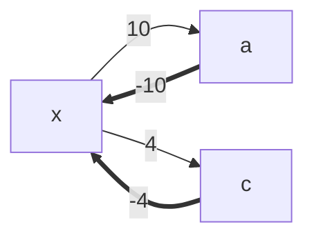
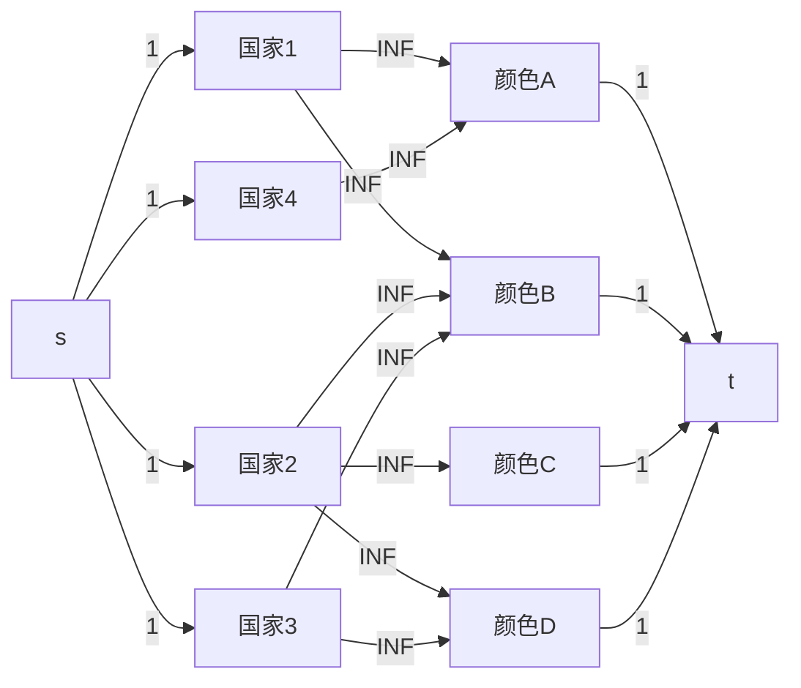
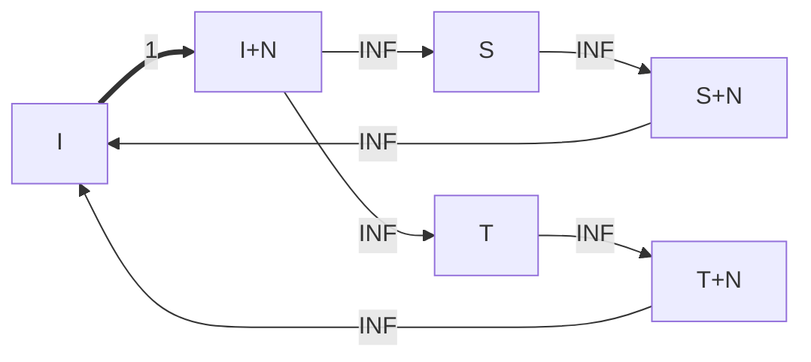

------


$$
-=Templates-Collection=- \\
OxyThe \hat Crack^{@} \\
$$


------


### 数据结构

#### 二维前缀和&二维差分

```c++
// 左上(x1,x2) 右下(x2,y2) 二维区间加和
auto insert = [&](int x1,int y1,int x2,int y2,int val) -> void
{
    diff[x1][y1] += val;
    diff[x2+1][y2+1] += val;
    diff[x2+1][y1] -= val;
    diff[x1][y2+1] -= val;
};
// 二维前缀和更新
auto update = [&]() -> void
{
    for(int i=1;i<=n;i++)
    	for(int j=1;j<=n;j++)
    		diff[i][j] = diff[i][j-1] + diff[i-1][j] - diff[i-1][j-1] + diff[i][j];
};
// 查询二维区间和
auto query = [&](int x1,int y1,int x2,int y2) -> int
{
	return pre[x2][y2] - pre[x2][y1-1] - pre[x1-1][y2] + pre[x1-1][y1-1];
};
```

#### 链表(std::list)

`td::list` 是一个基于**双向链表**实现的序列容器，它允许在序列的任意位置进行高效的插入和删除操作。与基于动态数组的 `std::vector` 不同，`std::list` 的元素在内存中不是连续存储的，而是通过指针（或引用）相互链接，这使得它在处理频繁插入 / 删除的场景时更具优势。

| 特性                | `std::list`                                       | `std::vector`                |
| ------------------- | ------------------------------------------------- | ---------------------------- |
| 内存存储            | 非连续（双向链表）                                | 连续（动态数组）             |
| 随机访问            | 不支持（O (n)）通常使用map映射迭代器优化至O(logn) | 支持（O (1)）                |
| 插入 / 删除（中间） | O (1)（已知位置）                                 | O (n)（需移动元素）          |
| 插入 / 删除（首尾） | O(1)                                              | 尾部 O (1)，头部 O (n)       |
| 迭代器稳定性        | 插入 / 删除不影响其他迭代器                       | 插入可能导致所有迭代器失效   |
| 内存开销            | 较高（额外指针）                                  | 较低（仅元素本身）           |
| 缓存友好性          | 差（元素分散）                                    | 好（连续存储，缓存命中率高） |

下面介绍一些不同于` std::vector` 的`std::list`操作

**插入操作**

- `push_front(val)`：在头部插入元素 `val`（O(1)）
- `push_back(val)`：在尾部插入元素 `val`（O(1)）
- `insert(pos, val)`：在迭代器 `pos` 指向的位置前插入 `val`，返回指向新元素的迭代器（O (1)）
- `insert(pos, n, val)`：在 `pos` **前**插入 `n` 个 `val`（O(n)）
- `insert(pos, first, last)`：在 `pos` **前**插入 `[first, last)` 范围内的元素（O (n)，n 为元素个数）

**删除操作**

- `pop_front()`：删除头部元素（O (1)，若链表为空，行为未定义）
- `pop_back()`：删除尾部元素（O (1)，若链表为空，行为未定义）
- `erase(pos)`：删除迭代器 `pos` 指向的元素，返回下一个元素的迭代器（O (1)）
- `erase(first, last)`：删除 `[first, last)` 范围内的元素，返回下一个元素的迭代器（O (n)）
- `clear()`：清空所有元素（O (n)）

**大小与容量**

- `size()`：返回当前元素个数（O (1)
- `empty()`：判断链表是否为空（O (1)）
- `resize(n)`：调整链表大小为 `n`，若 `n` 大于当前大小，新增元素默认初始化；若 `n` 更小，删除多余元素
- `resize(n, val)`：调整大小为 `n`，新增元素用 `val` 初始化

**其他常用操作**

- `swap(lst)`：与另一个链表 `lst` 交换元素（O (1)，仅交换指针）
- `reverse()`：反转链表中元素的顺序（O (n)）
- `sort()`：对链表元素排序（默认升序，O (n log n)，注意：`std::sort` 要求随机访问迭代器，`std::list` 需用自身的 `sort` 成员函数）
- `unique()`：删除连续的重复元素（需先排序，否则只删相邻重复项，O (n)）
- `merge(lst)`：合并两个已排序的链表（合并后 `lst` 为空，O (n + m)）

例：给出 *N* 个结点，编号依次为 1…*N*，初始按编号从小到大排列成一条双向链表。

接下来有 *M* 条指令，请按要求对链表进行修改。所有操作均保证合法。

|   指令    |                           含义                            |
| :-------: | :-------------------------------------------------------: |
| 1 *x* *y* | 将结点 *x* 插入到 *y* 的左侧（若 *x*=*y* 则忽略本条指令） |
| 2 *x* *y* | 将结点 *x* 插入到 *y* 的右侧（若 *x*=*y* 则忽略本条指令） |
|   3 *x*   |        删除结点 *x*；若 *x* 已被删除则忽略本条指令        |

操作结束后，请按从左到右的顺序输出当前链表中所有结点的编号

```c++
void solve() 
{
    int n,m;
    cin >> n >> m;
    vector<int> arr(n+1);
    iota(arr.begin(),arr.end(),0ll);
    list<int> ls(arr.begin()+1,arr.end());
    vector<list<int>::iterator> pos(n+1);
    auto it = ls.begin();
    for(int i=1;i<=n;i++)
    {
        pos[i] = it++;
    }
    while(m--)
    {
        int op;
        cin >> op;
        if(op == 1)
        {
            int x,y;
            cin >> x >> y;
            if(x == y) continue;
            ls.erase(pos[x]);
            auto new_it = ls.insert(pos[y],x);
            pos[x] = new_it;
        }
        else if(op == 2)
        {
            int x,y;
            cin >> x >> y;
            if(x == y) continue;
            ls.erase(pos[x]);
            auto new_it = ls.insert(next(pos[y]),x);
            pos[x] = new_it;
        }
        else 
        {
            int x;
            cin >> x;
            ls.erase(pos[x]);
        }
    }
    if(ls.empty())
    {
        cout << "Empty!\n";
        return;
    }
    for(auto it = ls.begin();it != ls.end();it++)
    {
        cout << *it << ' ';
    }
}
```


#### 树状数组

```c++
struct BIT
{   
    vector<int> tree;
    int n;
    BIT(int n) : n(n)
    {
       tree.resize(n+100,0);
    }
    //注意树状数组的下标一定从1开始
    int lowbit(int i)
    {
        return i & -i;
    }
    void add(int i,int v)
    {
        while(i <= n)
        {   
            //将起始i二进制位不断加其本身最右边的1更新树状数组
            tree[i] += v;
            i += lowbit(i);
        }
    }
    //返回1-i范围的累加和
    int sum(int i)
    {
        int ans = 0;
        while(i>0)
        {
            ans += tree[i];//不断加减去二进制最右边1的数
            i -= lowbit(i);//不断减去二进制位最右边的1
        }
        return ans;
    } 
    //返回l-r范围的累加和
    int rangesum(int l,int r)
    {
        return sum(r) - sum(l-1);
    }
    
    // O(logN) 查找第K小
    int select(int k)
    {
        int x = 0;
        int cur = 0;
        //  使用时需指定最高位数。默认32位
        for(int i = 1ll << 32; i > 0; i >>= 1)
        {
            if(x + i <= n && cur + tree[x + i] < k)
            {
                cur += tree[x + i];
                x += i;
            }
        }
        return x + 1;  // 返回x+1是因为树状数组下标从1开始
    }
};  
```

#### ST表&RMQ问题

```c++
struct SparseTable {
    int n;
    vector<int> arr,near;
    vector<vector<int>> stmax,stmin,stgcd;
    SparseTable(int n, vector<int> _arr) : arr(_arr), near(n+1), stmax(n+1, vector<int>(__lg(n) + 1)),
    stmin(n+1, vector<int>(__lg(n) + 1)), stgcd(n+1, vector<int>(__lg(n) + 1)) {
        this->n = n;
        build();
    } 
    void build() {
        near[0] = -1;
        for(int i=1;i<=n;i++) {   
            near[i] = near[i >> 1] + 1;
            stmax[i][0] = arr[i];
            stmin[i][0] = arr[i];
            stgcd[i][0] = arr[i];
        }
        for(int p=1;p<=near[n];p++)//按列填入数据
        {
            for(int i=1;i+(1<<p)-1<=n;i++)//不断计算第i点向后延申2^p长度所占的区间最值，因为是长度所以要-1
            {
                stmax[i][p] = max(stmax[i][p-1],stmax[i+(1<<(p-1))][p-1]);//两段区间对比出最值
                stmin[i][p] = min(stmin[i][p-1],stmin[i+(1<<(p-1))][p-1]);
                stgcd[i][p] = __gcd(stgcd[i][p-1],stgcd[i+(1<<(p-1))][p-1]);
            }
        }
    }
    // [max, min, gcd]
    tuple<int,int,int> query(int l, int r) {
        assert(r >= l);
        int len = r - l + 1;
        int pow = near[len];
        int resmax = max(stmax[l][pow],stmax[r-(1<<pow)+1][pow]);
        int resmin = min(stmin[l][pow],stmin[r-(1<<pow)+1][pow]);
        int resgcd = __gcd(stgcd[l][pow],stgcd[r-(1<<pow)+1][pow]);
        return {resmax, resmin, resgcd};
    }
};

```

#### 次最值

```c++
// 维护最大值、次大值、最小值、次小值的数据结构
struct CM
{
    int mx1, mx2, mn1, mn2;  // 最大值、次大值、最小值、次小值
    // 确保mx1 >= mx2
    void fix_mx(){
        if(mx1 < mx2){
            swap(mx1, mx2);
        }
    }
    // 确保mn1 <= mn2
    void fix_mn(){
        if(mn1 > mn2){
            swap(mn1, mn2);
        }
    }
    // 构造函数，初始化两个值
    CM(int a, int b){
        mx1 = mn1 = a;
        mx2 = mn2 = b;
        fix_mx();
        fix_mn();
    }
    // 添加新值并更新四个维护值
    void add(int x){
        mx2 = max(mx2, x);
        mn2 = min(mn2, x);
        fix_mx();
        fix_mn();
    }
    // 获取排除指定值后的区间长度
    // 如果x等于最大值/最小值，则使用次大值/次小值计算
    int get_seg(int x){
        pair<int, int> res = {mn1, mx1};
        if(x == mn1) res.first = mn2;
        if(x == mx1) res.second = mx2;
        return res.second - res.first + 1;
    }
};
void solve()
{   
    int n;
    cin >> n;
    vector<pii> point(n+1);
    for(int i=1;i<=n;i++)
    {
        cin >> point[i].first >> point[i].second;
    }
    if(n<=2)
    {
        cout << n << endl;
        return;
    }
    CM xc(point[1].first,point[2].first);
    CM yc(point[1].second,point[2].second);
    for(int i=3;i<=n;i++)
    {
        xc.add(point[i].first);
        yc.add(point[i].second);
    }
    int ans = xc.get_seg(-1) * yc.get_seg(-1);
    for(int i=1;i<=n;i++)
    {
        int tempx = xc.get_seg(point[i].first);
        int tempy = yc.get_seg(point[i].second);
        if(tempx * tempy == n - 1)
        {
            ans = min(ans,min(tempx*(tempy+1),tempy*(tempx+1)));
        }
        else
        ans = min(ans,tempx*tempy);
    }
    cout << ans << endl;
}
```

#### 并查集

```c++
struct DSU 
{   
    vector<int> fa,Size;
    DSU(int n) : fa(n+1),Size(n+1,1)
    {
        iota(fa.begin(),fa.end(),0);
    }
    int find(int x) 
    {   
        //注意：路径压缩是在find()函数内进行，所以不可以直接用fa数组比较!
        while (x != fa[x]) x = fa[x] = fa[fa[x]];
        return x;
    }
    bool same(int x, int y) 
    { 
        return find(x) == find(y); 
    }
    bool merge(int x, int y) 
    {
        x = find(x);
        y = find(y);
        if(x == y) return false;
        Size[x] += Size[y]; 
        fa[y] = x; 
        return true;
    }
    int size(int x) // 返回当前x节点所在集合的大小
    { 
        return Size[find(x)]; 
    }
};
```

#### 可撤销并查集

```c++
struct DSU 
{   
    vector<int> fa,Size;
    // 存储合并信息(父节点x,子节点y,合并前y的集合大小)
    vector<array<int,3>> his;
    DSU(int n) : fa(n+1),Size(n+1,1)
    {
        iota(fa.begin(),fa.end(),0);
    }
    // 注意使用可撤销并查集时不要进行路径压缩
    int find(int x) 
    {   
        return x == fa[x] ? x : find(fa[x]);
    }
    bool same(int x, int y) 
    { 
        return find(x) == find(y); 
    }
    void merge(int x, int y) 
    {
        x = find(x);
        y = find(y);
        if(x == y) // 无效输入
        {
            his.push_back({-1,-1,-1});
            return;
        }
        Size[x] += Size[y]; 
        fa[y] = x; 
        his.push_back({x,y,Size[y]});
    }
    int time() 
    {
        return his.size();
    }
    void revert(int tm) 
    {
        while(his.size() > tm)
        {
            auto [x,y,s] = his.back();
            his.pop_back();
            fa[y] = y;
            Size[x] -= s; // 恢复x的大小
        }
    }
    void undo()
    {
        auto [x,y,s] = his.back();
        his.pop_back();
        if(x == -1) return; // 无效输入不操作
        fa[y] = y;
        Size[x] -= s; // 恢复x的大小
    }
    int size(int x)
    { 
        return Size[find(x)]; 
    }
};
```

**判断连通分量是否为二分图**

```c++
struct DSU 
{
    vector<pair<int &, int>> his;
    int n;
    vector<int> f;
    vector<int> g;
    vector<int> bip;//二分图标记数组bip[i] = 1表示以 i为根的连通分量目前是二分图；bip[i] = 0表示该连通分量不是二分图（因为检测到了奇环）
    DSU(int n_) : n(n_), f(n, -1), g(n), bip(n, 1) {}
    // 查找元素 x 所在集合的代表元素（根节点），并返回该代表元素和从 x 到代表元素的异或值
    pair<int,int> find(int x) 
    {
        if (f[x] < 0) {
            return {x, 0};
        }
        auto [u, v] = find(f[x]);
        return {u, v ^ g[x]};
    }
    void set(int &a, int b) 
    {
        his.emplace_back(a, a);
        a = b;
    }
    // 合并元素 a 和 b 所在的集合，并更新二分图的数量
    void merge(int a,int b,int &ans) {
        auto [u, xa] = find(a);
        auto [v, xb] = find(b);
        int w = xa ^ xb ^ 1;        
        if (u == v) 
        {
            if (bip[u] && w) {
                set(bip[u], 0);         
                ans--;
            }
            return;
        }
        if (f[u] > f[v]) {
            swap(u, v);
        }
        ans -= bip[u];       
        ans -= bip[v];		
        set(bip[u], bip[u] && bip[v]);       
        set(f[u], f[u] + f[v]);   
        set(f[v], u);
        set(g[v], w);
        ans += bip[u];  
    }
    // 返回当前历史操作的数量，即时间戳
    int timeStamp() 
    {
        return his.size();
    }
    // 回滚到指定的时间戳 t
    void rollback(int t) {
        while (his.size() > t) {
            auto [x, y] = his.back();
            x = y;
            his.pop_back();
        }
    }
};
```

#### 种类并查集

常用于类2-SAT问题，可以用于判断合并前后的连通块是否是二分图，一般的做法是将一个点拆做两种互斥的选择点，合并时判断非法状态

例：团伙

现在有 *n* 个人，他们之间有两种关系：朋友和敌人。我们知道：

- 一个人的朋友的朋友是朋友
- 一个人的敌人的敌人是朋友

现在要对这些人进行组团。两个人在一个团体内当且仅当这两个人是朋友。请求出这些人中最多可能有的团体数。

```c++
void solve()
{   
    int n,m;
    cin >> n >> m;
    DSU dsu(2*n);
    // I 朋友状态点 I+N 敌人状态点
    for(int i=1;i<=m;i++)
    {
        char op;
        int x,y;
        cin >> op >> x >> y;
        if(op == 'F') dsu.merge(x,y);
        else
        {
            dsu.merge(x,y+n);
            dsu.merge(y,x+n);
        }
    }
    int ans = 0;
    for(int i=1;i<=n;i++) if(dsu.find(i) == i) ans++;
    cout << ans << endl;
}
```

例：(2021 ICPC Shenyang Regional)

给定M组约束关系（Ai xor Aj = w）和一个序列长度N，求出满足所有约束关系的序列的和，或报告不存在满足所有约束关系的序列

0 <= W < 2^30

```c++
void solve()
{   
    int n,m;
    cin >> n >> m;
    vector<DSU> dsu(30,DSU(2*n+1));
    // 初始化 i+n 的 Size 为 0，是为了在无约束时强制选择 0 状态（贡献 0），最小化贡献
    for(int b=0;b<=29;b++)
        for(int j=n+1;j<=n*2;j++) 
            dsu[b].Size[j] = 0; 
    // i + 1 ~ i + n 为 i ~ n状态的反集，与其互质
    for(int i=1;i<=m;i++)
    {
        int x,y,w;
        cin >> x >> y >> w;
        bitset<30> bits(w);
        for(int b=0;b<=29;b++)
        {
            if(bits[b]) // 必须互异
            {
                if(dsu[b].same(x,y) or dsu[b].same(x+n,y+n))
                {
                    cout << -1 << endl;
                    return;
                }   
                dsu[b].merge(x,y+n);
                dsu[b].merge(x+n,y);
            }
            else // 必须相同
            {
                if(dsu[b].same(x,y+n) or dsu[b].same(x+n,y))
                {
                    cout << -1 << endl;
                    return;
                }
                dsu[b].merge(x,y);
                dsu[b].merge(x+n,y+n);
            }
        }
    }
    int ans = 0;
    for(int b=0;b<=29;b++)
    {   
        for(int i=1;i<=n;i++)
        {
            // 选择互斥集合中大小较小的一个集合作为1状态集合，可使答案最小化
            ans += min(dsu[b].size(i),dsu[b].size(i+n)) * (1ll << b);
            // 已经加过贡献的连通块大小清空，防止重复计算
            dsu[b].Size[dsu[b].find(i)] = dsu[b].Size[dsu[b].find(i+n)] = 0;
        }
    }
    cout << ans << endl;
}

```


####  带权并查集

用一维数轴相对距离模型理解带权并查集

- 点权代表当前节点到集合头节点的距离，并不保证实时正确，可以经过find过程修正正确

- void merge(l，r，v)，l和r属于两个集合，并且l到r的距离为v，合并两个集合find(l)头为lf，find(r)头rf，find过程会修正dist[l]和dist[r]

  **father[lf] = rf		**

  **dist[lf] = dist[r] - dist[l] + v**

- int find(i)，寻找i所在集合的头，同时修正dist[i]的值

  路径压缩之前i的父为fa，路径压缩之后**dist[i] += dist[fa]**

- int query(l，r)查询l和r之间的距离关系

  **find(l) == find(r)，才有距离关系，距离 = dist[l] - dist[r]**

```c++
struct WeightedDSU
{
    vector<int> fa,dis;
    WeightedDSU(int n) : fa(n+1),dis(n+1,0ll)
    {
        iota(fa.begin(),fa.end(),0ll);
    };
    int find(int x)
    {
        if(x != fa[x]) 
        {
            int root = fa[x];
            fa[x] = find(root);
            dis[x] += dis[root];
        }
        return fa[x];
    }
    bool same(int x,int y)
    {
        return find(x) == find(y);
    }
    bool merge(int l,int r,int val)
    {
        int rl = find(l),rr = find(r);
        if(rl == rr) return false;
        fa[rl] = rr;
        dis[rl] = val + dis[r] - dis[l];
        return true;
    }
    int query(int l,int r)
    {
        if(find(l) != find(r)) return -1;
        return dis[l] - dis[r];
    }
};
// 有n个元素，给定m组l~r之和，每次询问是否能求出[l,r]的和，不能的话输出UNKNOWN
void solve()
{   
    int n,m,q;
    cin >> n >> m >> q;
    WeightedDSU dsu(n);
    for(int i=1;i<=m;i++)
    {
        int l,r,v;
        cin >> l >> r >> v;
        // 注意处理前i项之和为xx时，由于要加上端点值，节点要转化为前缀和形式(v = s[r] - s[l-1])
        l--;
        dsu.merge(l,r,v);
    }
    while(q--)
    {
        int l,r;
        cin >> l >> r;
        l--;
        int ans = dsu.query(l,r);
        if(ans == -1)
        {
            cout << "UNKNOWN\n";
        }
        else cout << ans << endl;
    }
}
```

带权并查集的核心：

dist数组自定义，含义可以根据问题场景灵活定义（如距离、差值、代价等），合并时仅修改集合头部dist元素并考虑如何通过find()路径压缩过程更正各节点数据，一般带权并查集的细节修改主要在merge方法中修改

例：银河英雄传说 (2002NOI)

```
    // dis[i]表示i前面有几艘战舰
    // Size[i]为集合大小
    bool merge(int l,int r)
    {
        int rl = find(l),rr = find(r);
        if(rl == rr) return false;
        fa[rl] = rr;
        dis[rl] += Size[rr];
        Size[rr] += Size[rl];
        return true;
    }
    int query(int l,int r) // 求L和R之间的战舰数量
    {
        if(find(l) != find(r)) return -1;
        return abs(dis[l] - dis[r]) - 1;
    }
```


#### 单调队列&单调栈

```c++
// Monotonic Stack
struct node 
{
    ll val;
    int index;
    int prev;  // 左边第一个大于该元素的下标
    int next;  // 右边第一个大于该元素的下标
    node() 
    {
        prev = 0;
        next = 0;
    }
};
node arr[N];
stack<node> stk;
signed main() {
    ios::sync_with_stdio(false);
    cin.tie(nullptr);
    cout.tie(nullptr);
    int n;
    cin >> n;
    for (int i = 1; i <= n; i++) 
    {
        cin >> arr[i].val;
        arr[i].index = i;
    }
    // 从左到右遍历，找到每个元素右边第一个大于它的元素的下标
    for (int i = 1; i <= n; i++) {
        while (!stk.empty() && arr[i].val > stk.top().val) 
        {
            arr[stk.top().index].next = i;
            stk.pop();
        }
        stk.push(arr[i]);
    }
    // 清空栈
    while (!stk.empty()) 
    {
        stk.pop();
    }
    // 从右到左遍历，找到每个元素左边第一个大于它的元素的下标
    for (int i = n; i >= 1; i--) {
        while (!stk.empty() && arr[i].val > stk.top().val) 
        {
            arr[stk.top().index].prev = i;
            stk.pop();
        }
        stk.push(arr[i]);
    }
    for (int i = 1; i <= n; ++i) 
    {
        cout  << arr[i].val << " " << arr[i].prev << " " << arr[i].next << endl;
    }
    return 0;
}
// Monotonic Queue
struct node
{
    int x;// 水滴落点
    int sec;// 水滴下落时间
}drip[N];

deque<int> qmax;
deque<int> qmin;

bool cmp(node a,node b) { return a.x < b.x; }
void solve()
{   
    cin >> n >> D;
    for(int i=0;i<n;i++)
    {
        cin >> drip[i].x >> drip[i].sec;
    }
    sort(drip,drip+n,cmp);
    int ans = LLONG_MAX;

    int tail = drip[0].x;//尾指针指向离散化后的窗口左边界
    int index = 0;//指针指向未离散化时的窗口左边界
    int head;//头指针指向离散化后的窗口右边界
    //i为未离散化的窗口右边界
    for(int i=0;i<n;i++)
    {   
        head = drip[i].x;
        //求最大值的单调递减队列
        while(!qmax.empty()&&drip[i].sec >= qmax.back()) qmax.pop_back();
        qmax.push_back(drip[i].sec);
        //求最小值的单调递增队列
        while(!qmin.empty()&&drip[i].sec <= qmin.back()) qmin.pop_back();
        qmin.push_back(drip[i].sec);
        while(qmax.front()-qmin.front() >= D)
        {
            ans = min(ans,head-tail);
            if(drip[index].sec==qmax.front()) qmax.pop_front();
            if(drip[index].sec==qmin.front()) qmin.pop_front();
            index++;
            tail = drip[index].x;         
        }
    }
    if(ans==LLONG_MAX)
    {
        cout << -1;
    }
    else
    cout << ans;
}
```

#### 倍增法求最近公共祖先LCA

```c++
struct SparseTable
{
    vector<int> depth,dis;   // 深度、距离
    vector<vector<int>> st;  // 稀疏表 st[i][j]表示节点i向上跳2^j步到达的节点
    vector<int> head;        // 链式前向星头指针
    int cnt;                 // 边计数器
    int maxpow;              // 最大幂次
    int n,root;              // 节点数、根节点
    struct Edge{ int to,next,w;};
    vector<Edge> edge;
    SparseTable() {}
    SparseTable(int n,int root = 1)
    {
        init(n,root);
    }
    void init(int n,int root = 1)
    {
        this->n = n;
        this->root = root;
        maxpow = log2(n) + 1;
        depth.resize(n+1);
        dis.resize(n+1);
        head.resize(n+1,0);
        edge.resize((n+1)<<1);
        st.resize(n+1, vector<int>(maxpow+1,-1));
        cnt = 0;
        // dfs(root,-1);
    }
    
    void addedge(int u,int v,int w = 0)
    {
        edge[++cnt] = {v,head[u],w};
        head[u] = cnt;
    }
    
    void dfs(int u,int fa)
    {
        depth[u] = (fa == -1) ? 0 : (depth[fa] + 1);
        st[u][0] = fa;
        for(int p=1;p<=maxpow;p++)
        {
            st[u][p] = (st[u][p-1] == -1) ? -1 : st[st[u][p-1]][p-1];
        }
        for(int i=head[u];i;i=edge[i].next)
        {
            int v = edge[i].to;
            int w = edge[i].w;
            if(v != fa)
            {
                dis[v] = dis[u] + w;
                dfs(v, u);
            }
        }
    }
    int lca(int x, int y)
    {
        if(depth[x] > depth[y]) swap(x, y);
        int diff = depth[y] - depth[x];
        for(int i=0;i<=maxpow;i++) if(diff & (1 << i)) y = st[y][i];  
        if(x == y) return x;
        for(int i=maxpow;i>=0;i--)
        {
            if(st[x][i] != st[y][i])
            {
                x = st[x][i];
                y = st[y][i];
            }
        }
        return st[x][0];
    }
};
```

#### 线段树

```c++
#include <bits/stdc++.h>
#define int long long
#define endl '\n'
#define Single
#define ls(p) (p << 1)       // 左子节点索引
#define rs(p) (p << 1 | 1)   // 右子节点索引
using namespace std;
/*
    线段树常见方法一览
    void push_up(..){} : 根据子范围的查询信息，把父范围的查询信息更新正确
    void push_down(..){} : 父范围的懒信息，往下下发一层，并给左范围，右范围，然后父范围的懒信息清空
    void apply(..){} : 一段范围的整体被任务整体全覆盖或是父范围下发的懒信息，该如何处理，可以理解为一旦apply了此操作，该线段的值该如何去处理
    void build(..){} : 建树
    void update(..){} : 范围上的更新任务
    void query(..){} : 范围上的查询任务
*/
struct SegTree 
{
    private:
        struct Node 
        {
            int l,r;
            int sum,max,min,gcd,xor_sum,lcm;

            int add,mul;
            int set;
            bool change;
            // 仅需初始化初始状态所有线段信息都相同的信息(懒更新信息)，其余信息会在build过程中初始化，防止卡常
            Node() : change(false), add(0), mul(1), set(0) {}
            inline int len()
            {
                return r - l + 1;
            }
        };

        vector<int> arr;
        vector<Node> tree;

        void push_up(int p) 
        {
            tree[p].sum = tree[ls(p)].sum + tree[rs(p)].sum;
            tree[p].max = max(tree[ls(p)].max,tree[rs(p)].max);
            tree[p].min = min(tree[ls(p)].min,tree[rs(p)].min);
            tree[p].gcd = __gcd(tree[ls(p)].gcd,tree[rs(p)].gcd); 
            tree[p].xor_sum = tree[ls(p)].xor_sum ^ tree[rs(p)].xor_sum;
            tree[p].lcm = (tree[ls(p)].lcm * tree[rs(p)].lcm) / __gcd(tree[ls(p)].lcm, tree[rs(p)].lcm);
        }
    
        void apply_set(int p,int val)
        {
            tree[p].sum = val * tree[p].len();
            tree[p].max = tree[p].min = val;
            tree[p].gcd = val;
            tree[p].xor_sum = 0;
            tree[p].lcm = val;
            tree[p].set = val;
            tree[p].change = true;
            tree[p].add = 0;
            tree[p].mul = 1;
        }
    
        void apply_add(int p,int val) 
        {
            tree[p].sum += val * tree[p].len();
            tree[p].max += val;
            tree[p].min += val;
            tree[p].gcd += val;  
            tree[p].xor_sum ^= (val * tree[p].len());
            tree[p].lcm += val; 
            tree[p].add += val;
        }
    
        void apply_mul(int p, int val) 
        {
            tree[p].sum *= val;
            tree[p].max *= val;
            tree[p].min *= val;
            tree[p].gcd *= val;
            tree[p].xor_sum *= val;
            tree[p].lcm *= val;
            tree[p].mul *= val;
            tree[p].add *= val;
        }
    
        void push_down(int p) 
        {
            if(tree[p].change) 
            {
                apply_set(ls(p), tree[p].set);
                apply_set(rs(p), tree[p].set);
                tree[p].change = false;
            }
            if(tree[p].mul != 1) 
            {
                apply_mul(ls(p), tree[p].mul);
                apply_mul(rs(p), tree[p].mul);
                tree[p].mul = 1;
            }
            if(tree[p].add != 0) 
            {
                apply_add(ls(p), tree[p].add);
                apply_add(rs(p), tree[p].add);
                tree[p].add = 0;
            }
        }
    
    public:
        SegTree(const vector<int>& _arr) : arr(_arr) 
        {   
            this -> tree.assign(((int)arr.size()+5)<<2,Node());
            build(1, 1, (int)arr.size()-1);
          //build(1, 0, (int)arr.size()-1);
        }
        void build(int p, int l, int r) 
        {
            tree[p].l = l;
            tree[p].r = r;
            if(l == r)
            {
                tree[p].sum = tree[p].max = tree[p].min = arr[l];
                tree[p].gcd = arr[l];
                tree[p].xor_sum = arr[l];
                tree[p].lcm = arr[l];
                return;
            }
            int mid = (l + r) >> 1;
            build(ls(p),l,mid);
            build(rs(p),mid+1,r);
            push_up(p);
        }
    
        void updateSet(int p,int ul,int ur,int val) 
        {
            if(ul <= tree[p].l and tree[p].r <= ur) 
            {
                apply_set(p,val);
                return;
            }
            push_down(p);
            int mid = (tree[p].l + tree[p].r) >> 1;
            if(ul <= mid) updateSet(ls(p),ul,ur,val);
            if(ur > mid) updateSet(rs(p),ul,ur,val);
            push_up(p);
        }
    
        void updateAdd(int p,int ul,int ur,int val)
        {
            if(ul <= tree[p].l and tree[p].r <= ur)
            {
                apply_add(p,val);
                return;
            }
            push_down(p);
            int mid = (tree[p].l + tree[p].r) >> 1;
            if(ul <= mid) updateAdd(ls(p),ul,ur,val);
            if(ur > mid) updateAdd(rs(p),ul,ur,val);
            push_up(p);
        }
    
        void updateMul(int p,int ul,int ur,int val) 
        {
            if(ul <= tree[p].l and tree[p].r <= ur) 
            {
                apply_mul(p,val);
                return;
            }
            push_down(p);
            int mid = (tree[p].l + tree[p].r) >> 1;
            if(ul <= mid) updateMul(ls(p),ul,ur,val);
            if(ur > mid) updateMul(rs(p),ul,ur,val);
            push_up(p);
        }
        // 对区间开平方的操作无法根据懒更新去维护区间和与区间最大值，所以只能进行暴力下传到叶节点进行修改，但下传过程可以剪枝
        // 时间复杂度O(6 * N * log(N)) 6为数据最大值1e13所能开平方的最大次数，因为是暴力下传到叶节点，所以需乘上树的高度logN 
        void updateSqrt(int p,int ul,int ur) 
        {
            if(tree[p].l == tree[p].r) 
            {
                arr[tree[p].l] = sqrt(arr[tree[p].l]);
                tree[p].sum = arr[tree[p].l];
                tree[p].max = arr[tree[p].l];
                return;
            }
            push_down(p);
            int mid = (tree[p].l + tree[p].r) >> 1;
            //剪枝：如果区间最大值已经为1，则此区间无需再进行开平方操作.
            if(ul <= mid and tree[ls(p)].max > 1)
            {
                updateSqrt(ls(p),ul,ur);
            }
            if(ur > mid and tree[rs(p)].max > 1) 
            {
                updateSqrt(rs(p),ul,ur);
            }
            push_up(p);
        }
        //对区间取模数的操作无法根据懒更新去维护区间和与区间最大值，所以只能进行暴力下传到叶节点进行修改，但下传过程可以剪枝
        void updateMod(int p,int ul,int ur,int mod) 
        {   
            //剪枝：如果区间最大值小于mod，则此区间无需再进行取模操作.
            if(mod > tree[p].max) return;
            if(tree[p].l == tree[p].r) 
            {
                arr[tree[p].l] %= mod;
                tree[p].sum = arr[tree[p].l];
                tree[p].max = arr[tree[p].l];
                return;
            }
            push_down(p);
            int mid = (tree[p].l + tree[p].r) >> 1;
            if(ul <= mid)
            {
                updateMod(ls(p),ul,ur,mod);
            }
            if(ur > mid) 
            {
                updateMod(rs(p),ul,ur,mod);
            }
            push_up(p);
        }
        //修改单个元素的值O(logn)
        void updateval(int p,int ul,int ur,int val) 
        {
            if(tree[p].l == tree[p].r)
            {   
                arr[tree[p].l] = val;
                tree[p].sum = arr[tree[p].l];
                tree[p].max = arr[tree[p].l];
                return;
            }
            push_down(p);
            int mid = (tree[p].l + tree[p].r) >> 1;
            if(ul <= mid) updateval(ls(p),ul,ur,val);
            if(ur > mid) updateval(rs(p),ul,ur,val);
            push_up(p);
        }
        int querySum(int p,int ql,int qr) 
        {
            if(ql <= tree[p].l and tree[p].r <= qr) return tree[p].sum;
            push_down(p);
            int mid = (tree[p].l + tree[p].r) >> 1,res = 0;
            if(ql <= mid) res += querySum(ls(p),ql,qr);
            if(qr > mid) res += querySum(rs(p),ql,qr);
            return res;
        }
    
        int queryMax(int p,int ql,int qr) 
        {
            if(ql <= tree[p].l and tree[p].r <= qr) return tree[p].max;
            push_down(p);
            int mid = (tree[p].l + tree[p].r) >> 1, res = LLONG_MIN;
            if(ql <= mid) res = max(res,queryMax(ls(p),ql,qr));
            if(qr > mid) res = max(res,queryMax(rs(p),ql,qr));
            return res;
        }
    
        int queryMin(int p,int ql,int qr) 
        {
            if(ql <= tree[p].l and tree[p].r <= qr) return tree[p].min;
            push_down(p);
            int mid = (tree[p].l + tree[p].r) >> 1,res = LLONG_MAX;
            if(ql <= mid) res = min(res, queryMin(ls(p),ql,qr));
            if(qr > mid) res = min(res, queryMin(rs(p),ql,qr));
            return res;
        }
    
        int queryGCD(int p,int ql,int qr) 
        {
            if(ql <= tree[p].l and tree[p].r <= qr) return tree[p].gcd;
            push_down(p);
            int mid = (tree[p].l + tree[p].r) >> 1,res = 0;
            if(ql <= mid) res = __gcd(res, queryGCD(ls(p),ql,qr));
            if(qr > mid) res = __gcd(res, queryGCD(rs(p),ql,qr));
            return res;
        }
    
        int queryXOR(int p,int ql,int qr) 
        {
            if(ql <= tree[p].l and tree[p].r <= qr) return tree[p].xor_sum;
            push_down(p);
            int mid = (tree[p].l + tree[p].r) >> 1,res = 0;
            if(ql <= mid) res ^= queryXOR(ls(p),ql,qr);
            if(qr > mid) res ^= queryXOR(rs(p),ql,qr);
            return res;
        }
    
        int queryLCM(int p,int ql,int qr)
        {
            if(ql <= tree[p].l and tree[p].r <= qr) return tree[p].lcm;
            push_down(p);
            int mid = (tree[p].l + tree[p].r) >> 1, res = 1;
            if(ql <= mid) res = (res * queryLCM(ls(p),ql,qr)) / __gcd(res,queryLCM(ls(p),ql,qr));
            if(qr > mid) res = (res * queryLCM(rs(p),ql,qr)) / __gcd(res,queryLCM(rs(p),ql,qr));
            return res;
        }
};
void solve()
{
    int n,m;
    cin >> n >> m;
    vector<int> arr(n+1);
    for(int i=1;i<=n;i++) cin >> arr[i];
    SegTree st(arr);
    while(m--)
    {
        int op;
        cin >> op;
        if(op==1)
        {
            int l,r,x;
            cin >> l >> r >> x;
            st.updateSet(1,l,r,x);
        }
        if(op==2)
        {
            int l,r,x;
            cin >> l >> r >> x;
            st.updateAdd(1,l,r,x);
        }
        if(op==3)
        {
            int l,r;
            cin >> l >> r;
            cout << st.queryMax(1,l,r) << endl;
        }
    }
}
```

##### 线段树的信息合并维护

```c++
		struct Node  
        {
            //例：求解区间[l,r]中的最长1字串长度
            int l,r;
            int sum; // 有多少1
            int set; // 重置为哪个数字
            int pre0,suf0; // 前缀0和后缀0的长度
            int pre1,suf1; // 前缀1和后缀1的长度
            int len1; // 1的最长连续字串长度
            int len0; // 0的最长连续字串长度
            bool change;
            bool reverse;
            Node() : l(0), r(0), sum(0), set(0), change(false), reverse(false), pre0(0), suf0(0), pre1(0), suf1(0), len1(0), len0(0) {}
            inline int len()
            {
                return r - l + 1;
            }
        } tree[N << 2];
		void push_up(int p) 
        {
            tree[p].sum = tree[ls(p)].sum + tree[rs(p)].sum;
            tree[p].len1 = max({tree[ls(p)].len1,tree[rs(p)].len1,tree[ls(p)].suf1 + tree[rs(p)].pre1});
            tree[p].len0 = max({tree[ls(p)].len0,tree[rs(p)].len0,tree[ls(p)].suf0 + tree[rs(p)].pre0});
            tree[p].pre1 = tree[ls(p)].pre1 + (tree[ls(p)].pre1 == tree[ls(p)].len()) * tree[rs(p)].pre1;
            tree[p].pre0 = tree[ls(p)].pre0 + (tree[ls(p)].pre0 == tree[ls(p)].len()) * tree[rs(p)].pre0;
            tree[p].suf1 = tree[rs(p)].suf1 + (tree[rs(p)].suf1 == tree[rs(p)].len()) * tree[ls(p)].suf1;
            tree[p].suf0 = tree[rs(p)].suf0 + (tree[rs(p)].suf0 == tree[rs(p)].len()) * tree[ls(p)].suf0;
        }
        int queryLen1(int p,int ql,int qr)
        {
            if(ql <= tree[p].l and tree[p].r <= qr) return tree[p].len1;
            
            push_down(p);
            int mid = (tree[p].l + tree[p].r) >> 1;
		   // 注意此时为qr <= mid , ql > mid 与正常线段树相反
            // 如果mid不把当前线段分割
            if(qr <= mid) return queryLen1(ls(p),ql,qr);
            if(ql > mid) return queryLen1(rs(p),ql,qr);
            // 如果mid会分割当前线段，则需要结合前后线段信息更新
            // 获得左右线段各自的最长字串长度
            int left = queryLen1(ls(p),ql,qr);
            int right = queryLen1(rs(p),ql,qr);
		   // 维护合并两段中间的信息
            int leftsuf = min(tree[ls(p)].suf1,mid - ql + 1);
            int rightpre = min(tree[rs(p)].pre1,qr - (mid + 1) + 1);
    	   // 三者之间的最大值即为答案
            return max({left,right,leftsuf+rightpre});
        }  
```

##### 开点线段树

适用于需要维护范围很大（空间约为 操作数量 * 树高 * 2），但是操作数不大的情况，

可以支持很大的范围，但是一开始不为每个范围分配空间，当真的需要开辟左侧，右侧的空间时，再临时申请，父亲范围的空间编号i，利用cnt自增给左右两侧申请的空间，记录在left[i] 和 right[i] 里，

除此之外与普通线段树再无区别。

无延迟操作（例：2023 ICPC Shenyang Regional K）

```c++
struct DynamicSegTree
{
    int cnt;// 下标记录已开辟节点
    struct Node
    {
        int l,r; // 左右孩子索引（0表示不存在）
        int tl,tr; // 当前节点覆盖的区间[tl,tr]
        int sum; // 区间和
        int cnt; // 词频
        Node() {}
        inline int len(){ return tr - tl + 1;}
    };
    vector<Node> tree;
    void push_up(int p)
    {
        tree[p].sum = 0;
        tree[p].cnt = 0;
        if(tree[p].l)
        {
            tree[p].sum += tree[tree[p].l].sum;
            tree[p].cnt += tree[tree[p].l].cnt;
        }
        if(tree[p].r)
        {
            tree[p].sum += tree[tree[p].r].sum;
            tree[p].cnt += tree[tree[p].r].cnt;            
        }
    }

    DynamicSegTree(int l,int r,int query)
    {
        cnt = 1;
        // 默认log1e9
        // 非多测建议直接开接近空间极限的空间
        tree.resize(query*32*2);
        tree[1].tl = l;
        tree[1].tr = r;
    }
    
    void updateval(int p,int x,int val)
    {
        int tl = tree[p].tl;
        int tr = tree[p].tr;
        // 无交集
        if(tr < x or tl > x) return;
        // 完全包含
        if(x <= tl and tr <= x)
        {
            tree[p].cnt += val;
            tree[p].sum += x * val;
            return;
        }
        int mid = (tl + tr) >> 1;
        if(x <= mid)
        {
            if(tree[p].l == 0)
            {
                tree[p].l = ++cnt;
                tree[tree[p].l].tl = tl;
                tree[tree[p].l].tr = mid;
            }
            updateval(tree[p].l,x,val);
        }
        else
        {
            if(tree[p].r == 0)
            {
                tree[p].r = ++cnt;
                tree[tree[p].r].tl = mid + 1;
                tree[tree[p].r].tr = tr;
            }
            updateval(tree[p].r,x,val);
        }
        push_up(p);
    }
    // 查询最小的整数 x，使得最大的 x 个正数的和至少等于目标值 S
    int query(int p,int cursum)
    {
        if(cursum <= 0) return 0;
        if(tree[p].tl == tree[p].tr)
        {
            return (cursum + tree[p].tl - 1) / tree[p].tl;
        }

        if(tree[p].r and tree[tree[p].r].sum >= cursum)
        {
            return query(tree[p].r,cursum);
        }
        else
        {
            int rsum = 0,rcnt = 0;
            if(tree[p].r)
            {
                rsum = tree[tree[p].r].sum;
                rcnt = tree[tree[p].r].cnt;
            }
            int rem = cursum - rsum;
            if(rem <= 0) return rcnt;
            else return rcnt + query(tree[p].l,rem);
        }
    }
};

void solve()
{   
    int n,q;
    cin >> n >> q;
    vector<int> arr(n+1);
    int sum = 0;
    DynamicSegTree dst(1,1e9+10,q);
    for(int i=1;i<=n;i++)
    {
        cin >> arr[i];
        if(arr[i] > 0) dst.updateval(1,arr[i],1);
        sum += arr[i];
    }
    for(int i=1;i<=q;i++)
    {
        int x,v;
        cin >> x >> v;
        if(arr[x] > 0) dst.updateval(1,arr[x],-1);
        if(v > 0) dst.updateval(1,v,1);
        sum -= arr[x];
        sum += v;
        arr[x] = v;
        cout << dst.tree[1].cnt - dst.query(1,sum) + 1 << endl;
    }
}
```

有延迟修改

```c++
struct DynamicSegTree
{
    int cnt;
    struct Node
    {
        int l,r; // 左右孩子索引（0表示不存在）
        int tl,tr; // 当前节点覆盖的区间[tl,tr]
        int sum; // 区间和
        int add; // 懒更新加法
        Node() {}
        inline int len()
        {
            return tr - tl + 1;
        }
    };
    vector<Node> tree;
    void push_up(int p)
    {
        tree[p].sum = 0;
        tree[p].add = 0;
        if (tree[p].l) tree[p].sum += tree[tree[p].l].sum;
        if (tree[p].r) tree[p].sum += tree[tree[p].r].sum;
    }

    void apply_add(int p,int val)
    {
        tree[p].sum += val * tree[p].len();
        tree[p].add += val;
    }

    void push_down(int p)
    {
        if(tree[p].add != 0)
        {   
            int tl = tree[p].tl;
            int tr = tree[p].tr;
            int mid = (tl + tr) >> 1;
            // 懒更新任务下发，则左右两侧空间需要准备好 
            // 动态创建左孩子
            if(tree[p].l == 0)
            {
                tree[p].l = ++cnt;
                tree[tree[p].l].tl = tl;
                tree[tree[p].l].tr = mid;
            }
            // 动态创建右孩子
            if(tree[p].r == 0)
            {   
                tree[p].r = ++cnt;
                tree[tree[p].r].tl = mid + 1;
                tree[tree[p].r].tr = tr;
            }
            // 下发懒标记
            apply_add(tree[p].l,tree[p].add);
            apply_add(tree[p].r,tree[p].add);
            // 清除当前节点懒标记
            tree[p].add = 0;
        }
    }

    DynamicSegTree(int l,int r)
    {
        cnt = 1;
        // 接近空间极限即可
        tree.resize(1e7);
        tree[1].tl = l;
        tree[1].tr = r;
    }
    
    void updateadd(int p,int ul,int ur,int val)
    {
        int tl = tree[p].tl;
        int tr = tree[p].tr;
        // 无交集
        if(tr < ul or tl > ur) return;
        // 完全包含
        if(ul <= tl and tr <= ur)
        {
            apply_add(p,val);
            return;
        }
        // 部分交集则需分裂
        push_down(p);
        int mid = (tl + tr) >> 1;
        if (ul <= mid && tree[p].l == 0) 
        {
            tree[p].l = ++cnt;
            tree[tree[p].l].tl = tl;
            tree[tree[p].l].tr = mid;
        }
        if (ur > mid && tree[p].r == 0) 
        {
            tree[p].r = ++cnt;
            tree[tree[p].r].tl = mid+1;
            tree[tree[p].r].tr = tr;
        }
        // 递归更新左右孩子
        if(tree[p].l != 0) updateadd(tree[p].l,ul,ur,val);
        if(tree[p].r != 0) updateadd(tree[p].r,ul,ur,val);
        push_up(p);
    }

    int querysum(int p,int ql,int qr)
    {
        int tl = tree[p].tl;
        int tr = tree[p].tr;
        // 无交集
        if (tr < ql or tl > qr) return 0;
        // 完全包含
        if (ql <= tl and tr <= qr) return tree[p].sum;
        // 部分交集，需分裂
        push_down(p);
        int res = 0;
        // 查询左右孩子
        if (tree[p].l != 0) res += querysum(tree[p].l,ql,qr);
        if (tree[p].r != 0) res += querysum(tree[p].r,ql,qr);
        return res;
    }
};

void solve()
{
    int n,m;
    cin >> n >> m;
    DynamicSegTree dst(1,n,1000);
    for(int i=1;i<=m;i++)
    {
        int op;
        cin >> op;
        if(op == 1)
        {
            int l,r,k;
            cin >> l >> r >> k;
            dst.updateadd(1,l,r,k);
        }
        else
        {
            int l,r;
            cin >> l >> r;
            cout << dst.querysum(1,l,r) << endl;
        }
    }
}

```


##### 可持久化线段树(主席树)

```c++
struct PerSegTree 
{
    private:
        // 动态开点节点结构
        struct Node 
        {
            int lc,rc;    // 左右子节点指针
            int cnt;       // 值域区间内的元素计数
            // 默认初始化空节点
            Node() : lc(0),rc(0),cnt(0) {}
        };
        vector<Node> tree;    // 动态开点存储池
        vector<int> roots;    // 各版本根节点指针
        vector<int> arr;      // 原始数据
        vector<int> sorted;   // 离散化数组
        int n,idx;           // 数据规模 & 节点计数器
        // 辅助函数：分配新节点 O(1)
        inline int create_node() 
        {
            tree.emplace_back();
            return idx++;
        }
        // 离散化原始数据 O(nlogn)
        void discretize() 
        {
            sorted = arr;
            sort(sorted.begin(),sorted.end());
            sorted.erase(unique(sorted.begin(),sorted.end()),sorted.end());
        }
        // 获取离散化后的值 O(logn)
        inline int getid(int val) 
        {
            return lower_bound(sorted.begin(),sorted.end(),val) - sorted.begin();
        }
        int build_empty() 
        {
            return create_node();  // 创建空树根节点
        }
        // 递归建立空树（按需构建，实际使用中通常只需叶子）
        int build(int l,int r) 
        {
            int p = create_node();
            if(l == r) return p;
            int mid = (l + r) >> 1;
            tree[p].lc = build(l,mid);
            tree[p].rc = build(mid+1,r);
            return p;
        }
        // 更新操作：在旧版本基础上创建新路径 O(logN)
        int update(int oriroot,int l,int r,int pos) 
        {
            int p = create_node();
            tree[p] = tree[oriroot];  // 复制旧节点
            tree[p].cnt++;             // 更新计数
            if(l == r) return p;
            int mid = (l + r) >> 1;
            if(pos <= mid) tree[p].lc = update(tree[oriroot].lc,l,mid,pos); 
            else tree[p].rc = update(tree[oriroot].rc,mid+1,r,pos);
            return p;
        }
        // 构建完整的主席树 O(nlogn)
        void build_tree() 
        {
            roots.resize(n+1);
            roots[0] = build_empty();  // 0号版本为空树
            for(int i=0;i<n;i++) 
            {
                int pos = getid(arr[i]);
                roots[i+1] = update(roots[i],0,sorted.size()-1,pos);
            }
        }
        // 查询区间内值在[lval,rval]的元素数量 O(logN)
        int queryrangecnt(int root1,int root2,int lseg,int rseg,int L,int R) 
        {
            if(R < lseg or rseg < L) return 0;
            if(L <= lseg and rseg <= R) 
            {
                return tree[root2].cnt - tree[root1].cnt;
            }
            int mid = (lseg + rseg) >> 1;
            int res = 0;
            if(L <= mid) res += queryrangecnt(tree[root1].lc,tree[root2].lc,lseg,mid,L,R);
            if(R > mid) res += queryrangecnt(tree[root1].rc,tree[root2].rc,mid+1,rseg,L,R);
            return res;
        }
        // 双版本树上二分查询第k小值 O(logN)
        int query_kth_min(int root1,int root2,int l,int r,int k) 
        {
            if(l == r) return l;  // 返回离散化下标
            int mid = (l + r) >> 1;
            // 计算左子树差值（即区间内落入左值域的元素数）
            int left_cnt = tree[tree[root2].lc].cnt - tree[tree[root1].lc].cnt;
            if(k <= left_cnt) return query_kth_min(tree[root1].lc,tree[root2].lc,l,mid,k);
            else return query_kth_min(tree[root1].rc,tree[root2].rc,mid + 1,r,k - left_cnt);
        }
         // 双版本树上二分查询第k大值 O(logN)
        int query_kth_max(int root1,int root2,int l,int r,int k) 
        {
            if(l == r) return l;// 返回离散化下标
            int mid = (l + r) >> 1;
            // 计算右子树差值（即区间内落入右值域的元素数）
            int right_cnt = tree[tree[root2].rc].cnt - tree[tree[root1].rc].cnt;
            if(k <= right_cnt) return query_kth_max(tree[root1].rc,tree[root2].rc,mid+1,r,k);
            else return query_kth_max(tree[root1].lc,tree[root2].lc,l,mid,k - right_cnt);
        }
    public:
        PerSegTree(const vector<int>& _arr) : arr(_arr),n(arr.size()) 
        {
            tree.reserve(n * 20);  // 预分配空间(40倍保险起见)
            tree.emplace_back();   // 0号节点占位
            idx = 1;
            discretize();
            build_tree();
        }
        // 外部调用：查询区间[l,r]的第k小值（返回原始值）
        int queryKthMin(int l,int r,int k) 
        {
            int root1 = roots[l];      
            int root2 = roots[r+1];  
            int idx = query_kth_min(root1,root2,0,sorted.size()-1,k);
            return sorted[idx];
        }
        // 外部调用：查询区间[l,r]的第k大值（返回原始值）
        int queryKthMax(int l, int r, int k) 
        {
            int root1 = roots[l];    
            int root2 = roots[r+1];  
            int idx = query_kth_max(root1,root2,0,sorted.size()-1,k);
            return sorted[idx];
        }
        // 外部调用：区间[l,r]内值在[lval,rval]的元素数量
        int queryinter(int l,int r,int lval,int rval) 
        {
            int L = getid(lval);
            int R = upper_bound(sorted.begin(),sorted.end(),rval) - sorted.begin() - 1;
            if(L > R) return 0;
            return queryrangecnt(roots[l],roots[r+1],0,sorted.size()-1,L,R);
        }
};
```

##### 线段树二分

线段树内同样也可以使用内部二分来寻找第一个满足某一种性质的位置等信息

例：寻找大于x位置的第一个小于等于Val的位置

```c++
int queryFirst(int p,int x,int val)
{
    if(tree[p].r <= x) return INF; 
    if(tree[p].l == tree[p].r) return (arr[tree[p].l] <= val) ? tree[p].l : INF;
    int lp = queryFirst(ls(p),x,val);
    if(lp == INF) return queryFirst(rs(p),x,val);
    return lp;
}
```

例：将和cursum都尽量向右分配，返回第一个分配结束的位置(序列  ： 1 2 2 3 4 5，Cursum为10时返回4)

```c++
    int query(int p,int cursum)
    {
        if(cursum <= 0) return 0;
        if(tree[p].tl == tree[p].tr)
        {
            return (cursum + tree[p].tl - 1) / tree[p].tl;
        }

        if(tree[p].r and tree[tree[p].r].sum >= cursum)
        {
            return query(tree[p].r,cursum);
        }
        else
        {
            int rsum = 0,rcnt = 0;
            if(tree[p].r)
            {
                rsum = tree[tree[p].r].sum;
                rcnt = tree[tree[p].r].cnt;
            }
            int rem = cursum - rsum;
            if(rem <= 0) return rcnt;
            else return rcnt + query(tree[p].l,rem);
        }
    }
```


##### 线段树分治

线段树分治原理：

1. 一些问题中，可以把操作依次发生的顺序，进行时间点的划分，也可以进行答案点进行划分（例3：最小MEX生成树）
2. 某些修改操作，只在一段时间内有效
3. 某些查询操作，其实就是询问在某个时间点上，相关的状态信息
4. 如果把时间点认为是线段树的下标，修改操作就对应了区间修改，查询操作就对应了单点查询

线段树分治过程：

1. 先把所有操作记录下来，为每个操作依次分配时间点
2. 每个修改操作，确定生效的时间段，挂在若干个线段树的区间上
3. 遍历整棵线段树，来到某个线段树的区间时，执行对应的操作，离开区间时，撤销相应的修改
4. 线段树的叶节点，对应着单个时间点，如果有查询操作，记录当前的答案

线段树分治的使用场景

1. 在线算法实现困难较大，可能需要更高级的数据结构，或者时间复杂度无法达到预期
2. 题目没有强制在线的要求，并且操作的次序可以转化成离线的时序

线段树分治的时间复杂度

1. 操作的数量为m，每个有效时间段，会分解成log m个线段树的区间
2. 每个线段树区间都留有这个修改操作的记录，那么修改记录的总数为m * logm
3. 执行任务和撤销任务，使用到可撤销并查集，并查集上点的个数为n，单次操作的代价为 logn
4. 时间复杂度一般为 O(m * log m * log n)

线段树分治常用在与可撤销并查集结合去解决连通性相关问题：

**例：你要维护一张无向简单图。你被要求加入删除一条边及查询两个点是否连通。**

- `0`：加入一条边。保证它不存在。
- `1`：删除一条边。保证它存在。
- `2`：查询两个点是否连通。

```c++
struct DSU { ... ... };
struct SegmentTree
{
    struct Node
    {
        int l,r;  
        // 当前时间节点挂入的加边操作
        vector<array<int,2>> op;
    };
    vector<Node> tree;
    
    void build(int p,int l,int r)
    {
        tree[p].l = l;
        tree[p].r = r;
        if(l == r) return;
        int mid = (l + r) >> 1;
        build(ls(p),l,mid);
        build(rs(p),mid+1,r);
    }
    SegmentTree(int n) : tree(n << 2) 
    {   
        build(1,1,n);
    }
    void update(int p,int ul,int ur,array<int,2> v)
    {
        // 节点挂上操作
        if(tree[p].l >= ul and ur >= tree[p].r)
        {
            tree[p].op.push_back(v);
            return;
        }
        int mid = (tree[p].l + tree[p].r) >> 1;
        if(ul <= mid) update(ls(p),ul,ur,v);
        if(mid < ur) update(rs(p),ul,ur,v);
        // 不需要pushup，也不需要标记永久化和懒标记
        // 因为在线段树分治+可撤销并查集的场景下，天然的会走到叶子节点以及路上的标记
    }
    // 其他的内容我们倾向于用dfs的方法写进主函数内
};
void solve()
{   
    int n,m;
    cin >> n >> m;
    // 边{u,v}的操作时间节点
    map<array<int,2>,vector<int>> mpt;
    vector<array<int,3>> query(m+1);
    for(int i=1;i<=m;i++)
    {
        auto &[op,u,v] = query[i];
        cin >> op >> u >> v;
        if(u > v) swap(u,v);
        if(op == 0 or op == 1)
        {
            mpt[{u,v}].push_back(i);
        }
    }
    // 线段树范围必须刚好
    SegmentTree st(m);
    for(auto &[e,v] : mpt)
    {   
        //覆盖生效期间的时间节点
        for(int i=0;i<v.size();i+=2)
        {
            int l = v[i];
            int r = (i + 1 < v.size() ? v[i+1] - 1 : m);
            st.update(1,l,r,e);
        }
    }
    DSU dsu(n);
    vector<int> ans;
    auto dfs = [&](auto&& self,int p,int l,int r) -> void
    {
        // 枚举当前时间点下的加边，构成当前时间点的并查集
        for(auto &[u,v] : st.tree[p].op) dsu.merge(u,v);
        if(l == r)
        {
            auto [op,u,v] = query[l];
            // 如果是查询操作，存储答案
            if(op == 2) ans.push_back(dsu.same(u,v));
        }
        else
        {
            int mid = (l + r) >> 1;
            self(self,ls(p),l,mid);
            self(self,rs(p),mid+1,r);
        }
        // 使用后进行撤销
        int cnt = st.tree[p].op.size();
        while(cnt--) dsu.undo();
    };
    dfs(dfs,1,1,m);
    for(auto i : ans)
    {
        if(i) cout << "Y\n";
        else cout << "N\n";
    }
}
```

**例：判断二分图**

```c++
void solve()
{   
    int n,m,k;
    cin >> n >> m >> k;
    // 边{u,v}的操作时间节点
    map<array<int,2>,vector<int>> mpt;
    vector<array<int,4>> query(m+1);
    for(int i=1;i<=m;i++)
    {
        auto &[u,v,l,r] = query[i];
        cin >> u >> v >> l >> r;
        l++,r++;
        if(u > v) swap(u,v);
        if(l > r) swap(l,r);
    }
    SegmentTree st(k);
    for(int i=1;i<=m;i++)
    {   
        auto [u,v,l,r] = query[i];
        st.update(1,l,r-1,{u,v});
    }
    DSU dsu(2*n);
    // n + 1 ~ 2 * n为 i - n 点的对立点
    vector<int> ans(k+1);
    auto dfs = [&](auto&& self,int p,int l,int r) -> void
    {
        // 枚举当前时间点下的加边，构成当前时间点的并查集
        bool bip = true;
        int opcnt = 0;
        for(auto &[u,v] : st.tree[p].op)
        {
            if(dsu.same(u,v))
            {
                bip = false;
                break;
            }
            dsu.merge(u,v+n);
            dsu.merge(u+n,v);
            opcnt += 2;
        }
        // 如果此时还是二分图才有继续递归下放的必要
        if(bip)
        {   
            if(l == r)
            {
                ans[l] = true;
            }
            else
            {
                int mid = (l + r) >> 1;
                self(self,ls(p),l,mid);
                self(self,rs(p),mid+1,r);
            }
        }
        else // 否则此时间段内该图都不是二分图，直接修改答案
        {
            for(int i=l;i<=r;i++) ans[i] = false;
        }
        // 使用后进行撤销
        while(opcnt--) dsu.undo();
    };
    dfs(dfs,1,1,k);
    for(int i=1;i<=k;i++) cout << (ans[i] ? "Yes\n" : "No\n");
}

```

**例：最小MEX生成树**

求出一个这个图的生成树，使得其边权集合的 mex 尽可能小

**答案轴线段树分治**经典模板题，对可能的答案序列轴建线段树，并根据每种答案情况下那些边是使用的进行建图

```c++
void solve()
{   
    int n,m;
    cin >> n >> m;
    vector<array<int,3>> edge(m+1); 
    for(int i=1;i<=m;i++)
    {
        auto &[u,v,w] = edge[i];
        cin >> u >> v >> w;
        w++;
        if(u > v) swap(u,v);
    }
    SegmentTree st(1e5+1);
    for(int i=1;i<=m;i++)
    {   
        auto [u,v,w] = edge[i];
        st.update(1,w+1,1e5+1,{u,v});
        if(w - 1 >= 1) st.update(1,1,w-1,{u,v});
    }
    DSU dsu(n);
    bitset<100003> ans;
    ans.reset();
    ans[100002] = 1;
    auto dfs = [&](auto&& self,int p,int l,int r) -> void
    {
        int opcnt = 0;
        for(auto &[u,v] : st.tree[p].op)
        {
            dsu.merge(u,v);
            opcnt++;
        }
        int check = dsu.size(1) == n;
        if(l == r)
        {
            ans[l] = check;
        }
        else
        {
            int mid = (l + r) >> 1;
            self(self,ls(p),l,mid);
            self(self,rs(p),mid+1,r);
        }
        while(opcnt--) dsu.undo();
    };
    dfs(dfs,1,1,1e5+1);
    cout << ans._Find_first() - 1 << endl;
}
```


#### 有序表

##### AVL树

```c++
struct AVL
{
    int n;
    int vid; // 空间使用计数
    int root; // 整棵树的根节点编号
    vector<int> key,height,left,right,count,size;
    AVL() {}
    AVL(int n) : n(n)
    {
        this->n = n;
        root = 0;
        vid = 0;
        key.resize(n+1);
        height.resize(n+1);
        size.resize(n+1);
        left.resize(n+1);
        right.resize(n+1);
        count.resize(n+1);
    }
    // 修正信息
    void push_up(int i)
    {
        size[i] = size[left[i]] + size[right[i]] + count[i];
        height[i] = max(height[left[i]],height[right[i]]) + 1;
    }
    // 以i节点为头的树左旋，返回左旋后头节点空间编号
    int leftRotate(int i)
    {
        int r = right[i];
        right[i] = left[r];
        left[r] = i;
        push_up(i);
        push_up(r);
        return r;   
    }
    // 以i节点为头的树右旋，返回右旋后头节点空间编号
    int rightRotate(int i)
    {
        int l = left[i];
        left[i] = right[l];
        right[l] = i;
        push_up(i);
        push_up(l);
        return l;
    }
    // 检查i节点为头的树是否违规,如果命中了某种违规情况，就进行相应调整
	// 返回树的头节点的空间编号
    int maintain(int i)
    {
        int lh = height[left[i]];
        int rh = height[right[i]];
        if(lh - rh > 1)
        {
            if(height[left[left[i]]] >= height[right[left[i]]]) i = rightRotate(i);
            else left[i] = leftRotate(left[i]),i = rightRotate(i);
        }
        else if(rh - lh > 1)
        {
            if(height[right[right[i]]] >= height[left[right[i]]]) i = leftRotate(i);
            else right[i] = rightRotate(right[i]),i = leftRotate(i);
        }
        return i;
    }
    // 当前来到i号节点，num这个数字一定会加入以i为头的树
	// 树结构有可能变化，返回头节点编号
    int add(int i,int val)
    {
        if(i == 0)
        {
            key[++vid] = val;
            count[vid] = size[vid] = height[vid] = 1;
            return vid;
        }
        if(key[i] == val) count[i]++;
        else if(key[i] > val) left[i] = add(left[i],val);
        else right[i] = add(right[i],val);
        push_up(i);
        return maintain(i);
    }
    // 以i号节点为头的树上，最左节点的编号一定是mostLeft
	// 删掉这个节点，并保证树的平衡性，返回头节点的编号
	int removeleft(int i,int lp) 
    {
		if(i == lp) return right[i];
		else 
        {
			left[i] = removeleft(left[i],lp);
			push_up(i);
			return maintain(i);
		}
	}
    // 当前来到i号节点，以i为头的树一定会减少1个num
	// 树结构有可能变化，返回头节点编号
    int remove(int i,int val)
    {
        if(key[i] < val) right[i] = remove(right[i],val);
        else if(key[i] > val) left[i] = remove(left[i],val);
        else
        {
            if(count[i] > 1) count[i]--;
            else
            {
                if(!left[i] and !right[i]) return 0;
                else if(left[i] and !right[i]) i = left[i];
                else if(!left[i] and right[i]) i = right[i];
                else
                {
                    int lp = right[i];
                    while(left[lp]) lp = left[lp];
                    right[i] = removeleft(right[i],lp);
                    left[lp] = left[i],right[lp] = right[i];
                    i = lp;
                }
            }    
        }
        push_up(i);
        return maintain(i);
    }
    // 以i为头的树上，比val小的数字有几个
    int small(int i,int val)
    {
        if(i == 0) return 0;
        if(key[i] >= val) return small(left[i],val);
        else return size[left[i]] + count[i] + small(right[i],val);
    }
    int index(int i,int x)
    {
        if(size[left[i]] >= x) return index(left[i],x);
        else if(size[left[i]] + count[i] < x) return index(right[i],x-size[left[i]]-count[i]);
        return key[i];
    }
    int pre(int i,int val)
    {
        if(i == 0) return NINF;
        if(key[i] >= val) return pre(left[i],val);
        else return max(key[i],pre(right[i],val));
    }
    int post(int i,int val)
    {
        if(i == 0) return INF;
        if(key[i] <= val) return post(right[i],val);
        else return min(key[i],post(left[i],val));
    }
    // 查询后继
    int post(int val)
    {
        return post(root,val);
    }
    // 查询前驱
    int pre(int val)
    {
        return pre(root,val);
    }
    // 查询排名为x的数值
    int index(int x)
    {
        return index(root,x);
    }
    // 查询val的排名，比val小的数字个数+1，就是val的排名
    int rank(int val)
    {
        return small(root,val) + 1;
    }
    // 增加数值val,重复加入算多个词频
    void add(int val)
    {
        root = add(root,val);
    }
    // 删除数字val，如果有多个，只删掉一个
    void remove(int val)
    {
        if(rank(val) != rank(val + 1)) root = remove(root,val);
    }
    void clear()
    {
        fill(key.begin(),key.begin()+vid+1,0);
        fill(count.begin(),count.begin()+vid+1,0);
        fill(left.begin(),left.begin()+vid+1,0);
        fill(right.begin(),right.begin()+vid+1,0);
        fill(size.begin(),size.begin()+vid+1,0);    
        fill(height.begin(),height.begin()+vid+1,0);
        vid = 0;
        root = 0;   
    }
};
AVL avl(1e5+100);
```

##### 替罪羊树

码量小，扩展性低，但实现经典平衡树查询结构的常数因子小

一般设置平衡因子alpha = 0.7，单次查询代价O(log N)，单次调整均摊代价为O(log N)

发现有一节点不平衡，随即中序遍历出有序序列随后二分建树

```c++
// 1，增加x，重复加入算多个词频
// 2，删除x，如果有多个，只删掉一个
// 3，查询x的排名，x的排名为，比x小的数的个数+1
// 4，查询数据中排名为x的数
// 5，查询x的前驱，x的前驱为，小于x的数中最大的数，不存在返回整数最小值
// 6，查询x的后继，x的后继为，大于x的数中最小的数，不存在返回整数最大值
struct ScapeGoatTree
{
    int n;
    const double alpha = 0.7;
    int vid; // 空间使用计数
    int root; // 整棵树的根节点编号
    // diff : 节点总数 col : 中序收集节点的数组
    vector<int> key,ls,rs,cnt,size,diff,col;
    int colcnt; // 中序收集节点的计数
    int top;   // 最上方的不平衡节点
    int fa; // top的父节点
    int side; // top是父节点的什么孩子,1:L 2:R
    ScapeGoatTree() {}
    ScapeGoatTree(int n)
    {
        this->n = n;
        root = vid = fa = top = side = colcnt = 0;
        key.resize(n+5);
        diff.resize(n+5);
        size.resize(n+5);
        ls.resize(n+5);
        rs.resize(n+5);
        col.resize(n+5);
        cnt.resize(n+5);
    }
    int init(int val)
    {
        key[++vid] = val;
        ls[vid] = rs[vid] = 0;
        cnt[vid] = size[vid] = diff[vid] = 1;
        return vid;
    }
    // 修正信息
    void up(int i)
    {
        size[i] = size[ls[i]] + size[rs[i]] + cnt[i];
        diff[i] = diff[ls[i]] + diff[rs[i]] + (cnt[i] > 0 ? 1 : 0);
    }
    void inorder(int i) // 中序遍历收集有序序列
    {
        if(i)
        {
            inorder(ls[i]);
            if(cnt[i]) col[++colcnt] = i;
            inorder(rs[i]);
        }
    }
    int build(int l,int r) // 重构替罪羊树
    {
        if(l > r) return 0;
        int mid = (l + r) >> 1;
        int h = col[mid];
        ls[h] = build(l,mid-1);
        rs[h] = build(mid+1,r);
        up(h);
        return h;
    }
    void rebuild()
    {
        if(top)
        {
            colcnt = 0;
            inorder(top);
            if(colcnt)
            {
                if(!fa) root = build(1,colcnt);
                else if(side == 1) ls[fa] = build(1,colcnt);
                else rs[fa] = build(1,colcnt);
            }
        }
    }
    bool balance(int i)
    {
        return alpha * diff[i] >= max(diff[ls[i]],diff[rs[i]]);
    }
    void add(int i,int f,int s,int val) // adr,fa,sid,val
    {
        if(i == 0)
        {
            if(f == 0) root = init(val);
            else if(s == 1) ls[f] = init(val);
            else rs[f] = init(val);
        }
        else 
        {
            if(key[i] == val) cnt[i]++;
            else if(key[i] > val) add(ls[i],i,1,val);
            else add(rs[i],i,2,val);
            up(i);
            if(!balance(i)) top = i,fa = f,side = s;  
        }
    }
    void remove(int i,int f,int s,int val)
    {
        if(key[i] == val) cnt[i] --;
        else if(key[i] > val) remove(ls[i],i,1,val);
        else remove(rs[i],i,2,val);
        up(i);
        if(!balance(i)) top = i,fa = f,side = s;
    }
    int small(int i,int val)
    {
        if(i == 0) return 0;
        if(key[i] >= val) return small(ls[i],val);
        else return size[ls[i]] + cnt[i] + small(rs[i],val);
    }
    int index(int i,int x)
    {
        if(size[ls[i]] >= x) return index(ls[i],x);
        else if(size[ls[i]] + cnt[i] < x) return index(rs[i],x-size[ls[i]]-cnt[i]);
        return key[i];
    }
    void add(int val)
    {
        top = fa = side = 0;
        add(root,0,0,val);
        rebuild();
    }
    void remove(int val)
    {
        if(rank(val) != rank(val+1))
        {
            top = fa = side = 0;
            remove(root,0,0,val);
            rebuild();
        }
    }
    int rank(int val)
    {
        return small(root,val) + 1;
    }
    int index(int x)
    {
        return index(root,x);
    }
    int pre(int val)
    {
        int kth = rank(val);
        if(kth == 1) return NINF;
        else return index(kth-1);
    }
    int post(int val)
    {
        int kth = rank(val + 1);
        if(kth == size[root] + 1) return INF;
        else return index(kth);
    }
    void clear()
    {
        fill(key.begin(),key.begin()+vid+1,0);
        fill(cnt.begin(),cnt.begin()+vid+1,0);
        fill(ls.begin(),ls.begin()+vid+1,0);
        fill(rs.begin(),rs.begin()+vid+1,0);
        fill(size.begin(),size.begin()+vid+1,0);    
        fill(col.begin(),col.begin()+vid+1,0); 
        fill(diff.begin(),diff.begin()+vid+1,0);
        vid = 0;
        root = 0;   
    }
};
ScapeGoatTree sgt(1e5+100);
```

##### 笛卡尔树

一般默认key没有相同值，key按照搜索二叉树组织，value按照小根堆或者大根堆组织，不是狭义的小根堆或者大根堆

整棵子树的最小值或最大值，一定是子树的头，但不要求子树一定为完全二叉树，这种广义的堆

笛卡尔树建树过程，时间复杂度O(N)

1.当前插入节点假设为x，依据x的value值，在单调栈中依次弹出节点

2.最晚弹出的节点y以及其整棵子树，成为x的左树

3.弹出过程结束后，假设此时单调栈的顶部节点为z，x及整棵子树，成为z的右树

4.节点x根据value值加入单调栈

```c++
struct Descartes
{
    int n;
    vector<int> arr,ls,rs; 
    vector<int> stk;
    int root; 
    Descartes(const vector<int>& _arr) : arr(_arr)
    {
        // 假设输入数组从1开始索引
        init(_arr.size() - 1);
        build();
    }
    void init(int n) 
    {
        this->n = n;
        ls.resize(n+1,0);  // 0表示空节点
        rs.resize(n+1,0);
        stk.resize(n+1,0);
        root = 0;
    }
    void build()
    {
        int top = 0;
        for(int i=1;i<=n;i++)
        {   
            int pos = top;
            // 构建小根堆性质的笛卡尔树(父节点值 < 子节点值)
            while (pos > 0 and arr[stk[pos]] > arr[i]) pos--;
            if(pos > 0) rs[stk[pos]] = i;  // 当前元素成为栈顶元素的右孩子
            if(pos < top) ls[i] = stk[pos + 1];  // 栈顶元素剩余部分成为当前元素的左孩子
            stk[++pos] = i;
            top = pos;
        }
        root = stk[1];  // 栈底元素为根节点
    }
    // 前序遍历,总是先输出当前区间的最小值,再输出左,右子区间的内容
    void print_pre(int u)
    {
        if(u == 0) return;
        cout << arr[u] << " ";  
        print_pre(ls[u]);       
        print_pre(rs[u]);     
    }
    // 中序遍历,输出结果与原数组一致
    void print_mid(int u)
    {
        if(u == 0) return;
        print_mid(ls[u]);     
        cout << arr[u] << " ";  
        print_mid(rs[u]);      
    }
    // 后序遍历,总是先输出左右子区间的所有元素,最后输出当前区间的最小值
    void print_post(int u)
    {
        if(u == 0) return;
        print_post(ls[u]);      
        print_post(rs[u]);      
        cout << arr[u] << " ";  
    }
    void print_pre() { print_pre(root); cout << endl; }
    void print_mid() { print_mid(root); cout << endl; }
    void print_post() { print_post(root); cout << endl; }
};
```

##### Treap树

```c++

#include <bits/stdc++.h>
#define Single
using namespace std;
const int MAXN = 100001;
struct Treap 
{
    int cnt = 0;
    int head = 0;
    int key[MAXN]; 
    int key_count[MAXN]; 
    int ls[MAXN]; 
    int rs[MAXN]; 
    int SIZE[MAXN]; 
    double priority[MAXN]; 
    // 更新以节点 i 为根的子树的节点总数
    void up(int i) {
        SIZE[i] = SIZE[ls[i]] + SIZE[rs[i]] + key_count[i];
    }
    // 左旋操作，用于维护 Treap 的堆性质
    int leftRotate(int i) {
        int r = rs[i];
        rs[i] = ls[r]; 
        ls[r] = i;
        up(i); 
        up(r); 
        return r; 
    }
    // 右旋操作，用于维护 Treap 的堆性质
    int rightRotate(int i) {
        int l = ls[i]; 
        ls[i] = rs[l];
        rs[l] = i;
        up(i); 
        up(l); 
        return l; 
    }
    // 递归添加键值 num 到以节点 i 为根的子树中
    int add(int i, int num) {
        if (i == 0) { 
            key[++cnt] = num; 
            key_count[cnt] = SIZE[cnt] = 1; 
            priority[cnt] = static_cast<double>(rand()) / RAND_MAX; 
            return cnt; 
        }
        if (key[i] == num) { 
            key_count[i]++; 
        } else if (key[i] > num) { 
            ls[i] = add(ls[i], num); 
        } else { 
            rs[i] = add(rs[i], num);
        }
        up(i);
        if (ls[i] != 0 && priority[ls[i]] > priority[i]) {
            return rightRotate(i); 
        }
        if (rs[i] != 0 && priority[rs[i]] > priority[i]) { 
            return leftRotate(i); 
        }
        return i; 
    }
    // 对外提供的添加键值的接口
    void add(int num) {
        head = add(head, num); 
    }
    // 递归计算以节点 i 为根的子树中小于 num 的节点数量
    int small(int i, int num) {
        if (i == 0) {
            return 0; 
        }
        if (key[i] >= num) {
            return small(ls[i], num);
        } else {
            return SIZE[ls[i]] + key_count[i] + small(rs[i], num); 
        }
    }
    // 计算键值 num 的排名
    int getRank(int num) {
        return small(head, num) + 1;
    }
    // 递归查找以节点 i 为根的子树中排名为 x 的节点的键值
    int index(int i, int x) {
        if (SIZE[ls[i]] >= x) { 
            return index(ls[i], x);
        } else if (SIZE[ls[i]] + key_count[i] < x) { 
            return index(rs[i], x - SIZE[ls[i]] - key_count[i]);
        }
        return key[i]; 
    }
    // 对外提供的查找排名为 x 的节点的键值的接口
    int index(int x) {
        return index(head, x);
    }
    // 递归查找以节点 i 为根的子树中小于 num 的最大键值
    int pre(int i, int num) {
        if (i == 0) { 
            return INT_MIN;
        }
        if (key[i] >= num) {
            return pre(ls[i], num); 
        } else { 
            return max(key[i], pre(rs[i], num)); 
        }
    }
    // 对外提供的查找小于 num 的最大键值的接口
    int pre(int num) {
        return pre(head, num);
    }
    // 递归查找以节点 i 为根的子树中大于 num 的最小键值
    int post(int i, int num) {
        if (i == 0) { 
            return INT_MAX; 
        }
        if (key[i] <= num) { 
            return post(rs[i], num);
        } else {
            return min(key[i], post(ls[i], num));
        }
    }
    // 对外提供的查找大于 num 的最小键值的接口
    int post(int num) {
        return post(head, num); 
    }
    // 递归从以节点 i 为根的子树中删除键值 num
    int remove(int i, int num) {
        if (key[i] < num) { 
            rs[i] = remove(rs[i], num);
        } else if (key[i] > num) {
            ls[i] = remove(ls[i], num);
        } else {
            if (key_count[i] > 1) {
                key_count[i]--; 
            } else {
                if (ls[i] == 0 && rs[i] == 0) { 
                    return 0; 
                } else if (ls[i] != 0 && rs[i] == 0) {
                    i = ls[i]; 
                } else if (ls[i] == 0 && rs[i] != 0) {
                    i = rs[i]; 
                } else {
                    if (priority[ls[i]] >= priority[rs[i]]) {
                        i = rightRotate(i); 
                        rs[i] = remove(rs[i], num); 
                    } else { 
                        i = leftRotate(i); 
                        ls[i] = remove(ls[i], num);
                    }
                }
            }
        }
        up(i); 
        return i; 
    }
    // 对外提供的删除键值的接口
    void remove(int num) {
        if (getRank(num) != getRank(num + 1)) { 
            head = remove(head, num); 
        }
    }
    // 清空 Treap 树 时间复杂度并非O(T*N),而是树中的节点个数，多组样例用此清空
    void clear() {
        fill(key + 1, key + cnt + 1, 0);
        fill(key_count + 1, key_count + cnt + 1, 0);
        fill(ls + 1, ls + cnt + 1, 0);
        fill(rs + 1, rs + cnt + 1, 0); 
        fill(SIZE + 1, SIZE + cnt + 1, 0); 
        fill(priority + 1, priority + cnt + 1, 0); 
        cnt = 0; 
        head = 0;
    }
};
void solve()
{
    int n;
    cin >> n; 
    Treap treap; // 创建 Treap 对象
    for (int i = 1, op, x; i <= n; i++) 
    {
        cin >> op >> x; // 读取操作类型和操作数
        if (op == 1) 
        {   // 插入操作
            treap.add(x);
        }
        if (op == 2) 
        {   // 删除操作
            treap.remove(x);
        } 
        if (op == 3) 
        {   // 查询排名操作
            cout << treap.getRank(x) << endl;
        }
        if (op == 4) 
        {   // 查询排名对应的键值操作
            cout << treap.index(x) << endl;
        } 
        if (op == 5) 
        {   // 查询前驱操作
            cout << treap.pre(x) << endl;
        }
        if(op == 6)
        {   // 查询后继操作
            cout << treap.post(x) << endl;
        }
    }
    treap.clear();
}

signed main()
{
    ios::sync_with_stdio(false);cin.tie(nullptr);cout.tie(nullptr);
    srand(time(0)); // 初始化随机数种子
   	... ...
}
```

##### Splay树

```c++
struct Splay // leftroot <= root <= rightroot 
{
    int n;
    int root;
    int vid;
    vector<int> key,fa,ls,rs,size;
    Splay() {}
    Splay(int n) : n(n)
    {
        key.resize(n+5,0);
        fa.resize(n+5,0);
        ls.resize(n+5,0);
        rs.resize(n+5,0);
        size.resize(n+5,0);
        root = vid = 0;
    }
    void up(int i)
    {
        size[i] = size[ls[i]] + size[rs[i]] + 1;
    }
    int lr(int i)
    {
        return rs[fa[i]] == i ? 1 : 0;
    }
    void rotate(int i)
    {
        int f = fa[i],g = fa[f],soni = lr(i),sonf = lr(f);
        if(soni)
        {
            rs[f] = ls[i];
            if(rs[f]) fa[rs[f]] = f;
            ls[i] = f;
        }
        else
        {
            ls[f] = rs[i];
            if(ls[f]) fa[ls[f]] = f;
            rs[i] = f;
        }
        if(g)
        {
            if(sonf) rs[g] = i;
            else ls[g] = i;
        }
        fa[f] = i,fa[i] = g;
        up(f),up(i);
    }
    void splay(int i,int to)
    {
        int f = fa[i],g = fa[f];
        while(f != to)
        {
            if(g != to)
            {
                if(lr(i) == lr(f)) rotate(f);
                else rotate(i);
            }
            rotate(i);
            f = fa[i];
            g = fa[f];
        }
        if(!to) root = i;
    }
    // 整棵树上找到中序排名为rank的节点，返回节点编号
    int find(int rank)
    {
        int i = root;
        while(i)
        {
            if(size[ls[i]] + 1 == rank) return i;
            else if(size[ls[i]] >= rank) i = ls[i];
            else
            {
                rank -= size[ls[i]] + 1;
                i = rs[i];
            }
        }
        return 0;
    }
    void add(int val)
    {
        key[++vid] = val;
        size[vid] = 1;
        if(!root) root = vid;
        else
        {
            int f = 0,i = root,son = 0;
            while(i)
            {
                f = i; // son0 left 1 right
                if(key[i] <= val) son = 1,i = rs[i];
                else son = 0,i = ls[i];
            }
            if(son == 1) rs[f] = vid;
            else ls[f] = vid;
            fa[vid] = f;
            splay(vid,0);
        }
    }
    int rank(int val)
    {
        int i = root,last = root;
        int ans = 0;
        while(i)
        {
            last = i;
            if(key[i] >= val) i = ls[i];
            else ans += size[ls[i]] + 1,i = rs[i];
        }
        splay(last,0);
        return ans + 1;
    }
    int index(int x)
    {
        int i = find(x);
        splay(i,0);
        return key[i];
    }
    int pre(int val)
    {
        int i = root,last = root;
        int ans = NINF;
        while(i)
        {
            last = i;
            if(key[i] >= val) i = ls[i];
            else ans = max(ans,key[i]),i = rs[i];
        }
        splay(last,0);
        return ans;
    }
    int post(int val)
    {
        int i = root,last = root;
        int ans = INF;
        while(i)
        {
            last = i;
            if(key[i] <= val) i = rs[i];
            else ans = min(ans,key[i]),i = ls[i];
        }
        splay(last,0);
        return ans;
    }
    void remove(int val)
    {
        int kth = rank(val);
        if(kth != rank(val+1))
        {
            int i = find(kth);
            splay(i,0);
            if(!ls[i]) root = rs[i];
            else if(!rs[i]) root = ls[i];
            else
            {
                int j = find(kth+1);
                splay(j,i);
                ls[j] = ls[i];
                fa[ls[j]] = j;
                up(j);
                root = j;
            }
            fa[root] = 0;
        }
    }
    void clear()
    {
        fill(key.begin(),key.begin()+vid+1,0);
        fill(fa.begin(),fa.begin()+vid+1,0);
        fill(ls.begin(),ls.begin()+vid+1,0);
        fill(rs.begin(),rs.begin()+vid+1,0);
        fill(size.begin(),size.begin()+vid+1,0);    
        vid = 0;
        root = 0;   
    }
};  
Splay sp(1e5+100);
```


##### 文艺平衡树

```c++
const int N = 1e5+100;
const int M = 0; 
//封装FHQ Treap
int root;
struct FHQTreap 
{
    struct node 
    {
        int value,rand,size;
        int left,right;
        bool flag;
    }t[N+1];
    void update(int p) {t[p].size = t[t[p].left].size + t[t[p].right].size + 1;}
    void down(int p) 
    {
        if(t[p].flag) 
        {
            t[t[p].left].flag ^= true;
            t[t[p].right].flag ^= true;
            swap(t[p].left,t[p].right);
            t[p].flag = false;
        }
    }
    void split(int p,int x,int &l,int &r) 
    {
        if(p == 0) l = r = 0;
        else 
        {
            down(p);
            if(t[t[p].left].size + 1 <= x) 
            {
                l = p;
                split(t[l].right,x - t[t[p].left].size - 1,t[l].right,r);
            } 
            else 
            {
                r = p;
                split(t[r].left,x,l,t[r].left);
            }
            update(p);
        }
    }
    int merge(int l,int r) 
    {
        if(l == 0) return r;
        if(r == 0) return l;
        if(t[l].rand < t[r].rand) 
        {
            down(l);
            t[l].right = merge(t[l].right,r);
            update(l);
            return l;
        } 
        else 
        {
            down(r);
            t[r].left = merge(l,t[r].left);
            update(r);
            return r;
        }
    }
    int create(int x) 
    {
        static int top;
        t[++top] = {x,(int)rng(),1,0,0};
        return top;
    }
    void insert(int x) 
    {
        int l, r;
        split(root,x,l,r);
        root = merge(merge(l,create(x)),r);
    }
    void reserve(int l,int r) 
    {
        int pl,pr;
        split(root,r,pl,pr);
        split(pl,l - 1,pl,root);
        t[root].flag ^= true;
        root = merge(merge(pl,root),pr);
    }
    void print(int p = root) 
    {
        if (p == 0)
            return;

        down(p);
        print(t[p].left);
        printf("%d ",t[p].value);
        print(t[p].right);
    }
} treap;
void solve()
{       
    int n,m;
    cin >> n >> m;
    for(int i=1;i<=n;i++)
    {
        treap.insert(i);
    }
    for(int i=1;i<=m;i++)
    {
        int l,r;
        cin >> l >> r;
        treap.reserve(l,r);
    }
    treap.print();
}
```


#### 珂朵莉树

```c++
const int N = 1e5+10;
const int M = 0; 
struct ODT 
{
    struct Node 
    {
        int l, r;
        mutable int val;
        Node(int l, int r = -1, int val = 0) : l(l), r(r), val(val) {}
        bool operator<(const Node& o) const 
        {
            return l < o.l;
        }
    };
    set<Node> tree;
    // 分裂操作
    auto split(int pos) 
    {
        auto it = tree.lower_bound(Node(pos));
        if (it != tree.end() && it->l == pos) return it;
        --it;
        int l = it->l, r = it->r, val = it->val;
        tree.erase(it);
        tree.insert(Node(l, pos - 1, val));
        return tree.insert(Node(pos, r, val)).first;
    }
    // 初始化珂朵莉树
    void init(int n, int val) 
    {
        tree.insert(Node(1, n, val));
    }
    // 区间赋值操作
    void assign(int l, int r, int val) 
    {
        auto itr = split(r + 1), itl = split(l);
        tree.erase(itl, itr);
        tree.insert(Node(l, r, val));
    }
    // 区间上的数统一加上X
    void add(int l, int r, int x) 
    {
        set<Node>::iterator itr = split(r + 1), itl = split(l);
        for (set<Node>::iterator it = itl; it != itr; ++it) 
        {
            it->val += x;
        }
    }
    //返回区间内颜色种类
    int output(int l, int r) 
    {
        auto itr = split(r + 1), itl = split(l);
        int colors = 0;
        for (auto it = itl; it != itr; ++it) {
            colors |= (1 << (it->val - 1));
        }
        return __builtin_popcount(colors);
    }
    //返回整个区间的可视颜色（底层颜色会被表层颜色覆盖）   
    int countDistinctValues() 
    {
        set<int> values;
        for (const auto& node : tree)
        {
            if (node.val != 0) {
                values.insert(node.val);
            }
        }
        return values.size();
    }
    //输出将[l,r] 区间从小到大排序后的第x 个数
    struct Rank 
    {
        int num, cnt;
    
        bool operator<(const Rank &a) const {
            return num < a.num;
        }
    
        Rank(int num, int cnt) : num(num), cnt(cnt) {}
    };
    int findrank(int l, int r, int x) 
    {
        set<Node>::iterator itr = split(r + 1), itl = split(l);
        vector<Rank> v;
        for (set<Node>::iterator i = itl; i != itr; ++i) 
        {
            v.push_back(Rank(i->val, i->r - i->l + 1));
        }
        sort(v.begin(), v.end());
        int i;
        for (i = 0; i < v.size(); ++i) 
        {
            if (v[i].cnt < x) {
                x -= v[i].cnt;
            } else {
                break;
            }
        }
        return v[i].num;
    }
    void print()
    {
        for(const auto &node : tree)
        {
            cout << "[" << node.l << ", " << node.r << "] = " << node.val << endl;
        }
    }
};
```

#### BigInt

```c++
struct BigInt 
{
    int a[N];
    BigInt(int x = 0) : a{}
     {
        for (int i = 0; x; i++) 
        {
            a[i] = x % 10;
            x /= 10;
        }
    }
    BigInt(const std::string& s) : a{} 
    {
        for (size_t i = 0; i < s.size(); i++) a[s.size() - 1 - i] = s[i] - '0';
    }
    BigInt &operator*=(int x) 
    {
        for (int i = 0; i < N; i++) a[i] *= x;
        for (int i = 0; i < N - 1; i++) 
        {
            a[i + 1] += a[i] / 10;
            a[i] %= 10;
        }
        return *this;
    }
    BigInt &operator/=(int x) 
    {
        for (int i = N - 1; i >= 0; i--) 
        {
            if (i) a[i - 1] += a[i] % x * 10;
            a[i] /= x;
        }
        return *this;
    }
    BigInt &operator+=(const BigInt &x) 
    {
        for (int i = 0; i < N; i++) 
        {
            a[i] += x.a[i];
            if (a[i] >= 10) 
            {
                a[i + 1] += 1;
                a[i] -= 10;
            }
        }
        return *this;
    }
};

std::ostream &operator<<(std::ostream &o, const BigInt &a) 
{
    int t = N - 1;
    while (a.a[t] == 0) t--;
    for (int i = t; i >= 0; i--) o << a.a[i];
    return o;
}
```

#### Int128

```c++
namespace my128
{
    using int128 = __int128_t;
    int128 abs(const int128 &x) 
    {
        return x > 0 ? x : -x;
    }
    auto &operator>>(istream &it,int128 &j)
    {
        string val;
        it >> val;
        reverse(val.begin(),val.end());
        int128 ans = 0;
        bool f = false;
        char c = val.back();
        val.pop_back();
        for(;c<'0'||c>'9';c=val.back(),val.pop_back())
        {
            if(c=='-') f = 1;
        }
        for(;c>='0'&&c<='9';c=val.back(),val.pop_back())
        {
            ans = ans * 10 + c - '0';
        }
        j = f ? -ans : ans;
        return it;
    }
    auto &operator<<(ostream &os,const int128 &j)
    {
        string ans;
        function<void(int128)> write = [&](int128 x)
        {
            if(x<0) ans += '-',x = -x;
            if(x>9) write(x/10);
            ans += x % 10 + '0';
        };
        write(j);
        return os << ans;
    }
}
using namespace my128;
void solve()
{   
    int128 a,b;
    cin >> a >> b;
    cout << a + b << endl;
}
```

#### 数组离散化

```c++
struct Trans 
{
    vector<int> F;
    void init(const vector<int>& A) 
    {
        // 将向量 A 中的元素添加到 F 向量中
        // 下标从一开始计入数组
        for(int i=1;i<A.size();i++) F.push_back(A[i]);
        sort(F.begin(),F.end());
        F.erase(unique(F.begin(),F.end()),F.end());
    }
    // 找到第一个大于等于 val 的离散化后的值（相当于取得离散化后数值的排名）
    int findhigh(int val) 
    {
        int x = lower_bound(F.begin(),F.end(),val) - F.begin() + 1;
        return x;
    }
    // 找到最后一个小于等于 val 的离散化后的值
    int findlow(int val) 
    {
        int x = upper_bound(F.begin(),F.end(),val) - F.begin();
        return x;
    }
    // 将数组 A 中的元素转换为离散化后的值
    void change(vector<int>& A, int n) 
    {
        for(int i=1;i<=n;i++) 
        {
            A[i] = findhigh(A[i]);
        }
    }
    // 获取排名为rank的原数组中的值
    int origin(int rank)
    {
        return F[rank-1];
    }
};
```


### 数学

#### 整数域三分

```c++
while(l < r)
{
    mid = (l + r) >> 1;
    // >= 找极大值 <= 找极小值
    if(func(mid) >= func(mid + 1)) r = mid;
    else l = mid + 1;
}
// 得到的极值点l再与边界处判断[L,R]
cout << max({func(l),func(L),func(R)}) << endl;
```


#### 线性筛

```c++
vector<int> pri;
bitset<100000> not_prime;
void Euler(int n)
{
    for(int i=2;i<=n;i++)
    {
        if(!not_prime[i])
        {
            pri.push_back(i);
        }
        for(int pri_j : pri)
        {
            if(pri_j*i>n) break;
            not_prime[pri_j*i] = true;
            if(i%pri_j==0) break;
        }
    }
}
```

#### MR质数检测与PR质因数分解


$$
期望时间复杂度:O(n^{1/4}logn)
$$


```C++
mt19937 rng(chrono::steady_clock::now().time_since_epoch().count());
// 计算 (a * b) % m
int mul(int a,int b,int m) 
{
    return static_cast<__int128>(a) * b % m;
}
// 快速幂计算 (a^b) % m
int power(int a,int b,int m) 
{
    int res = 1 % m;
    for(;b;b>>=1,a = mul(a,a,m))
        if(b & 1) 
            res = mul(res,a,m);
    return res;
}
int gcd(int a,int b)//快速gcd 
{
	if(!a or !b) return a|b;
	int k = __builtin_ctzll(a|b);
	b >>= __builtin_ctzll(b);
	while(a)
	{
		a >>= __builtin_ctzll(a);
		if(a < b) swap(a,b);
		a -= b;
	}
	return (b << k);
}
// Miller-Rabin 质数测试
bool isprime(int n)
{
    if(n < 2) return false;
    static constexpr int A[] = {2,3,5,7,11,13,17,19,23,29,31,37};
    int s = __builtin_ctzll(n - 1);
    int d = (n - 1) >> s;
    for(auto a : A)
    {
        if(a >= n) continue; 
        int x = power(a,d,n);
        if(x == 1 || x == n - 1) continue;
        bool ok = false;
        for(int i=0;i<s-1;i++) 
        {
            x = mul(x,x,n);
            if(x == n - 1) 
            {
                ok = true;
                break;
            }
        }
        if(!ok) return false;
    }
    return true;
}
auto f(int x,int n,int c) 
{ 
    return (mul(x,x,n) + c) % n; 
};
int pollard_rho(int n)
{
    if(n % 2 == 0) return 2;
    if(n % 3 == 0) return 3;
    if(n % 5 == 0) return 5;
    while (true)
    {
        int c = rng() % (n - 1) + 1;
        int x = 2, y = 2, d = 1;
        int steps = 0,maxsteps = 1 << 20;
        while(d == 1 and steps < maxsteps)
        {
            x = f(x,n,c);
            y = f(f(y,n,c),n,c);
            d = gcd(abs(x-y),n);
            steps++;
        }
        if(d != 1 and d != n) return d;
    }
}
// 递归进行质因数分解，质因数存入factors
void factorize(int n,vector<int>& factors)
{
    if(n == 1) return;
    if(isprime(n))
    {
        factors.push_back(n);
        return;
    }
    int d = pollard_rho(n);
    factorize(d,factors);
    factorize(n/d,factors);
}
```


#### 康托展开

康托展开是一种哈希的方法，其作用是将全排列映射成一个整数，该整数为全排列的排名。

求 1∼*N* 的一个给定全排列在所有 1∼*N* 全排列中的排名，结果对 MOD 取模

```c++
struct BIT {... ...};
void solve()
{       
    auto get_fac = [&](int n) -> vector<int>
    {
        vector<int> fac(n+1);
        fac[0] = 1;
        for(int i=1;i<=n;i++) fac[i] = (fac[i-1] * i) % MOD;
        return fac;
    };
    // 单次查询O(N * logN)
    auto cantor = [&](vector<int>& p) -> int
    {
        int n = p.size() - 1;
        BIT bit;
        bit.setSize(n);
        for(int i=1;i<=n;i++) bit.add(i,1);
        auto fac = get_fac(n);
        int ans = 0;
        for(int i=1;i<=n;i++)
        {
            int x = p[i];
            int cnt = bit.sum(x-1);
            ans = (ans + cnt * fac[n-i]) % MOD;
            bit.add(x,-1);
        }
        return (ans + 1) % MOD;
    };  
    int n;
    cin >> n;
    vector<int> p(n+1);
    for(int i=1;i<=n;i++) cin >> p[i];
    Trans d;
    d.init(p);
    d.change(p,n);
    cout << cantor(p) << endl;
}
```


####  区间筛


$$
时间复杂度O(\sqrt{b} \log \log \sqrt{b} + (b-a)\log \log \sqrt{b})
$$


```c++
const int N = 1e6+100;
// 区间筛法求[a, b)内的质数
bitset<N> not_prime; // 标记区间[a,b)内的合数
vector<int> pri;  // 存储区间[a,b)内的质数
void segprime(ll a,ll b) 
{
    pri.clear();
    not_prime.reset();
    // 处理a=0或1的情况
    if (a == 0) a = 2;
    if (a == 1) a = 2;
    // 预处理sqrt(b)以内的质数
    ll sqrtb = sqrt(b) + 1;
    vector<int> primes;
    bitset<N> notprime;
    for (ll i = 2; i < sqrtb; i++) 
    {
        if (!notprime[i]) 
        {
            primes.push_back(i);
            for (ll j = i * i; j < sqrtb; j += i)
                notprime[j] = 1;
        }
    }
    // 筛选区间[a,b)
    for (ll p : primes) 
    {
        // 计算第一个>=a的p的倍数
        ll start = max(p * 2LL, (a + p - 1) / p * p);
        for (ll j = start; j < b; j += p)
            not_prime[j - a] = 1;
    }
    // 收集区间内的质数
    for (ll i = a; i < b; i++)
        if (!not_prime[i - a])
            pri.push_back(i);
}
void solve() 
{
    ll a, b;
    cin >> a >> b;
    segprime(a, b);
    // 输出区间内的质数个数
    cout << "区间[" << a << "," << b << ")内的质数个数: " << pri.size() << endl;
}
```

#### 欧拉函数线性筛

```c++
vector<int> pri;
bitset<N> not_prime;
int phi[N];
void Euler_Phi(int n) 
{
  phi[1] = 1;
  for (int i = 2; i <= n; i++) 
  {
    if (!not_prime[i]) 
    {
      pri.push_back(i);
      phi[i] = i - 1;
    }
    for (int pri_j : pri) 
    {
      if (i * pri_j > n) break;
      not_prime[i * pri_j] = true;
      if (i % pri_j == 0) 
      {
        phi[i * pri_j] = phi[i] * pri_j;
        break;
      }
      phi[i * pri_j] = phi[i] * phi[pri_j];//积性函数性质
    }
  }
}
```

#### Exgcd拓展欧几里得

解出来的x和y是特解，通解为：
$$
x^{\prime} = x + k \times(b/gcd(a,b)) \\
y^{\prime} = y - k \times(a/gcd(a,b)) \\
k 为整数
$$


```c++
 int exgcd(int a,int b,int &x,int &y) 
 {
    if(!b) 
    {
        x = 1;
        y = 0;
        return a;
    }
    else 
    {
        int g = exgcd(b, a % b, y, x);
        y -= a / b * x;
        return g;
    }
 }
```

#### 约数定理

**所有自然数都可以表示为质数的乘积。**

$$
Divisors = \prod_{i=1}^k(a_i + 1)\space\space\space[N = \prod_{i=1}^kp_i^{a_i}]\\
\\ n的约数个数
d(n) = (a_1 + 1)(a_2 + 1)(a_3 + 1)...(a_n + 1)
$$

#### 卡特兰数

特殊的，第0项为1

从第1项开始：

>[1,2,5,14,42,132,429,1430,4862,16796,58786,208012,742900 ... ...]

**常用的卡特兰数公式**


$$
f(n) = \binom{2n}{n}\ - \ 
\binom{2n}{n-1} \\
f(n) = \frac{\binom{2n}{n}}{n+1} \\ 
f(n) = \frac{f(n-1)(4n - 2)}{n+1} \\ 
f(n) = \sum^{n-1}_{i = 0}f(i)f(n-1-i)
$$

#### Lucas定理

```c++
// 快速幂函数，用于计算乘法逆元
int qpow(int a,int b,int mod) 
{
    int res = 1;
    while(b)
    {
        if(b&1) res = (res * a) % mod;
        a = (a * a) % mod;
        b >>= 1;
    }
    return res;
}
// 计算组合数取模的函数
int comb(int n, int k, int p) 
{
    if (k>n) return 0;
    if (k==0) return 1;
    int up = 1,down = 1;
    for (int i = n-k+1;i<=n;i++) up = (up*i) % p;
    for (int i = 1;i<=k;i++) down = (down*i) % p;
    return (up*qpow(down,p-2,p)) % p;
}
// 卢卡斯定理函数
int lucas(int n, int k, int p)
{
    if(k==0) return 1;
    return (comb(n%p,k%p,p) * lucas(n/p,k/p,p)) % p;
}
//Lucas(n,k,p) = C(n,k) % p
```

#### 乘法快速幂

```c++
// 整数域
int qpow(int x,int y,int mod)
{ 
 //  x = x % MOD;
 //  if(y==0) return 1;
 //  if(x==0) return 0;
 //  y = y % (MOD-1);   //[MOD == 质数]
    int res = 1;
    while(y>0)
    {
        if(y&1) res = (res * x) % mod;
        x = (x * x) % mod;
        y >>= 1;
	}
    return res;
}
// 实数域
long double qpow(long double q,int x)
{
    if(x==0) return 1.0;
    if(x==1) return q;
    long double temp = qpow(q,x / 2);
    temp *= temp;
    if(x & 1) temp *= q;
    return temp;
}
```

#### 逆元同余&组合数

```c++
vector<int> fac(N+1);
vector<int> invfac(N+1);

int qpow(int x,int y)
{
    int res = 1;
    while(y > 0)
    {
        if(y & 1) res = (res * x) % MOD;
        x = (x * x) % MOD;
        y >>= 1; 
    }
    return res;
}

int mul(int x,int y)
{
    return ((x % MOD) * (y % MOD)) % MOD;
}

int add(int x,int y) 
{
    x += y;
    if (x >= MOD) x -= MOD;
    if (x < 0) x += MOD;
    return x;
}

int inv(int x) 
{
    return qpow(x,MOD - 2) % MOD;
}

void pre()
{
    fac[0] = 1;
    for(int i=1;i<=N;i++) fac[i] = mul(fac[i-1],i);
    invfac[N] = inv(fac[N]);
    for(int i=N-1;i>=0;i--) invfac[i] = mul(i+1,invfac[i+1]);
}

int divide(int p,int q)
{
    return ((p % MOD) * inv(q)) % MOD;
}

int binom(int n,int m)
{
    int res = fac[n];
    return mul(mul(res,invfac[m]),invfac[n-m]);
}
```
#### 二项式定理

二项式定理的形式：


$$
(a + b)^{n} = \sum_{k=0}^{n}\binom{n}{k}a^{n-k}b^{k}\\
\\
其中,\binom{n}{k} = \frac{n!}{k!(n-k)!}是二项式系数
$$


#### 01分数规划

二分答案法寻找最大比值的过程
$$
给定若干组(ai,bi)，选取若干组ai,bi,使\frac{\sum_{i=1}^{k}a_{i}}{\sum_{i=1}^{k}b_{i}}最大
$$
(a,b) -> a - x * b = 结余

规定精度最小单位exp，找到x的可能范围[l,r]，随后开始二分答案：

首先令x = (l + r) / 2,计算每一个结余，最后选出结余最大的前k名，加起来看累加和

如果累加和 >= 0：答案更新成此时的x，然后去右侧二分，范围变成[x + exp,r]

如果累加和 < 0：答案不更新，然后去左侧二分，范围变成[l, x - exp]

如果发现范围[l,r]的大小 <= exp，过程停止，返回答案

时间复杂度O(N * logN * logCNT)

```c++
void solve()
{   
    int n,k;
    cin >> n >> k;
    // 挑选k对数据所能得到的最大比值
    vector<pair<double,double>> arr(n+1);
    for(int i=1;i<=n;i++) cin >> arr[i].first;
    for(int i=1;i<=n;i++) cin >> arr[i].second;
    auto check = [&](double x) -> bool
    {
        // x固定的情况下，得到所有数据的结余
        vector<double> vals;
        for (int i=1;i<=n;i++) 
        {
            vals.push_back(arr[i].first - x * arr[i].second);
        }
        // 结余从大到小排序
        sort(vals.begin(),vals.end(),greater<double>());
        // 最大k个结余的累加和
        double sum = 0.0;
        for(int i=0;i<k;i++) sum += vals[i];
        return sum >= 0;
    };
    double l = 0,r = 0,mid;
    double ans = 0;
    const double eps = 1e-6; // 设置精度
    for(int i=1;i<=n;i++) r += arr[i].first;
    while(r - l >= eps)
    {
        mid = (l + r) / 2;
        if(check(mid))
        {
            ans = mid;
            l = mid + eps;
        }
        else
        {
            r = mid - eps;
        }
    }
    cout << ans << endl;
}
```


#### 位运算内置函数

```c++
// GCC 内置函数
cout << "前导零: " << __builtin_clz(x) << endl;      // 26
cout << "末尾零: " << __builtin_ctz(x) << endl;      // 3
cout << "1的个数: " << __builtin_popcount(x) << endl; // 2
// 判断2的幂
(x != 0 && (x & (x - 1)) == 0)
```

#### 线性基

线性基常指的是异或空间线性基，一堆数字能得到的**非0的异或和**的结果，能被元素个数尽量少的集合，不多不少的全部得到。

那么就说，这个元素个数尽量少的集合，是这一堆数字的**异或空间线性基**

注意：只关心去重的非0异或和能否全部得到，并不关心每种异或和的个数

以下结论是构建异或空间线性基的基础：

- 一堆数字中，任意的a和b，用a^b的结果替代a，b中的一个数字，不会影响异或和的组成
- 一堆数字中，任意的a和b，如果有a^b=0，那么舍弃掉a和b其中一个数字，不会影响异或和的组成
- 一堆数字能否异或出0，在求出异或空间线性基之后，需要被单独标记

求解线性基的时间复杂度O(N * 最大数值位数)

注意位移操作加LL

```c++
struct Basis 
{
    vector<int> arr;
    vector<int> basis;    // 基向量，basis[i]表示最高位为i的基向量
    vector<int> rebuild;  // 重构后的基向量（用于第k小查询）
    int Bit;              // 最大位数
    bool zero;            // 是否包含零向量
    bool rebuilt;         // 是否已重构（用于第k小查询）
    int n;

    // 插入一个数 O(Bit)
    bool insert(int num) 
    {
        for(int i=Bit;i>=0;i--) 
        {
            if((num >> i) & 1) 
            {
                if(basis[i] == 0) 
                {
                    basis[i] = num;
                    rebuilt = false;  // 插入后需要重新重构
                    return true;
                }
                num ^= basis[i];
            }
        }
        zero = true;  // 插入失败，说明可以表示零向量
        return false;
    }
    // 构造函数 O(n*Bit)，每次使用需指定hibit
    Basis() 
    { 
        this -> Bit = 63;
        this -> basis.resize(Bit+1,0);
    }
    Basis(const vector<int> _arr,int hib = 63) : arr(_arr), basis(hib+1,0), Bit(hib), zero(false), rebuilt(false) 
    {
        this->n = _arr.size() - 1; // 1-indexed
        for(int i=1;i<=n;i++) insert(arr[i]);
    }
    // 判断一个数是否能被线性基表示 O(Bit)
    bool contains(int num) 
    {
        for(int i=Bit;i>=0;i--) 
        {
            if((num >> i) & 1)
            {
                if(basis[i] == 0) return false;
                num ^= basis[i];
            }
        }
        return num == 0;
    }
    
    // 获取最大异或和 O(Bit)
    int get_max() 
    {
        int ans = 0;
        for(int i=Bit;i>=0;i--) 
        {
            if(basis[i] and (ans >> i & 1) == 0) ans ^= basis[i];
        }
        return ans;
    }
    // 获取最小异或和 O(Bit)
    int get_min() 
    {
        if(zero) return 0;
        for(int i=0;i<=Bit;i++) 
        {
            if(basis[i]) return basis[i];
        }
        return 0;
    }
    // 重构线性基(用于第k小查询) O(Bit^2)
    void rebuild_basis() 
    {
        vector<int> tmp = basis; // 复制原基向量
        rebuild.clear();
        // 高斯消元得到最简形式
        for(int i=Bit;i>=0;i--) 
        {
            if(!tmp[i]) continue;
            // 用低位基向量消去高位基向量的低位
            for(int j=i-1;j>=0;j--) 
            {
                if(tmp[i] >> j & 1) tmp[i] ^= tmp[j];
            }
        }
        // 收集非零基向量（按位从小到大）
        for(int i=0;i<=Bit;i++) 
        {
            if(tmp[i]) rebuild.push_back(tmp[i]);
        }
        rebuilt = true;
    }
    // 获取第k小异或和（包含0） O(Bit)
    int kth_min(int k) 
    {
        if(!rebuilt) rebuild_basis();  // 需要时重构
        if(k == 1 and zero) return 0;  // 最小的是0
        int sz = rebuild.size();
        // 如果包含0，则第1小是0，第2小开始是rebuild的组合
        if(zero) k--;
        if(k >= (1LL << sz)) return -1;  // k太大，超出范围
        int ans = 0;
        for(int i=0; i<sz; i++) 
        {
            if(k >> i & 1) ans ^= rebuild[i];
        }
        return ans;
    }
 
    // 每个向量基选或不选，共会产生2^cnt种不同的数
    int size()
    {
        int cnt = 0;
        for(int i=0;i<=Bit;i++) if(basis[i]) cnt++;
        return cnt;
    }
};
void solve() 
{   
    int n,m;
    cin >> n >> m;
    vector<int> arr = {0};
    for(int i=1;i<=m;i++)
    {
        string s;
        cin >> s;
        int cur = 0ll;
        for(int j=0ll;j<n;j++)
        {
            if(s[j] == 'O') cur |= (1ll << j);
        }
        arr.push_back(cur);
    }
    Basis bs(arr,63);
    int cnt = bs.size();
    cout << (1ll << cnt) % 2008 << endl;
}
```

**线性基的合并&区间异或值求解（线段树维护）**

```c++
struct SegTree 
{
    private:
        struct Node 
        {
            int l,r;
            Basis bs;
            inline int len()
            {
                return r - l + 1;
            }
        };
        vector<int> arr;
        vector<Node> tree;
    	// merge方法，合并两个线性基，返回合并后的线性基O(Bit^2)
        Basis merge(Basis x, Basis y) 
        {
            Basis temp;
            for(int i=0;i<=x.Bit;i++) if(x.basis[i]) temp.insert(x.basis[i]);
            for(int i=0;i<=y.Bit;i++) if(y.basis[i]) temp.insert(y.basis[i]);
            if(x.zero or y.zero) temp.zero = true;
            return temp;
        }
        void push_up(int p)
        {
            tree[p].bs = merge(tree[ls(p)].bs,tree[rs(p)].bs);
        }   

    public:
        SegTree(const vector<int>& _arr) : arr(_arr) 
        {   
            this -> tree.resize(((int)arr.size()+5)<<2);
            build(1, 1, (int)arr.size()-1);
          //build(1, 0, (int)arr.size()-1);
        }
        void build(int p, int l, int r) 
        {
            tree[p].l = l;
            tree[p].r = r;
            if(l == r)
            {
                tree[p].bs.insert(arr[l]);
                return;
            }
            int mid = (l + r) >> 1;
            build(ls(p),l,mid);
            build(rs(p),mid+1,r);
            push_up(p);
        }
        void update(int p,int x,int val)
        {
            if(tree[p].l == tree[p].r)
            {   
                tree[p].bs.insert(val);
                return;
            }
            int mid = (tree[p].l + tree[p].r) >> 1;
            if(x <= mid) update(ls(p),x,val);
            if(x > mid) update(rs(p),x,val);
            push_up(p);
        }
        Basis query(int p,int ql,int qr)
        {
            if(ql <= tree[p].l and tree[p].r <= qr) return tree[p].bs;
            int mid = (tree[p].l + tree[p].r) >> 1;
            Basis res;
            if(ql <= mid) res = merge(res,query(ls(p),ql,qr));
            if(qr > mid) res = merge(res,query(rs(p),ql,qr));
            return res;
        }
};
```

#### 博弈论

##### Nim博弈

甲，乙两个人玩 Nim 取石子游戏。

Nim 游戏的规则是这样的：地上有 n 堆石子（每堆石子数量小于 10^4），每人每次可从任意一堆石子里取出任意多枚石子扔掉，可以取完，不能不取。每次只能从一堆里取。最后没石子可取的人就输了。假如甲是先手，且告诉你这 n 堆石子的数量，他想知道是否存在先手必胜的策略。

```c++
void solve()
{
    int n;
    int ans = 0;
    cin >> n;
    for(int i=1;i<=n;i++)
    {
        int x;
        cin >> x;
        ans ^= x;
    }
    if(ans==0)
    {
        cout << "No" << endl;
    }
    else cout << "Yes" << endl;
}
```

##### Bash博弈

游戏规则是这样的：共有 n 个石子，两人每次都只能取 p^k 个（ p 为质数，k 为自然数，且 p^k 小于等于当前剩余石子数），谁取走最后一个石子，谁就赢了。

现在 October 先取，问她有没有必胜策略。若她有必胜策略，输出一行 `October wins!`；否则输出一行 `Roy wins!`。

```c++
void solve()
{
    int n;
    cin >> n;
    if(n%6) cout << "October wins!" << endl;
    else cout << "Roy wins!" << endl;
}
```

##### 斐波那契博弈(Fibonacci Game + Zeckendorf定理)

 **Zeckendorf定理**：对于任意一个正整数 *n*，都可以视作若干个不相邻的斐波那契数之和。

**斐波那契博弈结论**：先手必胜当且 *n* 不是斐波那契数。

有 n 枚石子。两位玩家定了如下规则进行游戏：

- Mirko 先取一次，Slavko 再取一次，然后 Mirko 再取一次，两人轮流取石子，以此类推；
- Mirko 在第一次取石子时可以取走任意多个；
- 接下来，每次至少要取走一个石子，最多取走上一次取的数量的 2 倍。当然，玩家取走的数量必须不大于目前场上剩余的石子数量。
- 取走最后一块石子的玩家获胜。

双方都以最优策略取石子。Mirko 想知道，自己第一次至少要取走几颗石子最终才能够获胜

```c++
set<int> Fibonacci;
void pre()
{
    int last,cur,num;
    cur = 1;
    last = 1;
    Fibonacci.insert(1);
    while(cur < 1e15)
    {
        num = last + cur;
        last = cur;
        cur = num;
        Fibonacci.insert(cur);
    }
}
void solve()
{
    pre();
    int n;
    cin >> n;
    if(Fibonacci.find(n)!=Fibonacci.end())
    {
        cout << n;
        return;
    }
    while(n!=0)
    {
        auto it = lower_bound(Fibonacci.begin(),Fibonacci.end(),n);
        it--;
        n -= *it;
        if(Fibonacci.find(n)!=Fibonacci.end())
        {
            cout << n;
            return;
        }
    }
}
```

##### 威佐夫博弈

有两堆石子，数量任意，可以不同。游戏开始由两个人轮流取石子。游戏规定，每次有两种不同的取法：一是可以在任意的一堆中取走任意多的石子；二是可以在两堆中同时取走相同数量的石子。最后把石子全部取完者为胜者。现在给出初始的两堆石子的数目，你先取，假设双方都采取最好的策略，问最后你是胜者还是败者。

```c++
const long double split = (long double)((sqrtl(5.0) + 1.0)/2.0); // 黄金分割率
void solve()
{
    int a,b;
    cin >> a >> b;
    int mx = max(a,b);
    int mn = min(a,b);
    if(mn != (int)((mx-mn)*split))
    {
        cout << 1;
        return;
    }
    else cout << 0;
}
```

##### SG函数 及 SG定理

图游戏的概念：

任何局面都认为是图中的点，每一个局面都可以通过一种行动，走向图中的下一个点，如果当前行动有若干个，那么后继节点就有若干个。最终，必败局面的点认为不再有后继节点，那么公平组合游戏(ICG)，就可以对应成一张图

**SG函数(Sprague-Grundy函数)**

以下是SG返回值的求解方式，俗称MEX过程：

最终必败点是A，规定SG(A) = 0

假设状态点是B，那么SG(B) = 查看B所有后继节点的SG值，其中没有出现过的最小自然数SG(B) != 0,那么B为必胜态；SG(B) = 0,那么B为必败态。

**SG定理(Bouton定理)**

如果一个ICG游戏(总)，由若干个独立的ICG子游戏构成（分1，分2，分3...），那么：

					**$SG(总) = SG(分1)$ ^ $SG(分2)$ ^ $SG(分3)...$**

> **任何ICG游戏都是如此，正确性证明类似尼姆博弈**

题中是要善于使用对拍，打SG表观察等手段发现简洁规律。

**Bash博弈 SG打表**

```c++
void solve()
{
    int n,m;
    // cin >> n >> m; // n个石头，一次可以取1~m个
    n = 15, m = 3;
    vector<int> sg(n+1); // sg[i]表示只剩i个石头的局面下，当前选手的状态(>0必胜=0必败)
    sg[0] = 0; // 没有石子剩余时必败
    vector<bool> appear(m+1,false); // 用于记录某个数是否出现过，用于得到MEX
    for(int i=1;i<=n;i++) // 遍历建立SG表
    {
        fill(appear.begin(),appear.end(),false);
        for(int j=1;j<=m and i-j>=0;j++)
        {
            appear[sg[i-j]] = true; // 表示当前节点其能连接到的状态下的sg值都是已知出现过的
        }
        // 更新sg[i]为MEX
        for(int p=0;p<=m;p++)
        {
            if(!appear[p]) 
            {
                sg[i] = p;
                break;
            }
        }
    }
    for(int i=0;i<=n;i++)
    {
        cout << "sg[" << i << "] == " << sg[i] << endl;
    }

}
```

得出SG表为：

| INDEX   | 0    | 1    | 2    | 3    | 4    | 5    | 6    | 7    | 8    | 9    | 10   | 11   | 12   | 13   | 14   | 15   |
| ------- | ---- | ---- | ---- | ---- | ---- | ---- | ---- | ---- | ---- | ---- | ---- | ---- | ---- | ---- | ---- | ---- |
| **MEX** | 0    | 1    | 2    | 3    | 0    | 1    | 2    | 3    | 0    | 1    | 2    | 3    | 0    | 1    | 2    | 3    |

**显然当 n % (m+1) == 0 时，先手的SG值为0，此时处于必败态，否则则处于必胜态。**

**Nim博弈 SG定理**

假如有 5 堆石子，1~5堆分别有 a b c d e 个石子，由于Nim博弈中可以取一堆石子中的任意数量，故他们的SG值分别为SG[a] = a, SG[b] = b ...，则由SG定理得由这五个子游戏构成的Nim游戏的总SG值SG[总] = SG[a] ^ SG[b] ^ SG[c]...^ SG[e].

例：(2023 CCPC Harbin) Game on a Forest

普洛弗和乔治亚正在一棵森林图上玩游戏。给定一个**无向无环图**（一棵森林），它有n*n*个节点和m*m*条边。现在，普洛弗和乔治亚轮流对图进行操作，乔治亚先开始。

每个操作必须是以下类型之一：

1. 选择图中的一条边，然后将其移除。
2. 选择图中的一个节点，然后移除该节点及其连接的边。

当其中一个人无法在他的回合进行操作（这意味着图为空）时，游戏结束，另一个人获胜。现在，假设普洛弗和乔治亚都非常聪明，乔治亚想知道有多少种不同的第一次移动可以让她赢得游戏。

```cpp
struct DSU{ ... ... };
void solve()
{   
    int n,m;
    cin >> n >> m;
    DSU dsu(n);
    vector<int> head(n+1);
    vector<node> edge((m+1)<<1);
    int eid = 0;
    auto addedge = [&](int u,int v) -> void
    {
        edge[++eid] = {v,head[u]};
        head[u] = eid; 
    };
    vector<pii> E(m+1);
    for(int i=1;i<=m;i++)
    {
        int u,v;
        cin >> u >> v;
        // if(u > v) swap(u,v);
        dsu.merge(u,v);
        addedge(u,v);
        addedge(v,u);
        E[i] = {u,v};
    }
    auto sg = [&](int x) -> int
    {
        return (x % 2 == 0) ? 2 : 1;
    };
    vector<int> size(n+1); // n子树的大小
    auto dfs = [&](auto &&self,int u,int fa) -> void
    {
        size[u] = 1;
        for(int i=head[u];i;i=edge[i].next)
        {
            int v = edge[i].to;
            if(v == fa) continue;
            self(self,v,u);
            size[u] += size[v];
        }
    };
    int SG = 0;
    for(int i=1;i<=n;i++)
    {
        if(dsu.find(i) == i)
        {
            SG ^= sg(dsu.size(i));
            dfs(dfs,i,-1);
        }
    }
    int ans = 0;
    // 枚举删除节点
    int temp = SG;
    for(int i=1;i<=n;i++)
    {
        // 先异或当前整树的大小，抵消先前求取SG[总]时的异或
        SG ^= sg(dsu.size(i));

        int totalsize = dsu.size(i);
        int cursize = size[i];
        int split1 = totalsize - cursize;
        if(split1 != 0) SG ^= sg(split1);

        for(int j=head[i];j;j=edge[j].next)
        {
            int v = edge[j].to;
            if(size[v] > cursize) continue;
            SG ^= sg(size[v]);
        }
        // 如果下一步的人必败
        if(SG == 0) ans++;
        SG = temp;
    }
    // 枚举删除边
    for(int i=1;i<=m;i++)
    {   
        // 先异或当前整树的大小，抵消先前求取SG[总]时的异或
        auto [x,y] = E[i];

        SG ^= sg(dsu.size(x));
        if(size[x] < size[y]) swap(x,y); // 保证x在上

        int totalsize = dsu.size(x);
        int split1 = totalsize - size[y];
        int split2 = size[y];
        SG ^= sg(split1);
        SG ^= sg(split2);

        if(SG == 0) ans++;
        SG = temp;
    }
    cout << ans << endl;
}
```


#### ExBSGS


$$
给定正整数a,p,b，求满足a^{x} \equiv b ~(mod~p) 的最小非负整数x.
$$


```c++
void solve()
{       
    auto exgcd = [&](auto &&self,int a,int b,int& x,int& y) -> int
    {
        if(!b) 
        {
            x = 1, y = 0;
            return a;
        }
        int d = self(self,b,a%b,y,x);
        y -= a / b * x;
        return d;
    };
    // 保证a,p互质时仅需使用普通bsgs
    auto bsgs = [&](int a, int b, int p) -> int
    {
        if(1 % p == b % p) return 0;
        int k = sqrt(p) + 1;
        unordered_map<int,int> hash;
        for(int i=0,j=b%p;i<k;i++) 
        {
            hash[j] = i;
            j = 1ll * j * a % p;
        }
        int ak = 1;
        for(int i=0;i<k;i++) ak = ak * a % p;
        for(int i=1,j=ak;i<=k;i++) 
        {
            if (hash.count(j)) return i * k - hash[j];
            j = j * ak % p;
        }
        return NINF;
    };
    auto exbsgs = [&](auto &&self,int a,int b,int p) -> int 
    {
        b = (b % p + p) % p;
        if(1 % p == b % p) return 0;
        int x,y;
        int d = exgcd(exgcd,a,p,x,y);
        if(d > 1) 
        {
            if (b % d) return NINF;
            exgcd(exgcd,a / d,p / d,x,y);
            return self(self,a,b / d * x % (p / d),p / d) + 1ll;
        }
        return bsgs(a,b,p);
    };
    while(1)
    {
        int a,b,p;
        cin >> a >> p >> b;
        if(a == 0 and b == 0 and p == 0) break;
        int res = exbsgs(exbsgs,a,b,p);
        if(res < 0)
        {
            cout << "No Solution\n";
        }
        else
        cout << res << endl;
    }
}
```

#### 分数四则运算

```c++
template<class T>
struct Frac 
{
    T num;
    T den;
    Frac(T num_, T den_) : num(num_), den(den_) {
        if (den < 0) {
            den = -den;
            num = -num;
        }
    }
    Frac() : Frac(0, 1) {}
    Frac(T num_) : Frac(num_, 1) {}
    explicit operator double() const {
        return 1. * num / den;
    }
    Frac &operator+=(const Frac &rhs) {
        num = num * rhs.den + rhs.num * den;
        den *= rhs.den;
        return *this;
    }
    Frac &operator-=(const Frac &rhs) {
        num = num * rhs.den - rhs.num * den;
        den *= rhs.den;
        return *this;
    }
    Frac &operator*=(const Frac &rhs) {
        num *= rhs.num;
        den *= rhs.den;
        return *this;
    }
    Frac &operator/=(const Frac &rhs) {
        num *= rhs.den;
        den *= rhs.num;
        if (den < 0) {
            num = -num;
            den = -den;
        }
        return *this;
    }
    friend Frac operator+(Frac lhs, const Frac &rhs) {
        return lhs += rhs;
    }
    friend Frac operator-(Frac lhs, const Frac &rhs) {
        return lhs -= rhs;
    }
    friend Frac operator*(Frac lhs, const Frac &rhs) {
        return lhs *= rhs;
    }
    friend Frac operator/(Frac lhs, const Frac &rhs) {
        return lhs /= rhs;
    }
    friend Frac operator-(const Frac &a) {
        return Frac(-a.num, a.den);
    }
    friend bool operator==(const Frac &lhs, const Frac &rhs) {
        return lhs.num * rhs.den == rhs.num * lhs.den;
    }
    friend bool operator!=(const Frac &lhs, const Frac &rhs) {
        return lhs.num * rhs.den != rhs.num * lhs.den;
    }
    friend bool operator<(const Frac &lhs, const Frac &rhs) {
        return lhs.num * rhs.den < rhs.num * lhs.den;
    }
    friend bool operator>(const Frac &lhs, const Frac &rhs) {
        return lhs.num * rhs.den > rhs.num * lhs.den;
    }
    friend bool operator<=(const Frac &lhs, const Frac &rhs) {
        return lhs.num * rhs.den <= rhs.num * lhs.den;
    }
    friend bool operator>=(const Frac &lhs, const Frac &rhs) {
        return lhs.num * rhs.den >= rhs.num * lhs.den;
    }
    friend std::ostream &operator<<(std::ostream &os, Frac x) {
        T g = std::gcd(x.num, x.den);
        if (x.den == g) {
            return os << x.num / g;
        } else {
            return os << x.num / g << "/" << x.den / g;
        }
    }
};
```

#### 平面几何

```c++
struct Point 
{
    long double x;
    long double y;
    // 点
    Point(long double x_ = 0, long double y_ = 0) : x(x_), y(y_) {}

    Point operator+(const Point &p) const {
        return Point(x + p.x, y + p.y);
    }
    Point operator-(const Point &p) const {
        return Point(x - p.x, y - p.y);
    }
    Point operator*(const long double &v) const {
        return Point(x * v, y * v);
    }
    Point operator/(const long double &v) const {
        return Point(x / v, y / v);
    }
    Point operator-() const {
        return Point(-x, -y);
    }
    bool operator==(const Point &p) const {
        return x == p.x && y == p.y;
    }
    bool operator!=(const Point &p) const {
        return !(*this == p);
    }
    friend std::istream &operator>>(std::istream &is, Point &p) {
        return is >> p.x >> p.y;
    }
    friend std::ostream &operator<<(std::ostream &os, const Point &p) {
        return os << "(" << p.x << ", " << p.y << ")";
    }
};
    // 直线 AB 
struct Line {
    Point a;
    Point b;
    Line(const Point &a_ = Point(), const Point &b_ = Point()) : a(a_), b(b_) {}
};
    //计算两点点乘
long double dot(const Point &a, const Point &b) {
    return a.x * b.x + a.y * b.y;
}
    //计算两点叉乘
long double cross(const Point &a, const Point &b) {
    return a.x * b.y - a.y * b.x;
}
    //计算点平方(x^2 + y^2)
long double square(const Point &p) {
    return dot(p, p);
}
    //计算点到原点的长度
double length(const Point &p) {
    return std::sqrt(square(p));
}
    //计算线的长度
double length(const Line &l) {
    return length(l.a - l.b);
}
    //计算点的单位向量
Point normalize(const Point &p) {
    return p / length(p);
}
    //判断两线是否平行
bool parallel(const Line &l1, const Line &l2) {
    return cross(l1.b - l1.a, l2.b - l2.a) == 0;
}
    //计算两点距离
double distance(const Point &a, const Point &b) {
    return length(a - b);
}
    //计算点到直线距离
double distancePL(const Point &p, const Line &l) {
    return std::abs(cross(l.a - l.b, l.a - p)) / length(l);
}
    //计算点到线段距离
double distancePS(const Point &p, const Line &l) {
    if (dot(p - l.a, l.b - l.a) < 0) {
        return distance(p, l.a);
    }
    if (dot(p - l.b, l.a - l.b) < 0) {
        return distance(p, l.b);
    }
    return distancePL(p, l);
}
    //将点绕原点逆时针旋转90度
Point rotate(const Point &a) {
    return Point(-a.y, a.x);
}
    //判断点在 x 轴上方还是下方
int sgn(const Point &a) {
    return a.y > 0 || (a.y == 0 && a.x > 0)? 1 : -1;
}
    //判断点是否在线的左侧(>严格左侧,>=可以包含)
bool pointOnLineLeft(const Point &p, const Line &l) {
    return cross(l.b - l.a, p - l.a) >= 0;
}
    // 计算两条线的交点
Point lineIntersection(const Line &l1, const Line &l2) {
    return l1.a + (l1.b - l1.a) * (cross(l2.b - l2.a, l1.a - l2.a) / cross(l2.b - l2.a, l1.a - l1.b));
}
    // 计算两条线的交点
bool pointOnSegment(const Point &p, const Line &l) {
    return cross(p - l.a, l.b - l.a) == 0 && std::min(l.a.x, l.b.x) <= p.x && p.x <= std::max(l.a.x, l.b.x)
           && std::min(l.a.y, l.b.y) <= p.y && p.y <= std::max(l.a.y, l.b.y);
}
    // 判断点是否在多边形内 vector存储多边形点集
bool pointInPolygon(const Point &a, const std::vector<Point> &p) {
    int n = p.size();
    for (int i = 0; i < n; i++) {
        if (pointOnSegment(a, Line(p[i], p[(i + 1) % n]))) {
            return true;
        }
    }

    int t = 0;
    for (int i = 0; i < n; i++) {
        auto u = p[i];
        auto v = p[(i + 1) % n];
        if (u.x < a.x && v.x >= a.x && pointOnLineLeft(a, Line(v, u))) {
            t ^= 1;
        }
        if (u.x >= a.x && v.x < a.x && pointOnLineLeft(a, Line(u, v))) {
            t ^= 1;
        }
    }

    return t == 1;
}
// 判断两条线段是否相交，并返回相交情况和交点
// 0：表示两条线段不相交，即两条线段在平面上没有任何公共点。
// 1：代表两条线段严格相交，意味着两条线段相交且交点不在任何一条线段的端点上，而是在两条线段的内部。
// 2：表示两条线段重叠，说明两条线段完全重合，它们有无数个公共点，即一条线段的所有点都在另一条线段上。
// 3：表示两条线段相交于端点，也就是两条线段相交，且交点是其中一条线段的端点或者两条线段的端点重合。
std::tuple<int, Point, Point> segmentIntersection(const Line &l1, const Line &l2) {
    if (std::max(l1.a.x, l1.b.x) < std::min(l2.a.x, l2.b.x)) {
        return {0, Point(), Point()};
    }
    if (std::min(l1.a.x, l1.b.x) > std::max(l2.a.x, l2.b.x)) {
        return {0, Point(), Point()};
    }
    if (std::max(l1.a.y, l1.b.y) < std::min(l2.a.y, l2.b.y)) {
        return {0, Point(), Point()};
    }
    if (std::min(l1.a.y, l1.b.y) > std::max(l2.a.y, l2.b.y)) {
        return {0, Point(), Point()};
    }
    if (cross(l1.b - l1.a, l2.b - l2.a) == 0) {
        if (cross(l1.b - l1.a, l2.a - l1.a) != 0) {
            return {0, Point(), Point()};
        } else {
            auto maxx1 = std::max(l1.a.x, l1.b.x);
            auto minx1 = std::min(l1.a.x, l1.b.x);
            auto maxy1 = std::max(l1.a.y, l1.b.y);
            auto miny1 = std::min(l1.a.y, l1.b.y);
            auto maxx2 = std::max(l2.a.x, l2.b.x);
            auto minx2 = std::min(l2.a.x, l2.b.x);
            auto maxy2 = std::max(l2.a.y, l2.b.y);
            auto miny2 = std::min(l2.a.y, l2.b.y);
            Point p1(std::max(minx1, minx2), std::max(miny1, miny2));
            Point p2(std::min(maxx1, maxx2), std::min(maxy1, maxy2));
            if (!pointOnSegment(p1, l1)) {
                std::swap(p1.y, p2.y);
            }
            if (p1 == p2) {
                return {3, p1, p2};
            } else {
                return {2, p1, p2};
            }
        }
    }
    auto cp1 = cross(l2.a - l1.a, l2.b - l1.a);
    auto cp2 = cross(l2.a - l1.b, l2.b - l1.b);
    auto cp3 = cross(l1.a - l2.a, l1.b - l2.a);
    auto cp4 = cross(l1.a - l2.b, l1.b - l2.b);

    if ((cp1 > 0 && cp2 > 0) || (cp1 < 0 && cp2 < 0) || (cp3 > 0 && cp4 > 0) || (cp3 < 0 && cp4 < 0)) {
        return {0, Point(), Point()};
    }

    Point p = lineIntersection(l1, l2);
    if (cp1 != 0 && cp2 != 0 && cp3 != 0 && cp4 != 0) {
        return {1, p, p};
    } else {
        return {3, p, p};
    }
}
    // 计算两条线段之间的距离
double distanceSS(const Line &l1, const Line &l2) {
    if (std::get<0>(segmentIntersection(l1, l2)) != 0) {
        return 0.0;
    }
    return std::min({distancePS(l1.a, l2), distancePS(l1.b, l2), distancePS(l2.a, l1), distancePS(l2.b, l1)});
}
    // 判断线段是否在多边形内 
bool segmentInPolygon(const Line &l, const std::vector<Point> &p) {
    int n = p.size();
    if (!pointInPolygon(l.a, p)) {
        return false;
    }
    if (!pointInPolygon(l.b, p)) {
        return false;
    }
    for (int i = 0; i < n; i++) {
        auto u = p[i];
        auto v = p[(i + 1) % n];
        auto w = p[(i + 2) % n];
        auto [t, p1, p2] = segmentIntersection(l, Line(u, v));

        if (t == 1) {
            return false;
        }
        if (t == 0) {
            continue;
        }
        if (t == 2) {
            if (pointOnSegment(v, l) && v != l.a && v != l.b) {
                if (cross(v - u, w - v) > 0) {
                    return false;
                }
            }
        } else {
            if (p1 != u && p1 != v) {
                if (pointOnLineLeft(l.a, Line(v, u))
                    || pointOnLineLeft(l.b, Line(v, u))) {
                    return false;
                }
            } else if (p1 == v) {
                if (l.a == v) {
                    if (pointOnLineLeft(u, l)) {
                        if (pointOnLineLeft(w, l)
                            && pointOnLineLeft(w, Line(u, v))) {
                            return false;
                        }
                    } else {
                        if (pointOnLineLeft(w, l)
                            || pointOnLineLeft(w, Line(u, v))) {
                            return false;
                        }
                    }
                } else if (l.b == v) {
                    if (pointOnLineLeft(u, Line(l.b, l.a))) {
                        if (pointOnLineLeft(w, Line(l.b, l.a))
                            && pointOnLineLeft(w, Line(u, v))) {
                            return false;
                        }
                    } else {
                        if (pointOnLineLeft(w, Line(l.b, l.a))
                            || pointOnLineLeft(w, Line(u, v))) {
                            return false;
                        }
                    }
                } else {
                    if (pointOnLineLeft(u, l)) {
                        if (pointOnLineLeft(w, Line(l.b, l.a))
                            || pointOnLineLeft(w, Line(u, v))) {
                            return false;
                        }
                    } else {
                        if (pointOnLineLeft(w, l)
                            || pointOnLineLeft(w, Line(u, v))) {
                            return false;
                        }
                    }
                }
            }
        }
    }
    return true;
};
using P = Point; // 使用 Point 类型，保持与结构体定义一致
void solve() {
    int n;
    std::cin >> n;
    std::vector<P> p(n);
    for (int i = 0; i < n; i++) {
        std::cin >> p[i].x >> p[i].y;
    }
    int ans = 0;
    for (int i = 0; i < n; i++) {
        std::map<std::pair<long double, long double>, int> mp; // 为 long double 类型
        for (int j = 0; j < n; j++) {
            for (int k = 0; k < n; k++) {
                if (i == j || i == k || j == k) continue;
                if (square(p[j] - p[i]) != square(p[k] - p[i])) continue;
                if (cross(p[j] - p[i], p[k] - p[i]) <= 0) continue;
                auto d = p[k] - p[j];
                ans += mp[{d.x, d.y}]++;
            }
        }
    }
    std::cout << ans;
}
```
#### 凸包

给定平面上的点集，凸包就是将最外层的点连接起来构成的凸多边形，它能包含点集中所有的点

Andrew算法，时间复杂度O(N*logN)

```c++
struct Point 
{
    double x;
    double y;
    Point() : x{0}, y{0} {}
    Point(double x_,double y_) : x{x_}, y{y_} {}
};

double dot(Point a, Point b) 
{
    return a.x * b.x + a.y * b.y;
}

double cross(Point a, Point b) 
{
    return a.x * b.y - a.y * b.x;
}

double cross(Point a,Point b,Point c) // |cross(a,b,c)| / |AB| == c到直线AB距离
{
    return (b.x - a.x) * (c.y - a.y) - (b.y - a.y) * (c.x - a.x);
}

bool operator==(const Point &a, const Point &b) {
    return a.x == b.x and a.y == b.y;
}

Point operator+(Point a, Point b) 
{
    return Point(a.x + b.x, a.y + b.y);
}

Point operator-(Point a, Point b) 
{
    return Point(a.x - b.x, a.y - b.y);
}

double dis(const Point &a,const Point &b) {
    return sqrtl((a.x - b.x) * (a.x - b.x) + (a.y - b.y) * (a.y - b.y));
}
// 0-Indexed
vector<Point> getHull(vector<Point> p) 
{
    vector<Point> hi,lo;
    sort(p.begin(),p.end(),[&](auto a, auto b) 
    {
        if(a.x != b.x) return a.x < b.x;
        return a.y < b.y;
    });
    p.erase(unique(p.begin(),p.end()),p.end());
    if(p.size() <= 1) return p;
    for(auto a : p)
    {
        while(hi.size() > 1 and cross(a - hi.back(),a - hi[hi.size() - 2]) <= 0) hi.pop_back();
        while(lo.size() > 1 and cross(a - lo.back(),a - lo[lo.size() - 2]) >= 0) lo.pop_back();  
        lo.push_back(a);
        hi.push_back(a);
    }
    
    lo.pop_back();
    reverse(hi.begin(),hi.end());
    hi.pop_back();
    lo.insert(lo.end(),hi.begin(),hi.end());
    return lo;
}
void solve()
{       
    int n;
    cin >> n;
    vector<Point> p(n);
    for(int i=0;i<n;i++) cin >> p[i].x >> p[i].y;
    auto h = getHull(p);
    double ans = 0;
    // 求解凸包周长
    int s = h.size();
    for(int i=0;i<s;i++) ans += dis(h[i],h[(i+1)%s]);
    // 旋转卡壳求解凸包直径
     auto RotatingCalipers = [&]() -> double
    {
        if(s == 1) return 0;
        if(s == 2) return dis(h[0],h[1]);
        double res = 0;
        int j = 1;
        for(int i=0;i<s;i++) 
        {
            while(cross(h[i],h[(i+1)%s],h[j]) < cross(h[i],h[(i+1)%s],h[(j+1)%s])) j=(j+1)%s; 
            res = max({res,dis(h[i],h[j]),dis(h[(i+1)%s],h[j])});
        }
        return res;
    };
    auto d = RotatingCalipers();
    cout << ans << ' ' << d << endl;
}
```


#### 立体几何

```c++
using P = long double; // 定义默认数据类型(double / long double)
struct Point {
    P x = 0;
    P y = 0;
    P z = 0;
};
// 重载三维点/向量的加减乘除
Point operator+(const Point &a, const Point &b) {
    return {a.x + b.x, a.y + b.y, a.z + b.z};
}

Point operator-(const Point &a, const Point &b) {
    return {a.x - b.x, a.y - b.y, a.z - b.z};
}

Point operator*(const Point &a, P b) {
    return {a.x * b, a.y * b, a.z * b};
}

Point operator/(const Point &a, P b) {
    return {a.x / b, a.y / b, a.z / b};
}
// 返回向量模长
P length(const Point &a) {
    return hypot(a.x, a.y, a.z);
}
// 返回单位向量
Point normalize(const Point &a) {
    P l = length(a);
    return {a.x / l, a.y / l, a.z / l};
}
// 返回 a 和 b 的夹角
P getAng(P a, P b, P c) {
    return acos((a * a + b * b - c * c) / 2 / a / b);
}

ostream &operator<<(ostream &os, const Point &a) {
    return os << "(" << a.x << ", " << a.y << ", " << a.z << ")";
}

istream &operator>>(istream &is, Point &a) 
{
    return is >> a.x >> a.y >> a.z;
}
// 点乘
P dot(const Point &a, const Point &b) {
    return a.x * b.x + a.y * b.y + a.z * b.z;
}
// 叉乘
Point cross(const Point &a, const Point &b) {
    return {
        a.y * b.z - a.z * b.y,
        a.z * b.x - a.x * b.z,
        a.x * b.y - a.y * b.x
    };
}
```


### 字符串

#### 最小表示法


$$
若长度为 n 的字符串 s 中可以选择一个位置 i，使得 \overline{s_i\cdots s_ns_1\cdots s_{i-1}}=t，则称 s 与 t 循环同构\\字符串 s 的最小表示为与 s 循环同构的所有字符串中字典序最小的字符串\\给定一个长度为 n 的字符串 s，请求出 s 的最小表示。
$$

1. 断环成链

2. 初始化控制变量 i = 1, j = 2, k = 0.(这里，j  不能初始化为 1，因为初始化为 1 后，i 和 j 相等，就会导致不论 k 怎么变化比较的字符串都是一样) 

3. 当 i <= n 且 j <= n 时，循环，比较 S_{i + k} 是否等于 S_{j + k} 
   $$
   \begin{cases}  S_{i + k} = S_{j + k} & k \leftarrow k + 1 \\ S_{i + k} > S_{j + k} & i \leftarrow i + k + 1 \\ S_{i + k} < S_{j + k} & j \leftarrow j + k + 1  \end{cases}
   $$
    若跳转后 i = j，则让 \( j <- j + 1 \)。(原因见第 2 步) 

4.  重复上述过程，直到 i > n 或 j > n(比较结束)
5. 答案为 min(i, j)

```c++
void solve()
{   
    vector<char> str(2e7+10);// 断环成链，双倍空间
    int n;
    cin >> n;
    for(int i=1;i<=n;i++)
    {
        cin >> str[i];
        str[i+n] = str[i];
    }
    auto getmin = [&]() -> int
    {
        int i=1,j=2,k=0;
        while(i<=n and j<=n)
        {
            for(k=0;k<n and str[i+k] == str[j+k];k++);
            if(str[i+k] > str[j+k]) i += k + 1;
            else j += k + 1;
            if(i == j) j++;
        }
        return min(i,j);
    };
    auto idx = getmin();
    for(int l=0;l<n;l++)
    {
        cout << str[l+idx];
    }
}
```


#### 字符串匹配KMP算法

```c++
// KMP 字符串匹配算法，找出 str 中所有与 pat 匹配的子串，并返回这些子串开头的位置 
// 时间复杂度O(N + M)
struct KMP 
{
    vector<int> next;
    string pat;
    KMP(const string& p) : pat(p) 
    {
        int m = pat.length();
        next.resize(m + 1,0);
        int j = 0;
        for(int i=1;i<m;i++) 
        {
            while(j > 0 and pat[i] != pat[j]) j = next[j];   
            if(pat[i] == pat[j]) j++;
            next[i + 1] = j;
        }
    }
    // 返回所有匹配子串的起始位置
    vector<int> search(const string& str) 
    {
        vector<int> matches;
        int n = str.length();
        int m = pat.length();
        int j = 0;
        for(int i=0;i<n;i++) 
        {
            while(j > 0 and str[i] != pat[j]) j = next[j];
            if(str[i] == pat[j]) j++;
            if(j == m) 
            {
                matches.push_back(i - m + 1);
                j = next[j];
            }
        }
        return matches;
    }
    
    // 新增：返回第一个匹配子串的最左位置，未找到返回-1
    int find_first(const string& str) 
    {
        int n = str.length();
        int m = pat.length();
        if(m == 0) return 0;  
        if(n < m) return -1;
        int j = 0;
        for(int i=0;i<n;i++) 
        {
            while(j > 0 and str[i] != pat[j]) j = next[j];
            if(str[i] == pat[j]) j++;
            if(j == m) return i - m + 1;
        }
        return -1;
    }
}; 
void solve()
{   
    string S,T;
    cin >> S >> T;
    int n = S.length();
    int m = T.length();
    if(m == 0 or n == 0 or m > n) 
    {
        cout << S << endl;
        return;
    }
    KMP kmp(T);
    stack<pair<char,int>> stk;
    int j = 0;
    for(char c : S) 
    {
        while(j > 0 and c != T[j]) j = kmp.next[j];
        if(c == T[j]) j++;
        stk.push({c,j});
        if(j == m) 
        {
            for(int i=0;i<m;i++) stk.pop();
            j = stk.empty() ? 0 : stk.top().second;
        }
    }
    string ans = "";
    while(!stk.empty()) 
    {
        ans += stk.top().first;
        stk.pop();
    }
    reverse(ans.begin(),ans.end());
    cout << ans << endl;
}
```

#### 前缀树

```c++
struct Trie 
{
    struct Node 
    {
        unordered_map<char,int> leaf;  // 仅存储实际存在的子节点
        bool have;         // 标记是否为单词结尾
        int cnt;           // 经过该节点的字符串数量
        int endcnt; // 在该节点截止的字符串数量
        Node() : have(false), cnt(0), endcnt(0) {}  
    };
    vector<Node> trie;
    int num;
    Trie() 
    {
        trie.emplace_back(Node());
        num = 0;
    }
    void insert(const string& s) 
    {
        int u = 0;
        for(int i=0;i<s.length();i++) 
        {
            char c = s[i];
            // 检查子节点是否存在
            if(trie[u].leaf.find(c) == trie[u].leaf.end()) 
            {
                trie.emplace_back(Node());
                trie[u].leaf[c] = ++num;
            }
            u = trie[u].leaf[c];
            trie[u].cnt++;
        }
        trie[u].have = true;
        trie[u].endcnt++;
    }
    // 根据题目信息修改查询的前缀信息，此时查询的信息：s的前缀包含多少已经插入的字符串
    int query_prefix(const string& s) 
    {
        int u = 0;
        int cnt = 0;
        for(int i=0;i<s.length();i++)
        {
            char c = s[i];
            if(trie[u].leaf.find(c) == trie[u].leaf.end()) 
            {
                return cnt;
            }
            u = trie[u].leaf[c];
            if(trie[u].have) cnt += trie[u].endcnt;
        }
        return cnt;
    }
    int query_max_xor(const string& s) // 01Trie下寻找最大异或对
    {
        int u = 0;
        int ans = 0;
        for(int i=0;i<s.length();i++)
        {
            char c = s[i];
            char desired = (c == '0') ? '1' : '0';  // 尝试找相反的位以获得最大异或
            if(trie[u].leaf.find(desired) != trie[u].leaf.end())
            {
                ans = (ans << 1) | 1;
                u = trie[u].leaf[desired];
            }
            else if(trie[u].leaf.find(c) != trie[u].leaf.end())
            {
                ans = ans << 1;
                u = trie[u].leaf[c];
            }
            else
            {
                return -1;
            }
        }
        return ans;
    }
    void clear() 
    {
        trie.clear();
        trie.emplace_back(Node());
        num = 0;
    }
};
// 空间要求苛刻时不是用umap,此时注意特殊字符的id映射
struct Node 
{
    vector<int> ch;
    int cnt;
    Node()
    {
        cnt = 0;
        ch.resize(30,0);
    }  
};
```

#### 字符串哈希

```c++
// 预处理O(|S|) 查询O(1)
struct Hash 
{   
    // Based-On-1-Index
    int Base, P; // 常用模数1e9+7，998244353，常用base 131，13331
    vector<int> bin,sum;
    void init(int base,int p,string &s) 
    {
        bin.resize(s.size()+1);
        sum.resize(s.size()+1);
        P = p;
        Base = base;
        bin[0] = 1;
        for(int i=1;i<=s.size();i++) 
        {
            bin[i] = 1LL * bin[i - 1] * Base % P;
            sum[i] = (1LL * sum[i - 1] * Base + s[i - 1]) % P; // s[i-1]是因为字符串从0开始
        } 
    }
    int gethash() 
    {
        return sum.back();
    }
    int getsubhash(int l,int r) 
    {
        int res = (sum[r] - 1LL * sum[l - 1] * bin[r - l + 1]) % P;
        if(res < 0) res += P;
        return res;
    }
};
Hash h1,h2;
pair<int,int> getHash(string &s) 
{
    h1.init(131,1000000007,s);
    int hash1 = h1.gethash();
    h2.init(13331,998244353,s);
    int hash2 = h2.gethash();
    return {hash1,hash2};
}
void solve()
{   
    int n;
    cin >> n;
    unordered_set<int> st;
    for(int i=1;i<=n;i++) 
    {
        string s;
        cin >> s;
        auto [hash1,hash2] = getHash(s);
        // 将两个个哈希值合并为一个64位整数，用于存储在集合中
        int comb = (1LL * hash1 << 32) | hash2;
        st.insert(comb);   
    }
    cout << st.size() << endl;
}

```

#### Manacher

Manacher 算法是高效寻找最长回文子串的线性时间算法，核心原理是通过巧妙利用回文对称性避免重复计算，时间复杂度为 O (n)

1. **扩展字符串**：在原字符串每个字符间插入特殊符号（如`#`），将奇偶长度回文统一处理（如`abc`→`#a#b#c#`）
2. **回文半径数组 p []**：
   - **p [i] 表示以扩展串第 i 位为中心的最长回文半径（包含中心自身）**
   - **真实回文长度 = p [i] - 1**
   - **真实回文结束位置 = 扩展串回文结束位置 / 2**
3. **边界变量**：
   - `r`：当前所有回文覆盖的最右边界
   - `c`：对应`r`的回文中心
4. **对称加速机制**：
   - 当新中心`i`在`r`范围内时，利用对称点`i_mirror = 2*c - i`的回文信息
   - 三种加速情况：
     - 对称点回文完全在`[c-r,c+r]`内：`p[i] = p[i_mirror]`
     - 对称点回文超出`[c-r,c+r]`：`p[i] = r - i`
     - 对称点回文刚好触达`r`：从`r+1`开始向外扩展
5. **统一扩展逻辑**：
   通过一个 while 循环处理所有情况，无需显式判断，自动扩展并更新`p[i]`、`c`和`r`
6. **结果提取**：
   遍历 p 数组找到最大值，其对应位置和长度可转换为原字符串中的最长回文子串

```c++
void solve()
{   
    auto manacher = [&](string &s) 
    {
        // 构建扩展字符串，"$" 与 "^" 作为边界哨兵
        string str = "$#";
        for(int i=0;i<s.size();i++) str += s[i],str += '#';
        str += '^';
        vector<int> p(str.size());// p[i]：扩展串中以i为中心的最长回文半径（包含中心自身）
        int r = 0;// 当前所有回文能覆盖的最右边界（扩展串中的位置）
        int mid;// 对应r的回文中心位置（扩展串中的位置）
        for(int i=1;i<=str.size()-1;i++) // 遍历扩展串，忽略首尾哨兵 
        {   
            // i在当前右边界内：取对称点的回文半径与右边界距离的最小值
            // 对称点计算：2 * mid - i（基于中心mid的对称位置）
            if(i <= r) p[i] = min(p[2 * mid - i],r - i + 1);
            else p[i] = 1;// i在当前右边界外：无法利用对称，初始半径为1（自身）
            // 暴力扩展，检查左右扩展后的字符是否相等，相等则增大半径
            while(str[i - p[i]] == str[i + p[i]]) p[i]++;
            // 更新最右边界r和对应中心mid
            if(i + p[i] - 1 > r) r = i + p[i] - 1,mid = i;
        }
        return p; // 返回最长回文半径数组给后续操作
    };
    string s;
    cin >> s;
    auto p = manacher(s);
    int res = 0;
    for(int i=1;i<p.size();i++) //求最长回文串长度
    {
        res = max(res,p[i] - 1);
 	    int l = i - p[i] + 2, r = i + p[i] - 2;
        // l : 真实回文开始位置，r : 真实回文结束位置
        if(l > r) continue;// 剪枝过滤
    } 
    cout << res << endl;
    // 结尾添加最少的字符使其成为回文串
    int len = 0;
    for(int i=p.size()-1;i>=1;i--)
    {   // 计算扩展串回文结束位置
        // i - 1 : 扩展串当前i结尾时的真实长度(减去转1-index时辅助字符'$'的长度1)
        // 加上除去i字符本身的回文半径p[i] - 1长度，即为扩展串回文结束位置
        // 真实回文结束位置 = 扩展串回文结束位置 / 2 
        if((i - 1 + p[i] - 1)/2 == n)
        { 
            len = max(len,p[i]-1);
        }
    }
    int need = n - len;
    string add = s.substr(0,need);
    reverse(add.begin(),add.end());
    s += add;
    cout << s << endl;
}
```

#### Z函数&E函数(扩展KMP)

```c++
// Z函数：字符串s与自身每个后缀的最长公共前缀(LCP)长度
auto z_func = [&](string &s) -> vector<int> 
{
    int n = s.size();
    vector<int> z(n);
    z[0] = n;
    for(int i=1,c=1,r=0,len;i<n;i++) 
    {
        len = r > i ? min(r - i,z[i - c]) : 0;
        while(i + len < n and s[i + len] == s[len]) len++;
        if(i + len > r)
        {
            r = i + len;
            c = i;
        }
        z[i] = len;
    }
    return z;
};
// E函数：模式串p与文本串s每个后缀的最长公共前缀(LCP)长度,传入的Z函数为模式串Z函数
auto e_func = [&](string &s,string &p,vector<int>& z) -> vector<int> 
{
    int n = s.size(),m = p.size();
    vector<int> e(n);
    for(int i=0,c=0,r=0,len;i<n;i++)
    {
        len = r > i ? min(r - i,z[i - c]) : 0;
        while(i + len < n and len < m and s[i + len] == p[len]) len++;
        if(i + len > r)
        {
            r = i + len;
            c = i;
        }
        e[i] = len;
    }
    return e;
};
```

### 图

#### Floyd
##### 多源最短路

给你一个由 n 个点组成的 G，编号为 \(1 - n\)。我们将两点的 Geosetic 集定义为 \(Geodetic(x, y)\)，表示从点 x 到点 y 的所有最短路径上的点的集合。每个点都有一个权重 \(w_i\)，我们将 \(w_i\) 所对应的 \(Geodetic(x, y)\) 中点的总和定义为 \(U(x, y)\)，即：


$$
U(x,y) = \sum_{i\in Geodetic(x,y)}w_{i}
$$
给定一个无向图带权图，q 行每行两个整数 x 和 y 表示一个询问，输出表示 \(Geodetic(x, y)\) 对应的 \(U(x, y)\) 

```c++
void solve()
{
    int n,m,q;
	cin >> n >> m;
    vector<vector<int>> e(n+1,vector<int>(n+1));
    vector<vector<int>> U(n+1,vector<int>(n+1));
    vector<int> w(n+1);
	for(int i=1;i<=n;i++) cin >> w[i];
	for(int i=1;i<=n;i++)
	{
		for(int j=1;j<=n;j++)
		{
			if(i==j) e[i][j] = 0;
			else e[i][j] = INF;
		}
	}
	for(int i=1;i<=m;i++)
	{
		int u,v;
		cin >> u >> v;
		e[u][v] = 1;
		e[v][u] = 1;
	}
	for(int i=1;i<=n;i++)
	{
		for(int j=1;j<=n;j++)
		{
			if(i==j) U[i][j] = 0;
			else U[i][j] = w[j];
		}
	}
	for(int k=1;k<=n;k++)
	{
		for(int i=1;i<=n;i++)
		{
			for(int j=1;j<=n;j++)
			{
				if(e[i][j] > e[i][k] + e[k][j])
				{	
					e[i][j] = e[i][k] + e[k][j];
				}
			}
		}
	}
	for(int k=1;k<=n;k++)
	{
		for(int i=1;i<=n;i++)
		{
			for(int j=1;j<=n;j++)
			{
				if(e[i][j] == e[i][k] + e[k][j])
				{	
					if(k!=i and k!=j)
					U[i][j] += w[k];
				}
			}
		}
	}
	cin >> q;
	for(int i=1;i<=q;i++)
	{
		int u,v;
		cin >> u >> v;
        // 还需要加上目标点的点权
		cout << U[u][v] + w[u] << endl;
	}
}
```

##### 传递闭包

```c++
void solve()
{
    int n;
    cin >> n;
    for(int i=1;i<=n;i++)
    {
        for(int j=1;j<=n;j++)
        {
            cin >> a[i][j];
        }
    }
    for(int k=1;k<=n;k++)
    {
        for(int i=1;i<=n;i++)
        {
            for(int j=1;j<=n;j++){
                a[i][j] |= a[i][k] & a[k][j];
            }
        }
    }
    for(int i=1;i<=n;i++)
    {
        for(int j=1;j<=n;j++)
        {
            cout << a[i][j] << ' ';
        }
        cout << endl;
    }
}
```

#### Dijkstra堆优化

```c++
// 最短路计数
void solve()
{
    int n,m;
    cin >> n >> m;
    int eid = 0;
    vector<int> head(n+1);
    vector<int> dis(n+1,INF);
    vector<int> ans(n+1,0);
    vector<bool> vis(n+1,false);
    struct node
    {
        int to,next,w;
    };
    vector<node> edge((m<<1)+5);
    auto add = [&](int u,int v,int w) -> void
    {
        edge[++eid] = {v,head[u],w};
        head[u] = eid;
    };
    for(int i=1;i<=m;i++)
    {
        int u,v;
        cin >> u >> v;
        add(u,v,1);
        add(v,u,1);
    }
    auto dijkstra = [&](int start) -> void
    {   
        priority_queue<pii,vector<pii>,greater<pii>> q;
        dis[start] = 0;
        ans[start] = 1;
        q.push({0ll,start});
        while(!q.empty())
        {   
            auto [d,u] = q.top();
            q.pop();
            // 当需要处理各个相同最短路径下的不同信息时，不能忽略已更新最短路的节点
            // 当且仅当只需要各节点最短路径数值时使用vis数组优化
            // if(vis[u]) continue;
            // vis[u] = true;
            for(int i=head[u];i;i=edge[i].next)
            {
                int v = edge[i].to;
                int w = edge[i].w;
                if(dis[v] > d + w)
                {
                    dis[v] = d + w;
                    ans[v] = ans[u];
                    ans[v] %= MOD;
                    q.push({dis[v],v});
                }
                else
                if(dis[v] == d + w)
                {
                    ans[v] += ans[u];
                    ans[v] %= MOD;
                }
            } 
        }
    };
    dijkstra(1);
    for(int i=1;i<=n;i++)
    {
        cout << ans[i] << endl;
    }
}
```

##### Dijkstra变种

此类问题有着相似的类Dij松弛操作，但通常需要维护更复杂的信息，以及需要更细致的剪枝

例：Knapsack Problem (Asia EC Online 2025 I-I)

你有无限个容量为V的背包，经过每条边需要拾取一个重量为w的物品，问从各节点到T节点至少需要几个背包

```c++
struct node
{
    int u; // 当前节点
    int cnt,rcap;// 到当前节点时的背包数量，和背包所剩容量
    node (int _u,int _cnt,int _rcap) : u(_u), cnt(_cnt), rcap(_rcap) {};
    bool operator<(const node& obj) const // 背包数相同时，剩余容量大的优先度高
    {
        if(cnt == obj.cnt) return rcap < obj.rcap;
        return cnt > obj.cnt; // 否则背包数越小的优先度越高
    }
};
void solve()
{
    int n,m,V,t;
    cin >> n >> m >> V >> t;
    // ... ... 省略建图操作
    // dp[u][{背包数,背包所剩容量}]
    vector<array<int,2>> dp(n+1,{INF,0});
    priority_queue<node> q;
    dp[t][0] = 1; // 初始背包数为1
    dp[t][1] = V; // 初始背包剩余容量为V
    q.push(node(t,1,V));
    vector<bool> vis(n+1,false);
    while(!q.empty())
    {
        auto [u,cnt,rest] = q.top();
        q.pop();
        if(vis[u]) continue;
        vis[u] = true;
        for(int i=head[u];i;i=edge[i].next)
        {
            int v = edge[i].to;
            int w = edge[i].w;
            // 提前计算如果到达下一个节点，维护的信息怎么变化
            // 此时代表着若拿起下一个节点的物品，背包数和所剩容量
            int nextrest = rest,nextcnt = cnt;
            if(rest >= w) nextrest -= w;
            else nextrest = V - w,nextcnt++;
            // 类Dijkstra松弛操作: 如果从当前转移过去,比以往答案更优,则更新状态并入队
            if(nextcnt < dp[v][0] or (nextcnt == dp[v][0] and nextrest > dp[v][1]))
            {
                dp[v][0] = nextcnt;
                dp[v][1] = nextrest;
                q.push(node(v,nextcnt,nextrest));
            }
        }
    }
    for(int i=1;i<=n;i++)
    {
        if(dp[i][0] == INF) cout << "-1" << ' ';
        else cout << dp[i][0] << " ";
    }
}
```

例：Eat and Ride

给一张图，求起点到各个点的最小成本，每走一条边的成本为曾经走过的点的权值之和
$$
\sum_{u \in path}W_{u}
$$

```c++
struct node
{
    int cost,u,w; // 存储每个节点的信息[到达此节点时的总花费，节点编号，到达此节点时增加的权值]
    node (int _cost,int _u,int _w) : cost(_cost), u(_u), w(_w) {};
    bool operator<(const node& obj) const
    {
        return cost > obj.cost; // 花费更小的边优先级更高
    };
};
void solve()
{
    int n,m;
    cin >> n >> m;
    // ... ... 省略建图过程
    // dp[u][w]当前处于u点，之前所走过的距离和为w
    vector<unordered_map<int,int>> dp(n+1);
    priority_queue<node> q;
    q.push(node(0,1,val[1]));
    while(!q.empty())
    {
        auto [d,u,w] = q.top();
        q.pop();
        if(dp[u].count(w) and dp[u][w] < d) continue; // 剪枝，到当前已有最优
        for(int i=head[u];i;i=edge[i].next)
        {
            int v = edge[i].to;
            int ncost = d + w;  // 若走到v点，那时花费的燃油
            int nw = w + val[v]; // 若走到v点，那时的体重
            bool better = false;
            for(auto& [wv,costv] : dp[v]) 
            {
                if(wv <= nw and costv <= ncost) // 如果找到更优状态
                {
                    better = true;
                    break;
                }
            }
            if(better) continue;
            // 没有找到更优状态
            dp[v][nw] = ncost;
            q.push(node(ncost,v,nw));
        }
    }
    for(int i=1;i<=n;i++) 
    {
        int ans = INF;
        // 枚举当前点的所有状态，取最小花费
        for (auto& [w,cost] : dp[i]) ans = min(ans,cost);
        cout << ans << endl;
    }
}
```

####  Johnson全源最短路

适用于有负边权情况下的全源最短路求解，时间复杂度O(nmlogn)

```c++
void solve()
{   
    int n,m;
    cin >> n >> m;
    vector<vector<pii>> adj(n+1);
    vector<vector<int>> dis(n+1,vector<int>(n+1,INF));
    vector<int> h(n+1); // 势能优化数组
    for(int i=1;i<=m;i++)
    {
        int u,v,w;
        cin >> u >> v >> w;
        adj[u].emplace_back(v,w);
    }
    for(int i=1;i<=n;i++)
    {
        bool flag = false;
        for(int j=1;j<=n;j++)
        {
            for(auto [v,w] : adj[j])
            {
                if(h[j] + w < h[v])
                {
                    flag = true;
                    h[v] = h[j] + w;
                }
            }
        }
        if(i == n and flag) // 图中存在负环
        {
            cout << -1 << endl;
            return;
        }
    }
    for(int i=1;i<=n;i++)
    {
        priority_queue<pii,vector<pii>,greater<pii>> q;
        dis[i][i] = 0;
        q.push({0ll,i});
        while(!q.empty())
        {
            auto [d,u] = q.top();
            q.pop();
            if(d > dis[i][u]) continue;
            for(auto [v,w] : adj[u])
            {
                int nw =  w + h[u] - h[v];
                if(dis[i][v] > d + nw)
                {
                    dis[i][v] = d + nw;
                    q.push({dis[i][v],v});
                }
            }
        }
    }
    for(int i=1;i<=n;i++)
    {
        for(int j=1;j<=n;j++)
        {
            // 获取真实最短距离
            if(i != j and dis[i][j] != INF) dis[i][j] += h[j] - h[i];
        }
    }
}
```


#### 0-1 BFS

适用于图中所有边的权重仅有0和1两种值的情况 O（N+M)

过程：

1.准备一个双端队列和dis[N]数组，dis[i]表示从源点到达i点的**最短距离**，初始化dis[N]为INF

2.源点进入双端队列，dis[源点] = 0;

3.双端队列 头部弹出 X

   A.如果X是目标点,返回dis[X]即为最短距离

   B.考察从X出发的每一条边,假设某边去往Y点,边权为W

​     1) 若 dis[x] > dis[y] + w 此时处理该边,否则忽略

​     2) 处理时更新 dis[x] = dis[y] + w

​       -1- 若W==0 Y从头部进入双端队列,继续重复步骤3

​       -2- 若W==1 Y从头部进入双端队列,继续重复步骤3

4.双端队列为空时停止

```c++
int dx[] = {1,-1,0,0};
int dy[] = {0,0,-1,1};

//从(1,1)到达(n,m)的途中需要移除多少障碍物

void solve()
{
    int n,m;
    cin >> n >> m;
    vector<vector<int>> dis(n+1,vector<int>(m+1,INF));
    vector<vector<int>> mp(n+1,vector<int>(m+1));
    auto check = [&](int x,int y) -> bool
    {
        return x>=1 and x<=n and y>=1 and y<=m;
    };
    for(int i=1;i<=n;i++)
    {
        for(int j=1;j<=m;j++)
        {
            char c;
            cin >> c;
            if(c == '.') mp[i][j] = 0;
            else mp[i][j] = 1;
        }
    }
    deque<pii> q;//(x,y)
    q.push_front({1,1});
    dis[1][1] = 0;
    auto bfs = [&]()
    {
        while(!q.empty())
        {
            auto [x,y] = q.front();
            q.pop_front();
            if(x==n and y==m)
            {
                return dis[x][y];
            }
            for(int i=0;i<4;i++)
            {
                int nx = x + dx[i];
                int ny = y + dy[i];
                if(check(nx,ny) and dis[x][y] + mp[nx][ny] < dis[nx][ny])
                {
                    dis[nx][ny] = dis[x][y] + mp[nx][ny];
                    if(!mp[nx][ny])
                    {
                        q.push_front({nx,ny});
                    }
                    else
                    {
                        q.push_back({nx,ny});
                    }
                }
            }
        }
        return -1;//无法找到
    };
    cout << bfs();
}
```

例：Knapsack Problem (Asia EC Online 2025 I-I)

你有无限个容量为V的背包，经过每条边需要拾取一个重量为w的物品，问从各节点到T节点至少需要几个背包

```c++
    deque<int> q;
    vector<array<int,2>> ans(n+1,{INF,0});
    // ans[i][0] 从点i出发到t所需的最小背包数量 
    // ans[i][1] 使用了ans[i][0]个背包的前提下，最后一个背包的剩余容量
    q.push_back(t);
    ans[t][0] = 1;
    ans[t][1] = V;
    while(!q.empty())
    {
        int u = q.front();
        q.pop_front();
        int cnt = ans[u][0];
        int rest = ans[u][1];
        for(int i=head[u];i;i=edge[i].next)
        {
            int v = edge[i].to;
            int w = edge[i].w;
            int tcnt = cnt,trest = rest; // 假设如果走到v后的背包数和背包剩余容量
            if(rest < w) trest = V - w,tcnt++; // 不能装下
            else trest -= w; // 能装下
            // 松弛操作，仅当答案更优时推入队列搜索
            if(ans[v][0] > tcnt or (ans[v][1] < trest and ans[v][0] == tcnt))
            {
                ans[v][0] = tcnt;
                ans[v][1] = trest;
                if(tcnt == cnt)// 对背包数产生0的贡献，加入队头
                    q.push_front(v);
                else // 对背包数产生1的贡献，加入队尾
                    q.push_back(v);
            }
        }
    }
    for(int i=1;i<=n;i++)
    {
        if(ans[i][0] == INF) cout << -1 << ' ';
        else cout << ans[i][0] << " ";
    }
}
```

#### 同余最短路

总体积极大，单个物品体积较小，这一类的**完全背包问题**，可以使用同余最短路的算法解决

选择一个基准数 m(通常选数组中最小的数，或任意一个数，最小数可减少节点数)，定义**节点为 "模 m 的余数"**(共 m 个节点，编号 \(0, 1, ..., m-1\))，每个节点代表 “模 m 余 r 的可达数中，最小的那个数”

通过构建节点间的边（表示 “从一个余数转移到另一个余数的代价”），最终用最短路算法求出每个余数对应的 “最小可达数”，再基于此解决目标问题

> 关于最大不可表数（弗罗贝尼乌斯数）：
>
> 前提是数组A个数互质且求出的所有dis值均不等于INF，否则有无数个不可表数
>
> 设基准数为m，其各个不可表数即为dis[r] - m,取各余数下的最小可表数-m其中的最大值即为最大不可表数

判断是否可达：

- 计算 \(r = N % m\)；
- 若 \(dist[r] <= N\)（说明存在 “模 m 余 r 的可达数” 且不大于 N），则 N 可达；否则不可达

**例：一幢高H(1<=H<=2^63-1)的大楼，初始处于楼层1层，在每一层可选择向上x层y层或z层(1<=x,y,z<=1e5)，问所有的可达楼层数。**

```c++
// x,y,z任选其一作基准数，其范围<=1e5
const int N = 1e5+10;
struct node
{
    int to,next,w;
};
void solve()
{   
    vector<int> head(N);
    vector<node> edge(N<<1);
    int eid = 0;
    auto addedge = [&](int u,int v,int w) -> void
    {
        edge[++eid] = {v,head[u],w};
        head[u] = eid;
    };  
    int h;
    cin >> h;
    h--;
    // 重定义为0~h-1层
    int x,y,z;
    cin >> x >> y >> z;
    // 选择x作基准数建图
    for(int i=0;i<x;i++)
    {
        // 对所有可能余数，建立权值为转移到当前余数代价的有向边
        addedge(i,(i+y)%x,y);
        addedge(i,(i+z)%x,z);
    }
    vector<int> dis(N,INF); // dis[r]: %x余数为r的最小可达数
    vector<int> vis(N,false);
    // 常规Dijkstra
    auto dijkstra = [&](int start) -> void
    {
        priority_queue<pii,vector<pii>,greater<pii>> q;
        dis[start] = 0;
        q.push({0ll,start});
        while(!q.empty())
        {
            auto [d,u] = q.top();
            q.pop();
            if(vis[u]) continue;
            vis[u] = true;
            for(int i=head[u];i;i=edge[i].next)
            {
                int v = edge[i].to;
                int w = edge[i].w;
                if(dis[v] > d + w)
                {
                    dis[v] = d + w;
                    q.push({dis[v],v});
                }
            }
        }
    };
    // 从0层开始
    dijkstra(0);
    int ans = 0;
    for(int r=0;r<x;r++)
    {   
        // dis[r] > h 说明在当前h条件下不可达
        if(dis[r] <= h)
        {
            ans += (h - dis[r]) / x + 1;
        }
    }
    cout << ans << endl;
}   
```

**例：给定N(1 <= N <= 100)种木棍，每种木棍有无数个，给定一个范围M(0 <= M <= 3000)，表示可以对任意个木棍修剪掉不超过M的长度，问用这些木棍，不能拼出的最大长度是多少，如果不存在不能拼出的最大长度，输出-1**

```c++
const int N = 3e5+100;
const int M = 0; 
struct node
{
    int to,next,w;
};
void solve()
{   
    int n,m;
    cin >> n >> m;
    vector<node> edge(N);
    vector<int> head(N);
    int eid = 0;
    auto addedge = [&](int u,int v,int w) -> void
    {
        edge[++eid] = {v,head[u],w};
        head[u] = eid;
    };
    vector<int> sticks(n+1);
    for(int i=1;i<=n;i++) cin >> sticks[i];
    set<int> st; // 所有可以用到的木棍长度的集合
    for(int i=1;i<=n;i++)
    {
        for(int j=0;j<=min(m,sticks[i]-1);j++)
        {
            st.insert(sticks[i]-j);
        }
    }
    // 基准数
    int x = *st.begin();
    if(x == 1) // 无数个1长度的木棍可以拼成任意长度
    {
        cout << -1 << endl;
        return;
    }  
    st.erase(st.begin());
    for(int r=0;r<x;r++) // 对于
    {
        for(auto v : st)
        {
            addedge(r,(r+v)%x,v);
        }
    }
    vector<int> dis(x,INF);
    vector<int> vis(x,false);
    priority_queue<pii,vector<pii>,greater<pii>> q;
    auto dijkstra = [&](int start) -> void
    {
        dis[start] = 0;
        q.push({0ll,start});
        while(!q.empty())
        {
            auto [d,u] = q.top(); 
            q.pop();
            if(vis[u]) continue;
            vis[u] = true;
            for(int i=head[u];i;i=edge[i].next)
            {
                int w = edge[i].w;
                int v = edge[i].to;
                if(dis[v] > d + w)
                {
                    dis[v] = d + w;
                    q.push({dis[v],v});
                }
            }
        }
    };
    dijkstra(0);
    int ans = 0;
    for(int r=0;r<x;r++)
    {   
        if(dis[r] == INF)
        {
            cout << -1 << endl;
            return;
        }
        ans = max(dis[r] - x,ans);
    }
    cout << ans << endl;
}
```


#### Kruscal	

时间复杂度 O(M * logM)

```c++
void solve()
{
    int n,m;
    cin >> n >> m;
    DSU dsu(n);
    vector<tuple<int,int,int>> edge;
    for(int i=1;i<=m;i++)
    {
        int x,y,w;
        cin >> x >> y >> w;
        edge.push_back({x,y,w});
    }
    sort(edge.begin(),edge.end(),[](auto& a,auto& b)
    {
        return get<2>(a) < get<2>(b);
    });
    int cnt = edge.size();
    auto Kruscal = [&]() -> void
    {
        int count = 0;//已经加入树的边数
        int ans = 0;//已经加入的总最小边权和
        for(int i=0;i<cnt;i++)
        {
            auto [u,v,w] = edge[i];
            int xr = dsu.find(u);
            int yr = dsu.find(v);
            if(xr!=yr)
            {
                count++;//边数+1
                ans += w;
                dsu.merge(xr,yr);
            }
            if(count == n-1)//已建成最小生成树
            {
                cout << ans << endl;
                return;
            }
        }
        //否则则说明该图不连通
        cout << "orz" << endl;
    };
    Kruscal();
}
```

#### Kruscal重构树

Kruscal重构树的构建过程:

1. 图中的每个点，都是Kruscal重构树的**底层叶节点**，初始时认为互不连通
2. 先考虑边权小的边，后考虑边权大的边，增加连通性的边就选择，不增加连通性的边就舍弃
3. 一旦一条边被选择，**就变成Kruscal重构树的非叶节点，并且作为头节点，连接两个联通的部分**
4. 考虑完所有的边，过程停止，原始图中有几个连通区域，就有几棵Kruscal重构树
5. 每颗Kruscal重构树，都进行树上DFS，建立倍增表等信息进行信息的收集维护

Kruscal重构树的原理

先考虑边权小的边，后考虑边权大的边，所建立的最小生成树，同时也是最小瓶颈树

Kruscal重构树，节点越往上，代表边权越大，获得的连通性也越大

任何(x,y)，利用Kruscal重构树，**查询x,y的最近公共祖先，代表x和y联通时，边权的最小瓶颈**（所有生成树中最大边权的最小值）


```c++
struct Edge // 全局定义，方便ST表读入重构树图
{
    int to,next;
};  
struct SpraseTable // 对Krsucal重构树建ST表求LCA
{
	... ...   
};
struct ExKruscal
{
    vector<array<int,3>> edge; // 用于建Kruscal的无向边 
    vector<int> fa,head; // fa[]并查集数组
    vector<int> kval; // Kruscal重构树上，节点的权值
    vector<Edge> tree; // 对Kruscal重构树建图
    int eid = 0; 
    int nodecnt; // Kruscal重构树的节点数量

    int n,m;
    ExKruscal() {}
    ExKruscal(int n,int m,const vector<array<int,3>>& _edge) : edge(_edge),fa(2*n+1),head(2*n+1),tree(2*n+1),kval(2*n+1) 
    {
        for(int i=1;i<=n;i++) fa[i] = i;
        this -> nodecnt = n;
        this -> n = n;
        this -> m = m;
        Rebuild();
    }

    void addedge(int u,int v)
    {
        tree[++eid] = {v,head[u]};
        head[u] = eid;
    }

    int find(int x)
    {
        if(x != fa[x]) fa[x] = find(fa[x]);
        return fa[x];
    }

    bool same(int x,int y)
    {
        return find(x) == find(y);
    }

    void Rebuild()
    {
        sort(edge.begin()+1,edge.end(),[](auto &a,auto &b)
        {
            return a[2] < b[2]; // 边权从小到大建Kruscal重构树
        });
        for(int i=1;i<=m;i++)
        {
            auto [u,v,w] = edge[i];
            int fu = find(u),fv = find(v);
            if(fu != fv)
            {
                fa[fu] = fa[fv] = ++nodecnt;
                fa[nodecnt] = nodecnt;
                kval[nodecnt] = w;
                addedge(nodecnt,fu);
                addedge(nodecnt,fv);
            }
        }
    }

    pair<int,vector<Edge>> gettree()
    {
        return {nodecnt,tree};
    }
};
void solve()
{   
    int n,m;
    cin >> n >> m;
    vector<array<int,3>> Edge(m+1);
    for(int i=1;i<=m;i++)
    {
        auto &[u,v,w] = Edge[i];
        cin >> u >> v >> w;
    }
    ExKruscal exkrs(n,m,Edge);
    auto [total,edge] = exkrs.gettree();
    SpraseTable st(total);
    st.edge = edge,st.head = exkrs.head,st.cnt = exkrs.eid;
    for(int i=1;i<=total;i++)
    {
        if(exkrs.find(i) == i) // 注意Krsucal重建树可以有多个
        {
            st.dfs(i,-1);
        }
    }
    int q;
    cin >> q;
    for(int i=1;i<=q;i++)
    {
        int x,y;
        cin >> x >> y;
        if(!exkrs.same(x,y))
        {
            cout << "impossible\n";
            continue;
        }
        int lca = st.lca(x,y);
        cout << exkrs.kval[lca] << endl;
    }
}
```

例：Life is a game(2021 ICPC Shanghai Regional)

给定一张n个点m条边的无向图，以及q个询问。对于每个询问，给定初始点和初始经验值，经过一条边要求当前经验值大于边权，经过一个点后点权累加至经验值。求能够获得的最大经验。

红色数字表示Kruskal重构树的点权，即为原图最大边权最小值。叶节点均为原图节点，黑色数字表示经验值，由于后期计算方便需要，将经验值自叶子节点向根节点求和。


我们对于某个询问，只需要从对应的叶节点开始往上跳到祖先节点，直至跳不过去(经验值小于点权(红色数字))，同时我们处理出了到达每个父节点能够获得的经验值(黑色数字)，这样只需要一路往上跳检查是否满足经验值大于Kruskal重构树的点权值就可以了

```c++
struct Edge
{
    int to,next;
};  
struct SpraseTable
{
	... ...
};
struct ExKruscal
{
    vector<array<int,3>> edge; // 用于建Kruscal的无向边 
    vector<int> fa,head; // fa[]并查集数组
    vector<int> kval; // Kruscal重构树上，节点的权值
    vector<int> kval2; // 表示该连通块内的点权和
    vector<Edge> tree; // 对Kruscal重构树建图
    int eid = 0; 
    int nodecnt; // Kruscal重构树的节点数量

    int n,m;
    ExKruscal() {}
    ExKruscal(int n,int m,const vector<array<int,3>>& _edge,vector<int>& _arr) : edge(_edge),fa(2*n+1),head(2*n+1),tree(2*n+1),kval(2*n+1),kval2(2*n+1) 
    {
        this -> nodecnt = n;
        this -> n = n;
        this -> m = m;
        for(int i=1;i<=n;i++) kval2[i] = _arr[i],fa[i] = i;
        Rebuild();
    }

    void addedge(int u,int v)
    {
        tree[++eid] = {v,head[u]};
        head[u] = eid;
    }

    int find(int x)
    {
        if(x != fa[x]) fa[x] = find(fa[x]);
        return fa[x];
    }

    bool same(int x,int y)
    {
        return find(x) == find(y);
    }

    void Rebuild()
    {
        sort(edge.begin()+1,edge.end(),[](auto &a,auto &b)
        {
            return a[2] < b[2]; // 边权从小到大建Kruscal重构树
        });
        for(int i=1;i<=m;i++)
        {
            auto [u,v,w] = edge[i];
            int fu = find(u),fv = find(v);
            if(fu != fv)
            {
                fa[fu] = fa[fv] = ++nodecnt;
                fa[nodecnt] = nodecnt;
                kval2[nodecnt] = kval2[fu] + kval2[fv];
                kval[nodecnt] = w;
                addedge(nodecnt,fu);
                addedge(nodecnt,fv);
            }
        }
    }

    pair<int,vector<Edge>> gettree()
    {
        return {nodecnt,tree};
    }
};
void solve()
{   
    int n,m,q;
    cin >> n >> m >> q;
    vector<array<int,3>> Edge(m+1);
    vector<int> arr(n+1);
    for(int i=1;i<=n;i++) cin >> arr[i];
    for(int i=1;i<=m;i++)
    {
        auto &[u,v,w] = Edge[i];
        cin >> u >> v >> w;
    }
    ExKruscal exkrs(n,m,Edge,arr);
    auto [total,edge] = exkrs.gettree();
    SpraseTable st(total);
    st.edge = edge,st.head = exkrs.head,st.cnt = exkrs.eid;
    for(int i=1;i<=total;i++)
    {
        if(exkrs.find(i) == i)
        {
            st.dfs(i,-1);
        }
    }
    int bit = st.maxpow;
    for(int i=1;i<=q;i++)
    {
        int x,k;
        cin >> x >> k;
        int ans = k;
        bool flag = true;
        while(flag) // 跳到不能跳为止
        {
            bool updated = false;
            for(int b=bit;b>=0;b--) // 倍增求解 
                if(st.st[x][b] != -1 and k + exkrs.kval2[x] >= exkrs.kval[st.st[x][b]]) x = st.st[x][b],updated = true;
            if(!updated) flag = false;
        }
        cout << ans + exkrs.kval2[x] << endl;
    }
}
```

例：归程（NOI2018）

一共有n个点，m条无向边，原图连通，每条边有长度l和海拔a，一共有q条查询，格式如下：
查询 x y : 起初走过海拔 > y的边免费，可视为开车，但是车不能走海拔 <= y的边，你可以在任意节点下车，车不能再用
下车后经过每条边的长度(包括海拔 > y 的边)，都算入步行长度，你想从点x到1号点，打印最小步行长度

```c++
struct Edge // 全局定义，方便ST表读入重构树图
{
    int to,next;
};  
struct SpraseTable
{
	... ...
};
struct ExKruscal
{
    vector<array<int,3>> edge; // 用于建Kruscal的无向边 
    vector<int> fa,head; // fa[]并查集数组
    vector<int> kval; // 当前连通块的瓶颈海拔
    vector<int> kval2; // 当前连通块的最小可达dis
    vector<Edge> tree; // 对Kruscal重构树建图
    int eid = 0; 
    int nodecnt; // Kruscal重构树的节点数量
    int n,m;
    ExKruscal() {}
    ExKruscal(int n,int m,const vector<array<int,3>>& _edge,const vector<int>& dis) : edge(_edge),fa(2*n+1),head(2*n+1),tree(2*n+1),kval(2*n+1),kval2(2*n+1) 
    {
        this -> nodecnt = n;
        this -> n = n;
        this -> m = m;
        for(int i=1;i<=n;i++) kval2[i] = dis[i],fa[i] = i;
        Rebuild();
    }

    void addedge(int u,int v)
    {
        tree[++eid] = {v,head[u]};
        head[u] = eid;
    }

    int find(int x)
    {
        if(x != fa[x]) fa[x] = find(fa[x]);
        return fa[x];
    }

    bool same(int x,int y)
    {
        return find(x) == find(y);
    }

    void Rebuild()
    {
        sort(edge.begin()+1,edge.end(),[](auto &a,auto &b)
        {
            return a[2] > b[2]; // 海拔从大到小建Kruscal重构树
        });
        for(int i=1;i<=m;i++)
        {
            auto [u,v,w] = edge[i];
            int fu = find(u),fv = find(v);
            if(fu != fv)
            {
                fa[fu] = fa[fv] = ++nodecnt;
                fa[nodecnt] = nodecnt;
                kval2[nodecnt] = min(kval2[fu],kval2[fv]);
                kval[nodecnt] = w;
                addedge(nodecnt,fu);
                addedge(nodecnt,fv);
            }
        }
    }

    pair<int,vector<Edge>> gettree()
    {
        return {nodecnt,tree};
    }
};
void solve()
{   
    int n,m;
    cin >> n >> m;
    vector<array<int,3>> Edge(m+1);
    vector<vector<pii>> adj(n+1);
    for(int i=1;i<=m;i++)
    {
        auto &[u,v,a] = Edge[i];
        int w;
        cin >> u >> v >> w >> a;
        adj[u].emplace_back(v,w);
        adj[v].emplace_back(u,w);
    }
    vector<int> dis(n+1,INF);
    auto dijkstra = [&](int start) -> void
    {
        dis[start] = 0ll;
        priority_queue<pii,vector<pii>,greater<pii>> q;
        q.push({0ll,start});
        vector<int> vis(n+1,false);
        while(!q.empty())
        {
            auto [d,u] = q.top();
            q.pop();
            if(vis[u]) continue;
            vis[u] = true;
            for(auto [v,w] : adj[u])
            {
                if(dis[v] > d + w)
                {
                    dis[v] = d + w;
                    q.push({dis[v],v});
                }
            }
        }
    };
    dijkstra(1);
    ExKruscal exkrs(n,m,Edge,dis);
    auto [total,edge] = exkrs.gettree();
    SpraseTable st(total);
    st.edge = edge,st.head = exkrs.head,st.cnt = exkrs.eid;
    for(int i=1;i<=total;i++)
    {
        if(exkrs.find(i) == i) // 注意Krsucal重建树可以有多个
        {
            st.dfs(i,-1);
        }
    }
    int q,k,s;
    cin >> q >> k >> s;
    int lastans = 0;
    int bit = st.maxpow;
    for(int i=1;i<=q;i++)
    {
        int v0,p0;
        cin >> v0 >> p0;
        int v = (v0 + k * lastans - 1) % n + 1;
        int p = (p0 + k * lastans) % (s + 1);
        for(int b=bit;b>=0;b--)
            if(st.st[v][b] != -1 and exkrs.kval[st.st[v][b]] > p)
                v = st.st[v][b];
        cout << exkrs.kval2[v] << endl;
        lastans = exkrs.kval2[v];
    }
}
```


#### Prim

时间复杂度 O(N * log M)

```c++
void solve()
{       
	// 省略建图
    auto prim = [&]() -> void
    {
        vector<int> dis(n+1,INF);// dis数组记录每个顶点到 MST 的最小距离
        vector<bool> added(n+1,false);// 标记是否已加入MST
        priority_queue<pii, vector<pii>, greater<pii>> q;
        dis[1] = 0; // 从顶点1开始构建MST
        q.push({0,1});
        int cnt = 0;// 已加入MST的节点数(非边数)
        int ans = 0;// MST边权和
        while(!q.empty())
        {
            auto [d,u] = q.top();
            q.pop();
            if(added[u]) continue;
            added[u] = true;
            ans += d;
            cnt++;
            for(int i=head[u];i;i=edge[i].next)
            {
                int v = edge[i].to;
                int w = edge[i].w;
                if(!added[v] and w < dis[v])
                {
                    dis[v] = w;
                    q.push({dis[v],v});
                }
            }
        }
        if(cnt == n)
        {
            cout << ans << endl;
        }
        else 
        {
            cout << "orz" << endl;
        }
    };
    prim();
}
```

#### 最长路

```c++
const int N = 1550;
const int M = 5e4+100; 
int head[N];
int indegree[N];
int cnt = 0;
struct node
{
    int to,next,w;
}edge[M];
void add(int u,int v,int w)
{
    cnt++;
    edge[cnt].to = v;
    edge[cnt].w = w;
    edge[cnt].next = head[u];
    head[u] = cnt;
}
void solve()
{
    int n,m;
    cin >> n >> m;
    for(int i=1;i<=m;i++)
    {
        int u,v,w;
        cin >> u >> v >> w;
        indegree[v]++;
        add(u,v,w);
    }   
    queue<int> q;
    for(int i=1;i<=n;i++) if(indegree[i]==0) q.push(i);
    vector<int> topo;//用于存储拓扑序列
    topo.push_back(0);
    //拓扑排序
    while(!q.empty())
    {
        int t = q.front();
        q.pop();
        topo.push_back(t);
        for(int i=head[t];i;i=edge[i].next)
        {
            int v = edge[i].to;
            indegree[v]--;
            if(indegree[v]==0)
            {
                q.push(v);
            }
        }
    }
    int dp[n+1];
    //可求解存在负边权的情况
    for(int i=1;i<=n;i++)
    {
        dp[i] = -INF;
    }
    dp[1] = 0;
    for(int i=1;i<=n;i++)
    {
        int u = topo[i];
        for(int i=head[u];i;i=edge[i].next)
        {
            int v = edge[i].to;
            int w = edge[i].w;
            dp[v] = max(dp[v],dp[u] + w);
        }
    }
    if(dp[n]==-INF)
    {
        cout << -1;
    }
    else
    cout << dp[n];
}
```

#### 欧拉路径

图中经过所有边**恰好一次**的路径叫**欧拉路径**，欧拉路径的起点与终点相同时称为**欧拉回路**

当 N <= 1e4 时优先考虑后两种解法

Hierholzer算法，时间复杂度O(N * MlogM)，当N >= 1e5时考虑使用

```c++
// 有向图 输出字典序最小的欧拉路径
void solve()
{       
    int n, m;
    cin >> n >> m;
    vector<int> ind(n+1);
    vector<int> edge[n+1];
    vector<int> hd(n+1);
    for(int i=1;i<=m;i++)
    {
        int u,v;
        cin >> u >> v;
        edge[u].push_back(v);
        ind[v]++;
    }
    int lar = 0;
    for(int i=1;i<=n;i++)
    {
        sort(edge[i].begin(),edge[i].end());
        if(abs((int)edge[i].size() - ind[i] > 1))
        {
            cout << "No\n";
            return;
        }
        if(edge[i].size() > ind[i])
        {
            if(lar)
            {
                cout << "No\n";
                return;
            }
            else lar = i;
        }
    }
    stack<int> stk;
    function<void(int)> dfs = [&](int id) -> void
    {
        for(int &i=hd[id];i<edge[id].size();) dfs(edge[id][i++]);
        stk.push(id);
    };
    dfs(lar ? lar : 1);
    if(stk.size() != m + 1)
    {
        cout << "No\n";
        return;
    }
    else
    {
        while(!stk.empty())
        {
            cout << stk.top() << ' ';
            stk.pop();
        }
    }
}
// 临界矩阵版(无向图)
void solve()
{       
    int m;
    cin >> m;
    vector<vector<int>> mp(505,vector<int>(505,0));
    vector<int> deg(505,0);
    stack<int> stk;
    int hi = 0;
    int lo = INF;
    int start = INF; // 防止存在欧拉回路，初始点先设为最小的存在点
    for(int i=1;i<=m;i++)
    {
        int u,v;
        cin >> u >> v;
        start = min({start,u,v});
        hi = max({hi,v,u});
        lo = min({lo,u,v});
        mp[u][v]++;
        mp[v][u]++;
        deg[u]++;
        deg[v]++;
    }
    // 欧拉路径定义：起点或者终点应该是度数为奇数的点
    for(int i=lo;i<=hi;i++)
    {
        if(deg[i]&1)
        {
            start = i;
            break;
        }
    }
    auto dfs = [&](auto &&self,int u) -> void
    {
        for(int v=lo;v<=hi;v++)
        {
            if(mp[u][v])
            {
                mp[u][v]--;
                mp[v][u]--;
                self(self,v);
            }
        }
        stk.push(u);
    };
    dfs(dfs,start);
    while(!stk.empty())
    {
        cout << stk.top() << endl;
        stk.pop();
    }
}
void solve()
{       
    // ... ...
    // 无向图求解欧拉回路
    stack<int> stk;
    auto dfs = [&](auto &&self,int u) -> void
    {
        for(int i=head[u];i;i=head[u])
        {
            head[u] = edge[i].next; // 通过这条边后，从图中删除
            int v = edge[i].to;
            self(self,v);
        }
        stk.push(u);
    };
    dfs(dfs,1);
    while(!stk.empty())
    {
        cout << stk.top() << endl;
        stk.pop();
    }
}
```

#### Bellman-Ford单源最短路

Bellman-Ford算法，用于解决可以有负边权，但没有负环的单源最短路问题

松弛操作：

假设源点为A，从A到任一点F的最短距离为dis[F]

假设从点P出发去往某条边，去往点S，边权为W

如果发现，dis[P] + W < dis[S] 也就说通过此点可以使得dis[S]变小，即P出发的这条边对点S进行了松弛操作

时间复杂度 O(V*E) 适用于顶点较少的情况

松弛操作轮数一定小于等于 n - 1 若大于此轮次，说明从某个点出发有负环

```c++
//求解从1到n号节点的、最多经过k条边的最短距离，图中存在负边权(有向图)
const int N = 505;
const int M = 1e5+100;
//此算法无需存图，只需存边 
struct node
{
    int u,v,w;
}edge[M];
int cnt = 0;
void add(int u,int v,int w)
{
    edge[++cnt].u = u;
    edge[cnt].v = v;
    edge[cnt].w = w; 
}
int dis[N],backup[N];//dis[i]表示从1开始到达第i点的最短距离
int n,m,k;
void bellmanford()
{
    for(int i=1;i<=n;i++)
    {
        dis[i] = INF;
    }
    dis[1] = 0;
    //最多经过K轮松弛操作
    for(int i=1;i<=k;i++)
    {   
        memcpy(backup,dis,sizeof dis);
        for(int j=1;j<=m;j++)
        {   
            auto [u,v,w] = edge[j];
            dis[v] = min(dis[v],backup[u]+w);
        }
    } 
}
void solve()
{
    cin >> n >> m >> k;
    for(int i=1;i<=m;i++)
    {
        int u,v,w;
        cin >> u >> v >> w;
        add(u,v,w);
    }
    bellmanford();
    if(dis[n]>INF/2)
    {
        cout << -1;
        return;
    }
    cout << dis[n];
}
```

#### SPFA &  负环判断

```c++
void solve()
{  
	// 省略建边操作
    vector<int> dis(n+1,INF);
    vector<int> incnt(n+1,0); // 入队次数
    vector<bool> vis(n+1,false); // 是否在队列中
    auto spfa = [&]() -> bool
    {   
        // 此时仅判断是否有从1开始能走到的负环
        queue<int> q;
        q.push(1);
        dis[1] = 0;
        vis[1] = true;
        incnt[1]++;
        // for(int i=1;i<=n;i++)
        // {
        //     q.push(i);
        //     vis[i] = true;
        //     incnt[i]++;
        // }
        while(!q.empty())
        {
            int u = q.front();
            q.pop();
            vis[u] = false;
            for(int i=head[u];i;i=edge[i].next)
            {
                int v = edge[i].to;
                int w = edge[i].w;
                if(dis[v] > dis[u] + w) // 松弛操作
                {
                    dis[v] = dis[u] + w;
                    if(!vis[v])
                    {
                        q.push(v);
                        vis[v] = true;
                        incnt[v]++;
                        // 松弛次数大于n,一定存在负环
                        if(incnt[v] > n) return true;
                    }
                }
            }
        }
        return false;
    };
    if(spfa())
    {
        cout << "YES" << endl;
    }
    else cout << "NO" << endl;
}
```

#### 差分约束

差分约束的两种形式：

1. 给定若干个不等式，类似Xi - Xj <= Ci，判断所有不等式是否有解，有解给出变量的一组解，其中Xi和Xj均为变量，Ci均为常量
2. 给定若干个不等式，类似Xi  - Xj >= Ci，判断所有不等式是否有解，有解给出变量的一组解，其中Xi和Xj均为变量，Ci均为常量

两种形式可以相互转化，形式1判断负环(最短路)，形式2判断无限增加的环(最长路)

设置一个连通超级源点，然后利用SPFA算法实现判断，时间复杂度O(N * M)，N为节点数，M为边数。

得到了一组变量的解(ans1,ans2, ... ... ,ansn)，那么就有无穷多的解(ans1 + d,ans2  + d, ... ...,ansn + d)

**SPFA判负环：从一个可以到达所有节点的源点出发，如果任意节点进入队列的次数大于节点总数（包括源点）-1，说明有负环**

```c++
struct node
{
    int to,next,w;
};
void solve()
{  
    int n,m;
    cin >> n >> m;
    vector<int> head(n+1);
    int eid = 0;
    vector<node> edge((m<<1)+5);
    auto addedge = [&](int u,int v,int w) -> void
    {
        edge[++eid] = {v,head[u],w};
        head[u] = eid;
    };
    for(int i=1;i<=m;i++)
    {
        int x1,x2,y;
        cin >> x1 >> x2 >> y;
        addedge(x2,x1,y); // 形式1的连边方式
    }
    vector<int> dis(n+1,INF);
    vector<int> incnt(n+1,0); // 入队次数
    vector<bool> vis(n+1,false); // 是否在队列中
    int s = 0; // 超级源点
    for(int i=1;i<=n;i++)
    {
        addedge(s,i,0);
    }
    // 有负环则返回true
    auto spfa = [&](int start) -> bool
    {   
        queue<int> q;
        dis[start] = 0;
        vis[start] = true;
        incnt[start]++;
        q.push(start);
        while(!q.empty())
        {
            int u = q.front();
            q.pop();
            vis[u] = false;
            for(int i=head[u];i;i=edge[i].next)
            {
                int v = edge[i].to;
                int w = edge[i].w;
                if(dis[v] > dis[u] + w) // 松弛操作，变小才更新
                {
                    dis[v] = dis[u] + w;
                    if(!vis[v])
                    {
                        q.push(v);
                        vis[v] = true;
                        incnt[v]++;
                        // 包括源点总共有n + 1个节点
                        if(incnt[v] > n) return true;
                    }
                }
            }
        }
        return false;
    };
    if(spfa(s))
    {
        cout << "NO" << endl;
    }
    else for(int i=1;i<=n;i++) cout << dis[i] << ' '; // 其中一组可行解
}
```

##### 若干变量确定的差分约束建图

类似于 a = 10, c= 4, 给定类似 a <= b , c >= b的式子，要判断其合法性，需要新建一个**超级限制源点**(不可与超级连通源点相同)，然后对直接确定的值的节点连接一组正，负的边

设新建超级限制源点是X,则对于给定的例子连边是：




其后再对不等式进行普通差分约束方式建边，找寻是否存在负环即可。

#### Tarjan

Tarjan算法O(N+M)：

时间戳 dfn[x] : 节点x第一次被访问时的顺序

追溯值 low[x] : 从节点x出发，所能访问到的最早时间戳

1. 搜入节点x时，盖戳后入栈
2. 枚举x的临点y，分三种情况
   - 若y未访问，对y进行DFS，返回x时，用low[y]更新low[x]，由于x是y的父节点，y能访问到的点x同样能够访问
   - 若y已访问且在栈中：说明y是祖先节点或左子树节点，用dfn[y]更新low[x]
   - 若y已访问且不在栈中：说明y已经搜索完毕，其所在连通分量已经被处理，可以不用操作
3. 弹出x时，记录SCC，只有遍历完一个SCC，才可以出栈

**其中更新low值的意义:避免SCC的节点提前出栈**

##### SCC和缩点

SCC是极大的强连通子图，在Tarjan算法中，我们对图进行DFS遍历，构成一个搜索树

其中有向边按访问情况分为四类：树边，返祖边，横叉边，前向边

其中：**返祖边和树边必构成环，横叉边可能与树边构成环，前向边无用**

所以我们只需要对两个可能构成环的条件进行判断其是否构成SCC即可，其中若节点x是某个SCC在搜索树中遇到的第一个节点，则节点x被成为这个SCC的根

**其中更新low值的意义:避免SCC的节点提前出栈**

```c++
const int M = 1e5+100; // 使用前需初始化最大边数
struct Edge
{
    int to,next;
};
// 使用 Tarjan 算法来寻找有向图中的强连通分量，并进行缩点。
struct SCC 
{
    int n;                  
    vector<int> head;        
    vector<Edge> edge;     
    int ecnt;           
    vector<int> stk;           // 栈，用于存储当前DFS路径上的节点
    vector<int> dfn,low,bel;  // dfn：访问时间戳；low：能追溯到的最早时间戳；bel：所属强连通分量编号
    int cur,cnt;             // cur：时间戳计数器；cnt：强连通分量计数器 计数范围[1,scc.cnt]
    SCC() {}
    SCC(int n) {init(n);}
    // 初始化图和变量
    void init(int n) 
    {
        this->n = n;
        head.assign(n+1,0); // 初始化为-1表示没有边
        edge.resize(M);        // M 为边的最大数量
        edge.clear();
        ecnt = 0;
        dfn.assign(n+1,-1);  // -1表示未访问
        low.resize(n+1);
        bel.assign(n+1,-1);  // -1表示未分配分量
        stk.clear();
        cur = 0;
        cnt = 1;
    }
    void addEdge(int u, int v) 
    {
        edge[++ecnt].to = v;
        edge[ecnt].next = head[u];
        head[u] = ecnt;
    }
    void dfs(int x) 
    {
        dfn[x] = low[x] = cur++;  
        stk.push_back(x);         
        for(int i=head[x];i;i=edge[i].next) 
        {
            int y = edge[i].to;
            if(dfn[y] == -1) 
            {   
                dfs(y);     
                low[x] = min(low[x],low[y]); 
            } 
            else if(bel[y] == -1) 
            {  
                // 如果y已访问但还未分配分量（在栈中）
                low[x] = min(low[x],dfn[y]);  // 更新x的low值
            }
        }
        // 如果当前节点的dfn等于low，说明它是一个强连通分量的根
        if(dfn[x] == low[x]) 
        {
            int y;
            do 
            {
                y = stk.back();
                bel[y] = cnt;  
                stk.pop_back();
            } while (y != x);   
            cnt++;            
        }
    }
    // 计算并返回每个节点所属的强连通分量
    vector<int> work() 
    {
        for (int i = 1; i <= n; i++) 
        {  
            if (dfn[i] == -1) {         
                dfs(i);             
            }
        }
        return bel;
    }
};
void solve()
{   
    // 例题 ：给定原始图的点权，求缩点后各强连通分量DAG的最长路
    int n,m;
    cin >> n >> m;
    SCC scc(n);
    vector<int> val(n+1);
    for(int i=1;i<=n;i++) cin >> val[i];
    for(int i=1;i<=m;i++) 
    {
        int u,v;
        cin >> u >> v;
        scc.addEdge(u,v);
    }
    // 得到原图各点属于哪个SCC
    vector<int> comp = scc.work();
    // 用于存储各个强连通分量的权值，即原图中属于各个强连通分量的权值总和
    // 由于SCC下标从1开始，scc.cnt中已经添加了0下标时默认的comp[-1],即scc.cnt = scc.cnt(real) + 1
    vector<int> comp_val(scc.cnt,0);
    for(int i=1;i<=n;i++)
    {
        comp_val[comp[i]] += val[i];
    }

    vector<int> head(scc.cnt,0);
    int cnt = 0;
    vector<Edge> edge(M); 
    auto add = [&](int u,int v)
    {
        edge[++cnt].to = v;
        edge[cnt].next = head[u];
        head[u] = cnt;
    };
    // 构建新图 DAG
    vector<int> ind(scc.cnt,0);
    for(int u=1;u<=n;u++)
    {
        for(int i=scc.head[u];i;i=scc.edge[i].next)
        {
            int v = scc.edge[i].to;
            int cu = comp[u]; 
            int cv = comp[v];
            if(cu != cv)
            {
                add(cu,cv);
                ind[cv]++;
            }
        }
    }
    // Toposort + DP 求解最长路
    queue<int> q;
    for(int i=1;i<=scc.cnt;i++)
    {
        if(ind[i]==0) q.push(i);
    }
    vector<int> dp(scc.cnt,0);
    while(!q.empty())
    {
        int u = q.front();
        q.pop();
        dp[u] += comp_val[u];
        for(int i=head[u];i;i=edge[i].next)
        {  
            int v = edge[i].to;
            dp[v] = max(dp[v],dp[u]);
            if(--ind[v]==0)
            {
                q.push(v);
            } 
        }
    }
    int ans = *max_element(dp.begin(),dp.end());
    cout << ans << endl;
}
```

###### 缩点后讨论度数的题型

常根据缩点后的点的入/出度结合题目信息得出答案,但由于SCC个数仅有一个时不会进行度数更新,故常添加特判

例:每头奶牛都梦想成为牛棚里的明星。被所有奶牛喜欢的奶牛就是一头明星奶牛。所有奶牛都是自恋狂，每头奶牛总是喜欢自己的。奶牛之间的“喜欢”是可以传递的——如果 *A* 喜欢 *B*，*B* 喜欢 *C*，那么 *A* 也喜欢 *C*。牛栏里共有 *N* 头奶牛，给定一些奶牛之间的爱慕关系，请你算出有多少头奶牛可以当明星。

```c++
void solve()
{   
    int n,m;
    cin >> n >> m;
    SCC scc(n);
    for(int i=1;i<=m;i++)
    {
        int u,v;
        cin >> u >> v;
        scc.addEdge(u,v);
    }
    vector<int> comp = scc.work();
    vector<int> outd(scc.cnt);
    for(int u=1;u<=n;u++)
    {
         for(int i=scc.head[u];i;i=scc.edge[i].next)
        {
            int v = scc.edge[i].to;
            int cu = comp[u]; 
            int cv = comp[v];
            if(cu != cv)
            {   
                outd[cu]++;
            }
        }
    }
    int tarcomp; // 可做喜欢出口的SCC
    int out = 0;
    for(int i=1;i<scc.cnt;i++)
    {
        if(outd[i] == 0)
        {
            tarcomp = i;
            out++;
        }
    }
    if(out > 1) // 当有一个以上的喜欢出口时,0个奶牛是奶牛明星
    {
        cout << 0 << endl;
        return;
    }
    if(scc.cnt == 2) // 当只有一个SCC时,所有奶牛都是奶牛明星
    {
        cout << n << endl;
        return;
    }
    int ans = 0;
    for(int i=1;i<=n;i++) // 计算该SCC中的节点个数,即为答案
    {
        if(comp[i] == tarcomp) ans++;
    }
    cout << ans << endl;
}
```

##### 割点

**对于一个无向图,如果把一个点删除后,连通块的个数增加了,那么这个点被称作割点(又称割顶)**

割点判定法则:

**如果X不是根节点,当搜索树上存在X的至少一个子节点Y,满足low[Y] >= dfn[X],那么X就是割点**

**如果X是根节点,当搜索树上存在至少两个子节点Y1,Y2,满足上述条件,那么X就是割点**

> low[Y] >= dfn[X],说明从Y出发在不通过X点的前提下,不管走哪条边,都无法到达比X更早访问的节点,故删除X点后,以Y为根的子树subtree(Y)也就断开了,即环顶的点割得掉
>
> 反之,若low[Y] < dfn[X],则说明Y能绕行到其他边到达比X更早访问的节点,X就不是割点,即环内的点割不掉

```c++
vector<int> dfn(n+1);
vector<int> low(n+1);
vector<bool> cut(n+1,false);
int t = 0;
auto tarjan = [&](auto &&self,int u,int root) -> void
{
    dfn[u] = low[u] = ++t;
    int son = 0;
    for(int i=head[u];i;i=edge[i].next)
    {
        int v = edge[i].to;
        if(!dfn[v])
        {
            self(self,v,root);
            low[u] = min(low[u],low[v]);
            if(low[v] >= dfn[u])
            {
                son++;
                // 对应法则,标记割点
                if(u != root or son > 1) cut[u] = true;
            }   
        }
        else
        {
            low[u] = min(low[u],dfn[v]);
        }
    }
};
for(int i=1;i<=n;i++) if(!dfn[i]) tarjan(tarjan,i,i);
```

例: B 城有 *n* 个城镇（从 1 到 *n* 标号）和 *m* 条双向道路。每条道路连结两个不同的城镇，没有重复的道路，所有城镇连通。请你对于每个节点 *i* 求出，把与节点 *i* 关联的所有边去掉以后（不去掉节点 *i* 本身），无向图有多少个有序点 (*x*,*y*)，满足 *x* 和 *y* 不连通.

```c++
auto tarjan = [&](auto &&self,int x,int root) -> void
{
    dfn[x] = low[x] = ++t;
    size[x] = 1;
    // 由于不去掉节点i本身,则x==root时只要low[y] >= dfn[x]就也会产生新的连通块,所以不需要特判
    // sum：已处理的「独立子树」总大小（独立子树指x被移除后会分离的子树,其个数可能不唯一）
    // 注意：sum不包含x本身，仅包含其分离的子树节点
    int sum = 0; 
    for(int i=head[x];i;i=edge[i].next)
    {
        int y = edge[i].to;
        if(!dfn[y])
        {
            self(self,y,root);
            low[x] = min(low[x],low[y]);
            size[x] += size[y];
            if(low[y] >= dfn[x]) // 如果是割点
            {
                // 计算当前独立子树（size[y]）与之前所有独立子树（sum）的不连通点对
                // 每对节点(x在新子树，y在旧子树)均不连通，贡献为size[y] * sum
                ans[x] += size[y] * sum;
                // 将当前子树加入已处理独立子树总和，供后续子树计算
                sum += size[y];
            }   
        }
        else
        {
            low[x] = min(low[x],dfn[y]);
        }
    }
    // 加上当前节点子树与剩余部分组成的贡献
    ans[x] += (n - sum - 1) * sum ; 
    // 再加上当前节点本身的贡献
    ans[x] += (n - 1);
};
for(int i=1;i<=n;i++) if(!dfn[i]) tarjan(tarjan,i,i);
for(int i=1;i<=n;i++) cout << ans[i] * 2 << endl; // 无序转有序
```

##### 割边

**割边(桥)的定义是删除后会增加图的连通分量数的边，原图中的边若连接不同分量，则为割边**

**当搜索树上存在x的一个子节点y,满足low[y] > dfn[x]则（x，y）为一组割边**

###### 普通割边求法

例:Bertown 有 n 个路口和 m 条双向道路。已知通过现有的道路，可以从任意一个路口到达任意其他路口。随着城市中汽车数量的增加，交通拥堵问题日益严重。为了解决这个问题，政府决定将所有道路改为单向通行，以缓解交通压力。你的任务是判断是否存在一种方式，将所有道路定向为单向，使得从任意一个路口仍然可以到达任意其他路口。如果存在这样的方案，你还需要给出其中一种可能的道路定向方式。保证通过现有的双向道路，可以从任意一个路口到达任意其他路口。每条道路连接不同的路口，每对路口之间至多只有一条道路。

```c++
void solve()
{               
   ... ...
    vector<vector<int>> ans(m+5,vector<int>(2,0)); // 记录加边策略
    // 加边策略
    // 对于树边（DFS 树中的边）：从父节点指向子节点
    // 对于回边（连接到已访问节点的边）：从当前节点指向祖先节点
    // 此时才能形成环保证强连通性
    auto tarjan = [&](auto &&self,int u,int fa) -> void 
    {
        dfn[u] = low[u] = ++cur;       
        for(int i=head[u];i;i=edge[i].next) 
        { 
            int v = edge[i].to;                  
            if(v == fa) continue;                    
            if(!dfn[v]) // 树边
            {  
                self(self,v,u);
                ans[++res][0] = u,ans[res][1] = v;
                if(low[v] > dfn[u]) // 此时表示边(u,v)为桥
                {
                    cout << 0 << endl;
                    exit(0);
                }
                low[u] = min(low[u],low[v]); 
            } 
            else // 回边
            {  
                low[u] = min(low[u],dfn[v]);
                // 记录回边方向：u -> v（确保是从后代指向祖先，避免重复记录边）
                if(dfn[v] < dfn[u]) 
                {
                    ans[++res][0] = u;
                    ans[res][1] = v;
                }
            }
        }
    };
    for(int i=1;i<=m;i++)
    {
        int u,v;
        cin >> u >> v;
        addedge(u,v);
        addedge(v,u);
    }
    tarjan(tarjan,1,-1);
    for(int i=1;i<=res;i++)
    {
        cout << ans[i][0] << ' ' << ans[i][1] << endl;
    }
}
```

例：(2021 ICPC Shenyang Regional)

定义线图，线图中的点是原图的边，原图中两条边有公共点则线图中两点有边，边权为原图中两边权之和。再定义线图的最大匹配为一组边的集合，集合内所有边无公共点。求线图最大匹配

若边数为偶数，所有的边都可以匹配，直接输出权值和

若边数为奇数，则需要删除一个边，其中可以发现，当一个边为割边且割掉该边会产生奇数边数连通块，则此边不可割，找出所有不可割的边，在可割的边里割掉权值最小的即可

```c++
void solve()
{   
    int n,m;
    cin >> n >> m;
    int ans = 0;
    vector<int> deg(n+1),low(n+1),dfn(n+1);
    int cnt = 0;
    multiset<int> st;
    vector<vector<pii>> adj(n+1);
    for(int i=1;i<=m;i++)
    {
        int u,v,w;
        cin >> u >> v >> w;
        adj[u].push_back({v,w});
        adj[v].push_back({u,w});
        ans += w;
        st.insert(w);
        deg[u]++,deg[v]++;
    }
    if(m % 2 == 0)
    {
        cout << ans << endl;
        return;
    }
    auto tarjan = [&](auto &&self,int u,int fa) -> void
    {
        dfn[u] = low[u] = ++cnt;
        for(auto [v,w] : adj[u])
        {
            if(v == fa) continue;
            if(!dfn[v])
            {
                self(self,v,u);
                // 若满足当前边为割边，且删掉该边后的子树边数为奇数，则该边不可割
                // deg[v] - 1代表去掉此割边后v子树的所有节点总度数和，所以其边数为 (deg[v] - 1) / 2
                if(low[v] > dfn[u] and (((deg[v] - 1) / 2) & 1))
                {
                    st.erase(st.find(w)); // 只删掉一个
                }
                low[u] = min(low[u],low[v]); 
                deg[u] += deg[v];
            }
            else
            {
                low[u] = min(low[u],dfn[v]);
            }
        }
    };  
    tarjan(tarjan,1,-1);
    ans -= *st.begin();
    cout << ans << endl;
}   
```


##### EDCC

 * 边双连通分量(EDCC)是指任意两点之间至少存在两条边不重复的路径的最大子图，删除任意一条边不会影响连通性(极大不含割边子图)

 * 添加最少的边，使图变为边双连通图(即不存在割边)，求出所有边双连通分量并缩点为树，最少边数 = (叶子节点数 + 1) /2

   ```c++
   struct EDCC 
   {
       int n;
       struct Edge { int to, next; };
       int ecnt;                   
       vector<Edge> edge;       
       vector<int> head;           
       vector<int> stk;            // 栈：记录DFS路径      
       vector<int> dfn,low,bel;  // dfn：时间戳；low：追溯值；bel：所属分量编号范围[1,cnt-1]
       int cur,cnt;             // cur：当前时间戳；cnt：分量总数 + 1     
   
       EDCC() {}
       EDCC(int n, int m) { init(n, m); }
   
       void init(int n, int m) 
       {
           this->n = n;
           head.assign(n+1,0);
           edge.resize(2*m+2); 
           dfn.assign(n+1,-1);
           low.resize(n+1);
           bel.assign(n+1,-1);
           stk.clear();
           cur = 0;
           cnt = ecnt = 1; // 分量编号和边编号均从1开始            
       }
   
       void addEdge(int u, int v) 
       {
           edge[++ecnt] = {v,head[u]}; 
           head[u] = ecnt;
           edge[++ecnt] = {u,head[v]};
           head[v] = ecnt;
       }
       // fe:上一个边的编号
       void dfs(int u,int fe)  
       {
           dfn[u] = low[u] = ++cur;  
           stk.push_back(u);        
           for(int i=head[u];i;i=edge[i].next) 
           { 
               int v = edge[i].to;                  
               if(i == (fe^1)) continue;// 跳过反向边
               if(dfn[v] == -1) 
               {  
                   dfs(v,i);// 传入当前边编号
                   low[u] = min(low[u],low[v]);  
               } 
               else if(bel[v] == -1) 
               {          
                   low[u] = min(low[u],dfn[v]);  
               }
           }
           if(dfn[u] == low[u]) 
           {
               int v;
               do 
               {
                   v = stk.back();
                   bel[v] = cnt;
                   stk.pop_back();
               } while (v != u);
               cnt++;
           }
       }
       vector<int> work() 
       {
           for(int i=1;i<=n;i++) if(dfn[i] == -1) dfs(i,0); // 初始fe=0
           return bel;
       }
       // 缩点：将每个边双连通分量作为一个节点，生成缩点树
       // O(n + mlogm)
       struct Graph 
       {
           int n;                      // 缩点后的节点数（分量数）
           vector<pair<int,int>> edges;// 缩点树的边（对应原图的割边）
           vector<int> siz;            // 每个分量的节点数
           vector<int> cnte;           // 每个分量的内部边数
       };
       Graph compress() 
       {
           Graph g;
           g.n = cnt - 1;
           g.siz.assign(cnt,0);
           g.cnte.assign(cnt,0);
           vector<int> tmp(cnt,0);  // 临时统计有向边
           set<pair<int,int>> E; // 避免重复加边
           for(int u=1;u<=n;u++) 
           {
               g.siz[bel[u]]++;
               for(int i=head[u];i;i=edge[i].next) 
               {   
                   int v = edge[i].to;
                   if(bel[u] == bel[v]) tmp[bel[u]]++; // 内部有向边计数
                   else 
                   {
                       int a = bel[u],b = bel[v];
                       if(a > b) swap(a,b);
                       E.insert({a,b});          // 割边自动去重
                   }
               }
           }
           // 计算内部无向边数量
           for(int i = 1; i < cnt; i++) 
               g.cnte[i] = tmp[i] / 2; // 有向边转无向边
           g.edges.assign(E.begin(),E.end());
           return g;
       }
   };
   ```

###### EDCC求割边

```c++
signed main() 
{
    ios::sync_with_stdio(false);cin.tie(nullptr);
    int n, m;
    cin >> n >> m;
    // 初始化EDCC（1-based节点，m条边）
    EDCC edcc(n, m);
    vector<pair<int,int>> edges;  // 存储原始边（用于输出时去重）
    for(int i=1;i<=m;i++) 
    {
        int a,b;
        cin >> a >> b;
        if(a > b) swap(a,b);
        edges.emplace_back(a,b);
        edcc.addEdge(a,b); 
    }
    vector<int> component = edcc.work();
    // 收集所有割边（两点属于不同分量）
    vector<pair<int,int>> bridges;
    for (auto [a,b] : edges) {
        if (component[a] != component[b]) {  // 割边判断
            bridges.emplace_back(a,b);
        }
    }
    sort(bridges.begin(),bridges.end());
    for (auto [a,b] : bridges) {
        cout << a << " " << b << endl;
    }
    return 0;
}
```

###### EDCC缩点


例:添加最少的边，使图变为边双连通图(即不存在割边)，求出所有边双连通分量并缩点为树，最少边数 = (叶子节点数 + 1) /2

```c++
void solve()
{  
    int n,m;
    cin >> n >> m;
    EDCC edcc(n,m);
    for(int i=1;i<=m;i++)
    {
        int u,v;
        cin >> u >> v;
        edcc.addEdge(u,v);
    }
    edcc.work();
    EDCC::Graph graph = edcc.compress();
    int total = graph.n;
    vector<int> deg(total+1);
    for(auto x : graph.edges)
    {
        deg[x.first]++,deg[x.second]++;
    }
    int leaf = 0;
    for(int i=1;i<=graph.n;i++)
    {
        if(deg[i] == 1) leaf++;
    }
    cout << (leaf + 1) / 2 << endl;
}
```

##### VDCC

当一张无向连通图不存在割点，则称它为**点双连通图**，点双连通分量(VDCC)即为无向图的极大点双连通子图，其中**对割点要裂点**

VDCC即为不删除边，分裂割点，构成的连通块

```c++
// O(N + M)
struct VDCC 
{
    int n;
    struct Edge { int to, next; };
    int ecnt;
    vector<Edge> edge;
    vector<int> head;
    vector<int> stk;            // 节点栈：存储DFS路径上的节点
    vector<int> dfn, low;       // dfn：时间戳；low：追溯值
    vector<bool> cut;           // 标记割点
    vector<bool> in_comp;       // 标记非割点是否已加入分量
    vector<vector<int>> vdcc;   // 存储所有点双连通分量的节点列表
    int cur, cnt;               // cur：当前时间戳；cnt：分量总数

    VDCC() {}
    VDCC(int n, int m) { init(n, m); }

    void init(int n, int m) 
    {
        this->n = n;
        head.assign(n + 1, 0);
        edge.resize(2 * m + 2);  // 确保足够空间（两倍边数+2）
        dfn.assign(n + 1, -1);
        low.resize(n + 1);
        cut.assign(n + 1, false);
        in_comp.assign(n + 1, false);  // 初始化非割点标记
        stk.clear();
        vdcc.clear();
        cur = 0;
        cnt = 0;
        ecnt = 1;                 // 边计数器从1开始（异或处理反向边）
    }
    void addEdge(int u, int v) 
    {
        edge[++ecnt] = {v, head[u]};
        head[u] = ecnt;
        edge[++ecnt] = {u, head[v]};
        head[v] = ecnt;
    }
    // fe:父边编号（用于跳过反向边）
    void dfs(int u, int fe) 
    {
        dfn[u] = low[u] = ++cur;
        stk.push_back(u);
        int child = 0;  // 根节点的子树计数
        for (int i = head[u]; i; i = edge[i].next) {
            int v = edge[i].to;
            if (i == (fe ^ 1)) continue;  // 跳过反向边
            if (dfn[v] == -1) {
                dfs(v, i);
                low[u] = min(low[u], low[v]);
                child++;
                // 检测到割点，弹出分量
                if (low[v] >= dfn[u]) {
                    if (fe != 0) cut[u] = true;
                    cnt++;
                    vector<int> comp;
                    int x;
                    do {
                        x = stk.back();
                        stk.pop_back();
                        comp.push_back(x);
                    } while (x != v);
                    comp.push_back(u);  // 将割点加入分量
                    // 标记非割点已加入分量
                    for (int node : comp) {
                        if (!cut[node]) {
                            in_comp[node] = true;
                        }
                    }
                    vdcc.push_back(comp);
                }
            } else {
                low[u] = min(low[u], dfn[v]);
            }
        }
        // 根节点的割点判定
        if (fe == 0 && child >= 2) cut[u] = true;
    }
    // 计算所有点双连通分量
    vector<vector<int>> work() 
    {
        for (int i = 1; i <= n; i++) {
            if (dfn[i] == -1) {
                int start = stk.size();
                dfs(i, 0);
                // 处理剩余节点
                if (stk.size() > start) {
                    if (stk.size() - start == 1) {
                        // 孤立点且不是割点且未加入过分量
                        int u = stk.back();
                        stk.pop_back();
                        if (!cut[u] && !in_comp[u]) {
                            cnt++;
                            vdcc.push_back({u});
                            in_comp[u] = true;
                        }
                    } else {
                        cnt++;
                        vector<int> comp;
                        while (stk.size() > start) {
                            comp.push_back(stk.back());
                            stk.pop_back();
                        }
                        // 标记非割点已加入分量
                        for (int node : comp) {
                            if (!cut[node]) {
                                in_comp[node] = true;
                            }
                        }
                        vdcc.push_back(comp);
                    }
                }
            }
        }
        return vdcc;
    }
    // 缩点
    struct Graph 
    {
        int n;                      // 缩点后节点总数
        vector<pair<int, int>> edges; // 缩点树边集
        vector<int> type;            // 节点类型：0-割点节点，1-分量节点
        vector<int> ori;             // 割点对应的原图节点ID（分量节点为-1）
        vector<int> compsiz;         // 分量节点包含的原图节点数
    };

    Graph compress() 
    {
        Graph g;
        vector<int> cutid(n + 1, -1);
        int cutcnt = 0;
        for (int i = 1; i <= n; i++) {
            if (cut[i]) {
                cutid[i] = ++cutcnt;  // 割点分配新ID
            }
        }
        g.n = cutcnt + cnt;        // 总节点数 = 割点数 + 分量数
        g.type.assign(g.n + 1, -1);
        g.ori.assign(g.n + 1, -1);
        g.compsiz.assign(g.n + 1, 0);
        // 设置割点节点信息（编号1~cnt_cut）
        for (int i = 1; i <= n; i++) {
            if (cutid[i] != -1) {
                int id = cutid[i];
                g.type[id] = 0;
                g.ori[id] = i;
            }
        }
        // 设置分量节点信息（编号cnt_cut+1~g.n）
        for (int i = 0; i < vdcc.size(); i++) {
            int newid = cutcnt + i + 1;
            g.type[newid] = 1;
            g.ori[newid] = -1;  // 分量节点无对应原节点
            g.compsiz[newid] = vdcc[i].size();
        }
        for (int i = 0; i < vdcc.size(); i++) {
            int compnode = cutcnt + i + 1;  // 当前分量节点ID
            for (int u : vdcc[i])            // 遍历分量内所有节点
            {
                if (cut[u])                  // 如果是割点则建边
                {
                    int cutnode = cutid[u];
                    g.edges.push_back({cutnode, compnode});
                }
            }
        }
        return g;
    }
};
void solve()
{  
    int n,m;
    cin >> n >> m;
    VDCC vdcc(n,m);
    for(int i=1;i<=m;i++)
    {
        int u,v;
        cin >> u >> v;
        vdcc.addEdge(u,v);
    }
    vector<vector<int>> comp = vdcc.work();
    cout << vdcc.cnt << endl;
    for(auto x : comp)
    {
        cout << x.size() << ' ';
        for(auto i : x)
        {
            cout << i << ' ';
        }
        cout << endl;
    }
}
```

#### 网络流

**网络**是指一个有向图G=(V,E)，有两个特殊节点：**源点S**和**汇点T**。每条有向边(x,y)都有一个权值c(x,y)，称为边的**容量**入若(x,y)不属于E，此时c(x,y) =  0

用f(x,y)表示边(x,y)上的**流量**，c(x,y) - f(x,y) 称为边的剩余容量。通常用f(x,y)/c(x,y)的形式标记边上的流量和容量

可行流应满足：


$$
容量限制：f(x,y) \leq c(x,y) \\
流量守恒：\sum_{(u,x)\in E}f(u,x) = \sum_{(x,v)
\in E}f(x,v),~x \ne S,~x \ne T \\
\sum_{(S,v)\in E}f(S,v)被称为整个网络的流量
$$
**最大流：**从源点流向汇点的最大流量

**增广路：**一条从源点到汇点的所有边的剩余容量>=0的路径

**残留网：**由网络中所有结点和剩余流量大于0的边构成的子图，这里的边包括有向边和其反向边

建图时每条有向边(x,y)都构建一条反向边(y,x)，初始容量为c(y,x) = 0,构建反向边的目的是提供一个退流通道，一旦前面的增广路堵死可行流，可以通过退流通道退流，提供了后悔机制。

##### 最大流(Dinic)

$$
时间复杂度\\
普通图：O(n^{2}m)~~~~二分图：O(\sqrt{n}m)
$$

```c++
template<class T>
struct Flow 
{
    int n;
    struct Edge { int to,next;T cap;}; // cap: 剩余流量
    vector<Edge> edge;
    vector<int> cur;   // 当前弧数组（优化：记录当前节点正在处理的边，避免重复遍历）
    vector<int> depth; // 深度数组（BFS分层结果，用于限制DFS路径）
    vector<int> head;
    int eid;
    Flow(int n,int m) { init(n,m); }
    void init(int n,int m)
    {
        this->n = n;
        edge.resize(2*m+2);
        depth.resize(n+1);
        cur.resize(n+1);
        head.assign(n+1,0);  // 初始化头指针为0
        eid = 1;  // 编号从2开始，便于操作反向边
    }
    void addedge(int u,int v,T cap)
    {
        edge[++eid] = {v,head[u],cap};
        head[u] = eid;
        edge[++eid] = {u,head[v],0};
        head[v] = eid;
    }
    //构建层次图，返回是否能从s到达t
    bool bfs(int s,int t) 
    {
        fill(depth.begin(),depth.end(),0);// 重置深度数组(0表示未访问)
        queue<int> que;
        depth[s] = 1;
        que.push(s);
        while(!que.empty()) 
        {
            const int u = que.front();
            que.pop();
            for(int i=head[u];i;i=edge[i].next)
            {
                int v = edge[i].to;
                T cap = edge[i].cap;
                if(cap and depth[v] == 0) 
                {
                    depth[v] = depth[u] + 1;
                    if(v == t) return true;  // 到达汇点，提前返回
                    que.push(v);
                }
            }
        }
        return false;  // 无法到达汇点
    }
    // 寻找增广路，每次返回实际推送的流量
    T dfs(int u,int t,T mf) 
    {
        if(u == t) return mf; // 已到达汇点
        T sum = 0; // 当前节点成功推送的总流量
        for(int i=cur[u];i;i=edge[i].next)
        {
            cur[u] = i;  // 当前弧优化
            int v = edge[i].to;
            T cap = edge[i].cap;
            if(depth[v] == depth[u] + 1 and cap)
            {
                T f = dfs(v,t,min(mf,cap));
                edge[i].cap -= f;
                edge[i^1].cap += f; // 反向边用于流量回退
                sum += f;
                mf -= f;
                if(mf == 0) break;  // 流量用尽，退出
            }
        }
        // 如果没有找到增广路，标记该节点不可达
        if(sum == 0) depth[u] = 0;
        return sum;
    }
    T maxflow(int s,int t) 
    {
        T ans = 0;
        while(bfs(s,t)) 
        {
            // 重置当前弧数组(初始为头指针,从下标0开始)
            for(int i=0;i<=n;i++) cur[i] = head[i];
            ans += dfs(s,t,INF); // 累加本条增广路的推送流量
        }
        return ans;
    }
    // 获取所有边的信息
    struct EdgeInfo {int from,to;T cap,flow;};
    vector<EdgeInfo> getEdges() 
    {
        vector<EdgeInfo> res;
        res.push_back({0,0,0,0}); // 1-indexed
        // 遍历所有正向边
        for(int i=2;i<=eid;i+=2) 
        {
            res.push_back
            ({
                edge[i^1].to,  // 反向边的终点即正向边的起点
                edge[i].to,      // 正向边的终点
                edge[i].cap + edge[i^1].cap,  // 总容量
                edge[i^1].cap  // 实际流量（反向边的容量）
            });
        }
        return res;
    }
};

template<class T>
void solve() // solve<int>()
{   
    int n,m,s,t;
    cin >> n >> m >> s >> t;
    Flow<T> mf(n,m);
    for(int i=1;i<=m;i++)
    {
        int u,v;
        T w;
        cin >> u >> v >> w;
        mf.addedge(u,v,w);
    }
    cout << mf.maxflow(s,t) << endl;
}   

```

##### 最小割

割的定义：对于一个网络G=(V,E)，我们切一刀，将所有的点划分为S和T两个集合，成为割(S,T)，其中源点s属于S，汇点t属于T，对于任意一个割(S,T)，都会使得网络断流

割的容量：割的容量c(s,t)表示所有从S到T的出边的容量之和

最小割：最小割就是求得一个割(S,T)，使得**割的容量c(s,t)最小**，最小割的方案往往并不是唯一的

最小割通常用于解决的是**二元选择**问题（如"选或不选"），特别适合处理覆盖约束（如"要么选A，要么选B"）

最大流最小割定理：


$$
f(s,t)_{max} = c(s,t)_{min}
$$
即**最大流等于最小割**

例：Alice 参加了一场有许多国家队伍的体育赛事，对她来说有一件事很重要：支持每一个国家。

共有 *N* 个国家参赛，她有两种方式支持一个国家：要么在身上画上该国国旗的颜色，要么佩戴带有该国名字的徽章。Alice 有一份清单，列出了每个国家国旗所需的颜色。所有国旗一共可能用到 *M* 种颜色，在 Alice 的清单中，每种颜色都用 1 到 *M* 之间的整数表示。

每支蜡笔和每个徽章的价格都是 1，但她的预算很紧张……你能帮她计算出支持所有国家所需的最小花费吗

在本题，建图后的样子如下图：

- **割的含义**：最小割将节点分为两个集合：包含源点 `s`的集合 `S`和包含汇点 `t`的集合 `T`。割边的容量和即为最小花费。
- **覆盖条件**：如果一个国家节点 `i`在 `T`中，则边 `s → i`必须被割（因为 `s`在 `S`，`i`在 `T`），表示为国家 `i`购买徽章。如果一个国家节点 `i`在 `S`中，则其所有颜色节点 `j`也必须在 `S`中（因为边 `i → j`容量 `INF`，如果 `j`在 `T`，则这条边会连接 `S`和 `T`，导致割无效）。由于颜色节点 `j`在 `S`，边 `j → t`必须被割（因为 `t`在 `T`），表示购买颜色 `j`的蜡笔。
- **花费计算**：最小割的容量等于割边的容量和，即：所有被割的 `s → i`边的数量（徽章数）。所有被割的 `j → t`边的数量（蜡笔数）。总花费 = 徽章数 + 蜡笔数。
- **INF固定条件**：颜色条件固定不可割，故其容量定为INF




由上面的**有向图**（注意方向，并不是有边间接连接就属于同一集合）关系可得，若某国家想呆在S集合中，则需要割掉该国家所需颜色连向T集合的边，表示购买所有需要的颜色，若国家想呆在T集合中，则需要割掉该国家节点连向S集合的边，表示直接花费1购买徽章

此时按上述方式建图，根据最大流最小割定理，所求出的最大流即为答案。

###### 最小割划分求解

```c++
    mf.maxflow(s,t);
    vector<bool> vis(n+1,false);
    auto mincut = [&](auto &&self,int u) -> void
    {
        vis[u] = true;
        for(int i=mf.head[u];i;i=mf.edge[i].next)
        {
            int v = mf.edge[i].to;
            int cap = mf.edge[i].cap;
            if(!vis[v] and cap) self(self,v);
        }
    };
    mincut(mincut,s);
    for(int i=1;i<=n;i++) if(vis[i]) cout << i << ' '; // 集合S
    for(int i=1;i<=n;i++) if(!vis[i]) cout << i << ' ';// 集合T
```


###### 求最小割的最小边数

```c++
void solve()
{   
    int n,m;
    cin >> n >> m;
    Flow<int> mf1(n,m);
    vector<int> u(m+1),v(m+1);
    for(int i=1;i<=m;i++)
    {
        int cap;
        cin >> u[i] >> v[i] >> cap;
        mf1.addedge(u[i],v[i],cap);
    }
    int maxflow = mf1.maxflow(1,n);
    // 第二次建图，用于计算最小割的最小边数
    Flow<int> mf2(n,m);
    for(int i=1;i<=m;i++)
    {
        // 每条正向边的索引是2*i
        int eid = 2*i;
        // 检查是否是满流边
        if(mf1.getcap(eid) == 0)
        {
            // 满流边，容量设为1
            mf2.addedge(u[i],v[i],1);
        }
        else
        {
            // 非满流边，容量设为INF
            mf2.addedge(u[i],v[i],INF);
        }
    }
    // 第二次最大流就是最小割的最小边数
    int mincutedge = mf2.maxflow(1,n);
    cout << maxflow << ' ' << mincutedge << endl;
}   
```

###### 最小割点转最小割边

将点拆为两个点，分别是该点的入点和出点，如下图所示，**内部入点连向出边，容量为割点费用的边连接**（不可割点（如源汇点）容量设为INF），建边时，连入该点的边与入点相连，连出该点的边从出点往外连



上图所示的最小割为 1

例：给定一个无向图,输出要让P,Q两点不再连通，至少需要割掉几个点

```c++
struct Flow{ ... ... };
void solve()
{   
    int n,m,p,q;
    cin >> n >> m >> p >> q;
    Flow<int> mf(n+n+100,m*m+10);
    for(int i=1;i<=n;i++)
    {
        if(i == p or i == q)// 如果是两个源汇点，则不可割
        {
            mf.addedge(i,i+n,INF);
        }
        else mf.addedge(i,i+n,1);// 否则割掉该点的费用为1
    }
    for(int i=1;i<=m;i++)
    {   
        int u,v;
        cin >> u >> v;
        // 建双向边
        mf.addedge(v+n,u,INF);
        mf.addedge(u+n,v,INF);
    }
    auto maxflow = mf.maxflow(p,q);
    cout << maxflow << endl;
}
```


##### 费用流

给定一个网络G=(V,E)，每条边都有容量限制c(u,v)，还有单位流量的费用w(u,v)，当(u,v)的流量f(u,v)时，需要花费f(u,v) * w(u,v)的费用。

该网络中总花费最小的最大流成为**最小费用最大流**，总花费最大的最大流成为**最大费用最大流**，两者合称费用流模型，即在最大流的前提下考虑费用的最值。

一个网络的最大流是唯一的，不同路径有不同的费用

我们用w f/c表示边的 边权 流量/容量 

###### 最小费用最大流

**最小费用最大流**：解决的是**资源分配**问题，需要在满足流量约束的同时最小化费用

时间复杂度 O(MaxFlow * mlogn)

```c++
template<class T>
struct MinCostFlow 
{
    struct Edge{int to,next;T cap,cost;};
    int n;
    vector<Edge> edge;
    vector<int> head;  
    vector<T> dis;     // 距离数组
    vector<int> pre;   // 前驱边索引
    vector<T> h;       // 势能数组
    int eid;           // 边的编号计数器
    MinCostFlow() {}
    MinCostFlow(int n,int m) 
    {
        init(n,m);
    }
    void init(int n,int m) 
    {
        this->n = n;
        edge.assign(2*m+10,{});  
        head.assign(n+1,0);        
        h.assign(n+1,0);           // 初始化势能
        eid = 1;                   // 边编号从1开始，方便异或操作
    }
    void addEdge(int u,int v,T cap,T cost)
    {
        edge[++eid] = {v,head[u],cap,cost};
        head[u] = eid;
        edge[++eid] = {u,head[v],0,-cost};
        head[v] = eid;
    }
    // Dijkstra求最小费用
    bool dijkstra(int s,int t) 
    {
        dis.assign(n+1,numeric_limits<T>::max());
        pre.assign(n+1,-1);
        priority_queue<pair<T,int>,vector<pair<T,int>>,greater<pair<T,int>>> que;
        dis[s] = 0;
        que.emplace(0,s);
        while(!que.empty()) 
        {
            auto [d,u] = que.top();
            que.pop();
            if(dis[u] < d) continue;
            for(int i=head[u];i;i=edge[i].next) 
            {
                int v = edge[i].to;
                T cap = edge[i].cap;
                T cost = edge[i].cost;
                // 若有剩余容量且能更新距离
                if(cap and dis[v] > d + h[u] - h[v] + cost)
                {
                    dis[v] = d + h[u] - h[v] + cost;
                    pre[v] = i;  // 记录前驱边
                    que.emplace(dis[v],v);
                }
            }
        }
        return dis[t] != numeric_limits<T>::max();  
    }
    // 计算从s到t的最大流和最小费用
    pair<T,T> flow(int s,int t) 
    {
        T max_flow = 0;
        T min_cost = 0;
        while(dijkstra(s,t)) 
        {
            // 更新势能
            for(int i=1;i<=n;i++) if(dis[i] != INF) h[i] += dis[i];
            // 寻找当前路径的最大可增广流量
            T aug = numeric_limits<T>::max();
            for(int i=t;i!=s;i=edge[pre[i]^1].to) aug = min(aug,edge[pre[i]].cap);
            // 更新残留网络
            for(int i=t;i!=s;i=edge[pre[i]^1].to) 
            {
                edge[pre[i]].cap -= aug;
                edge[pre[i]^1].cap += aug;
            }
            // 累加流量和费用
            max_flow += aug;
            min_cost += aug * h[t];
        }
        return {max_flow,min_cost};
    }
    // 获取所有边的信息
    struct EdgeInfo {int from,to;T cap,cost,flow;};
    vector<EdgeInfo> getEdges() 
    {
        vector<EdgeInfo> res;
        res.push_back({0,0,0,0}); // 1-indexed
        // 遍历所有正向边
        for(int i=2;i<=eid;i+=2) 
        {
            res.push_back
            ({
                edge[i^1].to,  // 反向边的终点即正向边的起点
                edge[i].to,      // 正向边的终点
                edge[i].cap + edge[i^1].cap,  // 总容量
                edge[i].cost,    // 单位费用
                edge[i^1].cap  // 实际流量（反向边的容量）
            });
        }
        return res;
    }
};
template<class T>
void solve() // 负载平衡问题
{
    int n;
    cin >> n;
    vector<int> arr(n+1);
    for(int i=1;i<=n;i++) cin >> arr[i];
    int total = accumulate(arr.begin()+1,arr.end(),0ll);
    int split = total / n;
    for(int i=1;i<=n;i++)
    {
        arr[i] -= split;
    }
    // + 需要流出 - 需要被供给 + == - 满足最大流模型，故求MCF即是答案
    MinCostFlow<int> mcf(n+2,500); // n+2，注意加上虚拟源汇点
    int s = 0,t = n + 1; // 设置虚拟源点和虚拟汇点
    for(int i=1;i<=n;i++)
    {
        if(arr[i] < 0)
        {
            mcf.addEdge(s,i,-arr[i],0);
        }
        else
        {
            mcf.addEdge(i,t,arr[i],0);
        }
        if(i == 1)
        {
            mcf.addEdge(1,n,INF,1);
            mcf.addEdge(n,1,INF,1);
        }
        else
        {
            mcf.addEdge(i-1,i,INF,1);
            mcf.addEdge(i,i-1,INF,1);
        }
    }
    auto [flow,mincost] = mcf.flow(s,t);
    cout << mincost << endl;
}
```

###### 最大费用最大流

建图时费用取负，正常跑最小费用最大流后结果取负，即是最大费用最大流

```c++
template<class T>
void solve() // 求出仓库向商店供货完毕后所能产生的最大和最小费用
{
    int m,n;
    cin >> m >> n;
    vector<int> Storage(m+1),Store(n+1);
    for(int i=1;i<=m;i++) cin >> Storage[i];
    for(int i=1;i<=n;i++) cin >> Store[i];
    MinCostFlow<int> mcf(n+m+2,2000); // 注意节点数为仓库数+商店数+2虚拟点
    int s = 0,t = n + m + 1; // 虚拟源汇点
    vector<vector<int>> cost(m+1,vector<int>(n+1));
    for(int i=1;i<=m;i++)
    {
        mcf.addEdge(s,i,Storage[i],0);
    }
    for(int i=1;i<=n;i++)
    {
        mcf.addEdge(i+m,t,Store[i],0);
    }
    for(int i=1;i<=m;i++)
    {
        for(int j=1;j<=n;j++)
        {
            cin >> cost[i][j];
            mcf.addEdge(i,j+m,INF,cost[i][j]);
        }
    }
    auto [maxflow,mincost] = mcf.flow(s,t);
    int lo = mincost;
    MinCostFlow<int> mcf2(n+m+2,2000); // 建负边权图
    for(int i=1;i<=m;i++)
    {
        mcf2.addEdge(s,i,Storage[i],0);
    }
    for(int i=1;i<=n;i++)
    {
        mcf2.addEdge(i+m,t,Store[i],0);
    }
    for(int i=1;i<=m;i++)
    {
        for(int j=1;j<=n;j++)
        {
            mcf2.addEdge(i,j+m,INF,-cost[i][j]); // 建负边
        }
    }
    auto [maxflow2,mincost2] = mcf2.flow(s,t);
    int hi = -mincost2; // 记得取相反数
    cout << lo << endl << hi;
}
```

###### 拆点费用流

同设置虚拟源汇点一样，根据题目限制信息对点进行拆点(**一般是拆为二分图**)，分析各信息性质连接汇点源点或节点也是一种常见套路

例：给你平面上 *n* 个点 (2≤*n*≤400)，要求用这些点组成一个二叉树(每个节点的儿子节点不超过两个)，定义每条边的权值为两个点之间的欧几里得距离。求一个权值和最小的二叉树，并输出这个权值。其中，点 *i* 可以成为点 *j* 的的父亲的条件是：点 *i* 的 *y* 坐标比 *j* 的 *y* 坐标大。

如果不存在满足条件的二叉树，输出 −1 。

```c++
struct point
{
    double x,y;
};
// 存在浮点数的题目防止卡常避免使用lambda表达式
double dis(double x1,double y1,double x2,double y2)
{
    return sqrt((x1-x2)*(x1-x2)+(y1-y2)*(y1-y2));
};
void solve() 
{   
    int n;
    cin >> n;
    vector<point> p(n+1);
    for(int i=1;i<=n;i++)
    {
        auto &[x,y] = p[i];
        cin >> x >> y;
    }
    // 每个节点u根据题目信息(当父节点或者子节点)拆为两个副节点u1,u2,总结点数来到2*n+2,+2表示算上虚拟源汇点
    MinCostFlow<double> mcf(2*n+2,(n+5)*(n+5)); // 最大边数M = 2 * (n^2 + 2 * n)
    int s = 0,t = 2 * n + 1; // 虚拟源点和虚拟汇点
    // 该点当父节点(u1)时: 可以向外"分配"两个边,这两个名额由源点给予
    for(int i=1;i<=n;i++)
    {
        mcf.addEdge(s,i,2.00,0.00);
    }
    // 该点当子节点(u2)时: 可以向内"接收"一个边,这一个需求给到汇点
    for(int i=n+1;i<=2*n;i++)
    {
        mcf.addEdge(i,t,1.00,0.00);
    }
    // 当点i的y ＞ 点j的y时: 点i可以向点j分配一个边,产生的费用为dis[i,j]
    for(int i=1;i<=n;i++)
    {
        for(int j=1;j<=n;j++)
        {
            int x1 = p[i].x,y1 = p[i].y;
            int x2 = p[j].x,y2 = p[j].y;
            if(y1 > y2)
            {
                // 点 i 的父节点角色（i）可以连接点 j 的子节点角色（j+n）
                mcf.addEdge(i,j+n,1.00,dis(x1,y1,x2,y2));
            }
        }
    }
    auto [maxflow,mincost] = mcf.flow(s,t);
    // 如果形成了一个二叉树,则应有n-1条边且每条边对应1单位流量，因此n-1条边的总流量为应n-1
    if(maxflow == n - 1)
    {
        // 在保证最大流的情况下的最小费用即为答案
        cout << fixed << setprecision(8) << mincost << endl;
    }
    else cout << -1 << endl; // 否则这n个点不能构成一个二叉树
}
```

例：(2024 ICPC chengdu regional K)你有一个神奇的集合，最初包含 n (1<=n<=300)个不同的整数。你发现这些数字可以通过分解成因子来产生能量。在每一步中，你可以从集合中选择任何一个大于1的数字，移除它，并插入它的一个因子。你插入的因子必须不等于原始数字。此外，由于神奇集合的不稳定性，你的操作必须确保集合中的数字保持不同。每次操作产生一个单位的能量，你的目标是通过尽可能多的操作来最大化产生的总能量。给定集合中的初始数字a_i(1<=a_i<=1e9)，确定可以产生的最大能量，即可以执行的最大操作次数。

```c++
const int N = 5e5; // 节点数量要给足，可用时间复杂度反推估算
int getfac(int x) // 若x可以操作到y(x>y)则其产生getfac(x)-getfac(y)的能量
{
    if(x == 1) return 0;
    int cnt = 0;
    for(int i=2;1LL*i*i<=x;i++) 
    {
        while(x % i == 0) 
        {
            cnt++;
            x /= i;
        }
    }
    if(x > 1) cnt++;
    return cnt;
}

void solve() 
{   
    int n;
    cin >> n;
    vector<int> arr(n+1);
    for(int i=1;i<=n;i++) cin >> arr[i];
    MinCostFlow<int> mcf(N+10,N); 
    int s = 0;
    int t = N;
    unordered_set<int> fac; // 用于记录可变因数集合
    unordered_map<int,int> mp; // 用于映射节点编号->因数值
    unordered_map<int,int> faccnt; // 用于映射当前值的质因数和，其中faccnt[1] = 0
    for(int i=1;i<=n;i++) 
    {
        faccnt[arr[i]] = getfac(arr[i]);
    }
    for(int i=1;i<=n;i++) 
    {
        int cur = arr[i];
        for(int j=1;1LL*j*j<=cur;j++) 
        {
            if(cur % j == 0) 
            {
                fac.insert(j);
                fac.insert(cur/j);
            }
        }
    }
    for(int d : fac) 
    {
        faccnt[d] = getfac(d);
    }
    int ptr = n; // 用于给各因数分配节点编号
    for(int d : fac) 
    {
        mp[d] = ++ptr;
        mcf.addEdge(ptr,t,1,0); // 因子向汇点连边，容量为1，保证达到最大流时各数互异(一个数只能被选用一次)
    }
    // 源点到初始数字
    for(int i=1;i<=n;i++) mcf.addEdge(s,i,1,0);
    // 初始数字到因子
    for(int i=1;i<=n;i++) 
    {
        int cur = arr[i];
        for(int j=1;1LL*j*j<=cur;j++) 
        {
            if(cur % j == 0) 
            {
                int d1 = j,d2 = cur/j;
                // 求最大费用最大流，费用取相反数
                int cost1 =  - (faccnt[cur] - faccnt[d1]);
                mcf.addEdge(i,mp[d1],1,cost1);
                int cost2 =  - (faccnt[cur] - faccnt[d2]);
                mcf.addEdge(i,mp[d2],1,cost2);
            }
        }
    }
    auto [maxflow,mincost] = mcf.flow(s,t);
    cout << -mincost << endl;
}
```

##### 可行流

###### 无源汇有上下界的最小费用可行流

一张 *n* 个点 *m* 条边网络流，其中每条边有一个流量限制 [L_i,R_i] 表示这条边**流量的范围**。

因为没有源汇，所以这张网络流需要满足**流入每个点的流量总量=流出的流量总量**。

由于流是在内部循环，所以是用于解决是否存在满足所有约束的流的问题

```c++
// 求解无源汇有上下界的最小费用可行流
// 同时也可以判断是否存在可行流
template<class T>
struct MinCostFlow 
{
    struct Edge{int to,next;T cap,cost;};
    int n;
    vector<Edge> edge;
    vector<int> head;  
    vector<T> lo;      // 存储下界
    vector<T> dis;     // 距离数组
    vector<int> pre;   // 前驱边索引
    vector<T> h;       // 势能数组
    int eid;           // 边的编号计数器
    vector<T> in,out;  // 节点流入/流出的下界总和
    T baseCost;        // 下界边产生的固定费用
    int SS,ST;         // 超级源点和汇点
    MinCostFlow() {}
    MinCostFlow(int n,int m) 
    {
        init(n,m);
    }
    void init(int n,int m) 
    {
        this->n = n + 2; // 增加超级源汇点
        edge.assign(6*m+10,{});  
        lo.resize(6*m+10,0);
        head.assign(n+5,0);        // 应是 (this->n)(n + 2) + 1 这里直接+5
        h.assign(n+5,0);           // 初始化势能
        in.assign(n+5,0);          // 下界流入
        out.assign(n+5,0);         // 下界流出
        baseCost = 0;              // 初始化固定费用
        eid = 1;                   // 边编号从1开始，方便异或操作
        SS = n + 1;                // 超级源点
        ST = n + 2;                // 超级汇点
    }
    // (u,v,cost,[L,R])
    void addEdge(int u,int v,T cost,T down,T up)
    {
        // 更新下界统计和固定费用
        in[v] += down;
        out[u] += down;
        baseCost += down * cost;
        // 添加正向边：容量=上界-下界
        edge[++eid] = {v,head[u],up-down,cost};
        head[u] = eid;
        lo[eid] = down;
        // 添加反向边：容量=0
        edge[++eid] = {u,head[v],0,-cost};
        head[v] = eid;
    }
    // Dijkstra求最小费用
    bool dijkstra(int s,int t) 
    {
        dis.assign(n+1,numeric_limits<T>::max());
        pre.assign(n+1,-1);
        priority_queue<pair<T,int>,vector<pair<T,int>>,greater<pair<T,int>>> que;
        dis[s] = 0;
        que.emplace(0,s);
        while(!que.empty()) 
        {
            auto [d,u] = que.top();
            que.pop();
            if(dis[u] < d) continue;
            for(int i=head[u];i;i=edge[i].next) 
            {
                int v = edge[i].to;
                T cap = edge[i].cap;
                T cost = edge[i].cost;
                if(cap > 0 and dis[v] > d + h[u] - h[v] + cost)
                {
                    dis[v] = d + h[u] - h[v] + cost;
                    pre[v] = i; 
                    que.emplace(dis[v],v);
                }
            }
        }
        return dis[t] != numeric_limits<T>::max();  
    }
    // 计算最小费用可行流
    pair<T,T> flow() 
    {
        T need = 0;
        for(int i=1;i<=n-2;i++)
        {
            T gap = in[i] - out[i];
            if(gap > 0) 
            {
                edge[++eid] = {i,head[SS],gap,0};
                head[SS] = eid;
                edge[++eid] = {SS,head[i],0,0};
                head[i] = eid;
                need += gap;
            }
            else if(gap < 0) 
            {
                edge[++eid] = {ST,head[i],-gap,0};
                head[i] = eid;
                edge[++eid] = {i,head[ST],0,0};
                head[ST] = eid;
            }
        }
        T max_flow = 0;
        T min_cost = 0;
        while(dijkstra(SS,ST)) 
        {
            for(int i=1;i<=n;i++) if(dis[i] != numeric_limits<T>::max()) h[i] += dis[i];
            T aug = numeric_limits<T>::max();
            for(int i=ST;i!=SS;i=edge[pre[i]^1].to) aug = min(aug,edge[pre[i]].cap);
            // 更新残留网络
            for(int i=ST;i!=SS;i=edge[pre[i]^1].to) 
            {
                edge[pre[i]].cap -= aug;
                edge[pre[i]^1].cap += aug;
            }
            // 累加流量和费用
            max_flow += aug;
            min_cost += aug * h[ST]; // 注意使用势能计算费用
        }
        // 检查是否满足所有下界要求
        if(max_flow < need) return {-1,-1}; // 无可行流
        min_cost += baseCost; // 加上下界产生的固定费用
        return {max_flow,min_cost};
    }
    // 获取所有边的详细信息
    struct EdgeInfo {int from,to;T cap,cost,flow;};
    vector<EdgeInfo> getEdges() 
    {
        vector<EdgeInfo> res;
        for(int i=2;i<=eid;i+=2) 
        { 
            res.push_back({
                edge[i^1].to,  // 反向边的终点是正向边的起点
                edge[i].to,      // 正向边的终点
                edge[i].cap + edge[i^1].cap,  // 总容量（上界）
                edge[i].cost,    // 单位费用
                lo[i] + edge[i^1].cap  // 实际流量
            });
        }
        return res;
    }
};
// 无源汇问题无需指定源汇点，仅分析节点间的流量关系
void solve() 
{
    int n;
    cin >> n;
    MinCostFlow<int> mcf(n,10000);
    // 添加支线剧情边(下界1,上界INF)
    // 意味着每个剧情至少看一次
    for(int i=1;i<=n;i++) 
    {
        int k;
        cin >> k;
        for(int j=1;j<=k;j++) 
        {
            int b,t;
            cin >> b >> t;
            mcf.addEdge(i,b,t,1,INF);
        }
    }
    // 添加重新开始边
    for (int i=2;i<=n;i++) mcf.addEdge(i,1,0,0,INF);    
    auto result = mcf.flow();
    cout << result.second << endl; // 输出最小费用
}
```

###### 有源汇有上下界最小可行流

有源汇上下界可行流问题是指在一个**有指定源点 `S`和汇点 `T`** 的流网络中，每条边有流量下界 `l(e)`和上界 `u(e)`，要求找到一个流满足：

1. 每条边的流量 `f(e)`满足 `l(e) ≤ f(e) ≤ u(e)`
2. 除源点和汇点外，所有节点满足流量守恒
3. 源点的净流出量等于汇点的净流入量

解决此类问题，仅需添加边T -> S,容量为无穷大，随后将问题转化为了无源汇可行流问题求解

```c++
template<class T>
struct Flow 
{
    int n;
    struct Edge { int to,next;T cap;}; // cap: 剩余流量
    vector<Edge> edge;
    vector<int> cur;   
    vector<int> depth;
    vector<int> head;
    int eid;
    vector<T> in,out; // 节点的下界流入、流出总和
    int SS,ST;        // 超级源汇
    int RS,RT;        // 真实源汇
    Flow(int n,int m,int s,int t) : RS(s),RT(t) 
    {
        init(n,m);
        SS = n+1;
        ST = n+2;
        in.assign(n+10,0);
        out.assign(n+10,0);
    }
    void init(int n,int m)
    {
        this->n = n + 2; // 增加超级源汇
        edge.resize(6*m+10); // 有上下界的问题要至少开6倍边数的空间
        depth.resize(n+10);
        cur.resize(n+10);
        head.assign(n+10,0);  // 初始化头指针为0
        eid = 1;  // 编号从2开始，便于操作反向边
    }
    void addedge(int u,int v,T cap)
    {
        edge[++eid] = {v,head[u],cap};
        head[u] = eid;
        edge[++eid] = {u,head[v],0};
        head[v] = eid;
    }
    // 添加有上下界的边
    void addEdge(int u,int v,T down,T up) 
    {
        in[v] += down;
        out[u] += down;
        addedge(u,v,up - down);
    }
    //构建层次图，返回是否能从s到达t
    bool bfs(int s,int t) 
    {
        fill(depth.begin(),depth.end(),0);
        queue<int> que;
        depth[s] = 1;
        que.push(s);
        while(!que.empty()) 
        {
            const int u = que.front();
            que.pop();
            for(int i=head[u];i;i=edge[i].next)
            {
                int v = edge[i].to;
                T cap = edge[i].cap;
                if(cap && depth[v] == 0) 
                {
                    depth[v] = depth[u] + 1;
                    if(v == t) return true; 
                    que.push(v);
                }
            }
        }
        return false; 
    }
    T dfs(int u,int t,T mf) 
    {
        if(u == t) return mf; 
        T sum = 0; 
        for(int i=cur[u];i;i=edge[i].next)
        {
            cur[u] = i; 
            int v = edge[i].to;
            T cap = edge[i].cap;
            if(depth[v] == depth[u] + 1 && cap)
            {
                T f = dfs(v,t,min(mf,cap));
                edge[i].cap -= f;
                edge[i^1].cap += f; 
                sum += f;
                mf -= f;
                if(mf == 0) break; 
            }
        }
        if(sum == 0) depth[u] = 0;
        return sum;
    }
    T maxflow(int s,int t) 
    {
        T ans = 0;
        while(bfs(s,t)) 
        {
            for(int i=1;i<=n;i++) cur[i] = head[i];
            ans += dfs(s,t,numeric_limits<T>::max());
        }
        return ans;
    }
    // 有源汇有上下界最大流
    T boundedMaxflow() 
    {
        // T->S容量为无穷大
        addedge(RT, RS, INF);
        int lastEid = eid - 1;
        T need = 0;
        for(int i=1;i<=n;i++) 
        {
            T gap = in[i] - out[i];
            if(gap > 0) 
            {
                addedge(SS,i,gap);
                need += gap;
            } 
            else if(gap < 0) 
            {
                addedge(i,ST,-gap);
            }
        }
        T flow1 = maxflow(SS,ST);
        if(flow1 < need) return -1;
        // 在删除边之前记录可行流流量
        T flow0 = edge[lastEid^1].cap;
        // 删除添加的边
        edge[lastEid].cap = 0;
        edge[lastEid^1].cap = 0;
        // 求残余网络上的最大流
        T flow2 = maxflow(RS,RT);
        // 总流量 = 可行流流量 + 新增流量
        return flow0 + flow2;
    }
    // 有源汇有上下界最小流
    pair<T,T> boundedMinflow() 
    {
        // T->S容量为无穷大
        addedge(RT, RS, INF);
        int lastEid = eid - 1;
        T need = 0;
        for(int i=1;i<=n;i++) 
        {
            T gap = in[i] - out[i];
            if(gap > 0) 
            {
                addedge(SS,i,gap);
                need += gap;
            } 
            else if(gap < 0) 
            {
                addedge(i,ST,-gap);
            }
        }
        T flow1 = maxflow(SS,ST);
        if(flow1 < need) return {-1,0};
        // 记录可行流流量
        T flow0 = edge[lastEid^1].cap;
        // 删除添加的边
        edge[lastEid].cap = 0;
        edge[lastEid^1].cap = 0;
        // 求退流（T->S的最大流）
        T flow_back = maxflow(RT,RS);
        return {flow0,flow_back};
    }
};

void solve()
{       
    int n,m,s,t;
    cin >> n >> m >> s >> t;
    Flow<int> mcf(n,m,s,t);
    for(int i=1;i<=m;i++) 
    {
        int u, v, l, r;
        cin >> u >> v >> l >> r;
        mcf.addEdge(u,v,l,r);
    }
    auto ans1 = mcf.boundedMinflow();
    if(ans1.first == -1) cout << "please go home to sleep\n";
    else cout << ans1.first - ans1.second << endl;
}
```

###### 有源汇有上下界费用流

```c++
template <class T>
struct BoundedFlow 
{
    struct Edge {int to, next;T cap, cost;};
    int n;
    vector<Edge> edge;
    vector<int> head;
    vector<T> lo;  // 边的下界
    vector<T> dis; // 距离数组(Dijkstra)
    vector<int> pre; // 前驱边索引
    vector<T> h;   // 势能数组(Johnson 算法优化)
    int eid;       // 边的编号(从 1 开始，方便异或)
    vector<T> in,out; // 节点的下界流入、流出总和
    T baseCost;    // 下界边的固定费用总和
    int SS,ST;     // 超级源，超级汇
    int RS,RT;    // 真实源、汇
    BoundedFlow() {}
    BoundedFlow(int n,int m,int s,int t) {init(n,m,s,t);}
    void init(int n,int m,int s,int t) 
    {
        this->n = n + 2; // 总节点数：原节点 + 超级源汇
        RS = s;
        RT = t;
        edge.assign(6*m+10,{});
        lo.resize(6*m+10,0);
        head.assign(n+5,0);
        h.assign(n+5,0);
        in.assign(n+5,0);
        out.assign(n+5,0);
        baseCost = 0;
        eid = 1;
        SS = n + 1;
        ST = n + 2;
    }
    // 添加边：u->v，费用 cost，下界 down，上界 up
    void addEdge(int u,int v,T cost,T down,T up) 
    {
        in[v] += down;   
        out[u] += down; 
        baseCost += down * cost; 
        // 正向边：容量 = 上界 - 下界
        edge[++eid] = {v,head[u],up-down,cost};
        head[u] = eid;
        lo[eid] = down;
        // 反向边：容量 0，费用 -cost
        edge[++eid] = {u,head[v],0,-cost};
        head[v] = eid;
    }
    // Dijkstra 找最短路(势能优化)
    bool dijkstra(int s,int t)
    {
        dis.assign(n+1,numeric_limits<T>::max());
        pre.assign(n+1,-1);
        priority_queue<pair<T,int>,vector<pair<T,int>>,greater<pair<T,int>>> que;
        dis[s] = 0;
        que.emplace(0,s);
        while(!que.empty()) 
        {
            auto [d, u] = que.top();
            que.pop();
            if(dis[u] < d) continue;
            for(int i=head[u];i;i=edge[i].next) 
            {
                int v = edge[i].to;
                T cap = edge[i].cap;
                T cost = edge[i].cost;
                if(cap and dis[v] > d + cost + h[u] - h[v])
                {
                    dis[v] = d + cost + h[u] - h[v];
                    pre[v] = i;
                    que.emplace(dis[v],v);
                }
            }
        }
        return dis[t] != numeric_limits<T>::max();
    }
    //有源汇有上下界最小费用最大流
    pair<T,T> flow() 
    {
        addEdge(RT,RS,0,0,INF);
        int addedE = eid - 1;
        // 构建超级源汇网络
        T need = 0;
        for(int i=1;i<=n-2;i++) 
        {
            T gap = in[i] - out[i];
            if(gap > 0) 
            {
                edge[++eid] = {i,head[SS],gap,0};
                head[SS] = eid;
                edge[++eid] = {SS,head[i],0,0};
                head[i] = eid;
                need += gap;
            } 
            else if(gap < 0) 
            {
                edge[++eid] = {ST,head[i],-gap,0};
                head[i] = eid;
                edge[++eid] = {i,head[ST],0,0};
                head[ST] = eid;
            }
        }
        //SS->ST最小费用流(满足下界约束)
        T max_flow = 0;
        T min_cost1 = 0;
        while(dijkstra(SS, ST))
        {
            for(int i = 1; i <= n; i++) if (dis[i] != INF) h[i] += dis[i];
            T aug = INF;
            for(int v=ST;v!=SS;v=edge[pre[v]^1].to) aug = min(aug,edge[pre[v]].cap);
            for(int v=ST;v!=SS;v=edge[pre[v]^1].to) 
            {
                edge[pre[v]].cap -= aug;
                edge[pre[v]^1].cap += aug;
            }
            max_flow += aug;
            min_cost1 += aug * dis[ST]; // 费用=流量*单位费用
        }
        // 检查是否满足下界
        if (max_flow < need) return {-1,-1};
        // 记录基础流量并删除辅助边
        T flow0 = edge[addedE^1].cap;
        edge[addedE].cap = 0;
        edge[addedE^1].cap = 0;
        // 重置势能
        fill(h.begin(),h.end(),0);
        //S->T最小费用流(在残余网络上增广)
        T flow1 = 0,cost2 = 0;
        while(dijkstra(RS, RT)) 
        {
            for (int i=1;i<=n;i++) if (dis[i] != INF) h[i] += dis[i];
            T aug = INF;
            for(int v=RT;v!=RS;v=edge[pre[v]^1].to) aug = min(aug,edge[pre[v]].cap);
            for(int v=RT;v!=RS;v=edge[pre[v]^1].to) 
            {
                edge[pre[v]].cap -= aug;
                edge[pre[v]^1].cap += aug;
            }
            flow1 += aug;
            cost2 += aug * dis[RT];
        }
        // 返回总流量和总费用
        return {flow0+flow1,baseCost+min_cost1+cost2};
    }
};
// 查看是否存在可行流
void solve() 
{
    int n,m,s,t;
    cin >> n >> m >> s >> t;
    BoundedFlow<int> mcf(n,m,s,t);
    for(int i=1;i<=m;i++) 
    {
        int u,v,l,r,cost;
        cin >> u >> v >> l >> r;
        cost = 0;
        mcf.addEdge(u,v,cost,l,r);
    }
    auto ans = mcf.flow();
    if(ans.first == -1) cout << "please go home to sleep\n";
    else cout << ans.first << endl;
}
```


#### 二分图

如果一张无向图的N个节点可以分成A,B两个不相交的非空集合，并且同一集合内的点之间没有边相连，那么称该无向图为二分图

定理: **二分图不存在奇环**(长度为奇数的环)，因为一条边都是从一个集合走到另一个集合，只有走偶数次才能回到同一个集合

##### 染色法判定二分图

我们可以使用染色法来判定二分图。即尝试用两种颜色标记图中的节点，当一个点被标记后，所有与他相邻的节点应该标记为和它相反的颜色，若标记过程中产生冲突，则说明图中存在奇环，可以用DFS或者BFS实现

**双向边建图**

```c++
// 有奇数环 返回true->不是二分图
int c1 = 0,c2 = 0;// 染成1/2颜色节点的个数
auto dfs = [&](auto &&self,int u,int c) -> bool
{
    color[u] = c;
    if(c == 1) c1++;
    else c2++;
    for(int i=head[u];i;i=edge[i].next)
    {
        int v = edge[i].to;
        if(!color[v])
        {
            if(self(self,v,3-c)) return true;
        }
        else if(color[v] == c) return true;
    }
    return false;
};
int ans = 0;
for(int i=1;i<=n;i++)
{
    if(!color[i])
    {   
        c1 = 0,c2 = 0;
        if(dfs(dfs,i,1))
        {
            cout << "Impossible" << endl;
            return;
        }
        ans += min(c1,c2);
    }
}
cout << ans << endl;
```

二分图染色同时也可以用于解决类2-SAT的问题：

例: Gifts from Knowledge (2023 ICPC Jinan Regional)

给定一个01矩阵，你可以选择反转其中的若干行，问使所有列都至多存在一个1不同的操作集合有多少种

将每一行作为点拆为 反转 和 不反转 两种情况，其中1 ~ n 表示反转第i行， n+1 ~ 2*n表示不反转

行之间不能同时进行的操作进行连边，跑一遍二分图染色，若不是二分图，则无解，否则方案数为二分图染色方案数：2 ^ 连通块数量

```c++
void solve()
{
	// ... ...
    for(int i=1;i<=n;i++)
    {
        addedge(i,i+n); // 一个点不能同时操作又不操作
        addedge(i+n,i);
        dsu.merge(i,i+n);
    }
    vector<vector<char>> grid(n+1,vector<char>(m+1));
    int cnt = 0;
    for(int i=1;i<=n;i++)
    {
        for(int j=1;j<=m;j++)
        {
            cin >> grid[i][j];
            if(grid[i][j] == '1') cnt++;
        }
    }
    if(cnt > m)
    {
        cout << 0 << endl;
        return;
    }
    vector<vector<int>> col(m+1);
    for(int i=1;i<=n;i++)
    {
        for(int j=1;j<=m;j++)
        {
            if(grid[i][j] == '1')
            {
                col[j].push_back(i);
            }
        }
    }
    for(int i=1;i<=m;i++)
    {
        for(int j=0;j<col[i].size();j++)
        {
            for(int k=0;k<col[i].size();k++)
            {
                if(col[i][j] == col[i][k]) continue;
                // 同一列内存在1的所有行，最多只有一个行不操作
                addedge(col[i][j]+n,col[i][k]+n);
                addedge(col[i][k]+n,col[i][j]+n);
                dsu.merge(col[i][j]+n,col[i][k]+n);
            }
        }
        for(int j=0;j<col[i].size();j++)
        {
            for(int k=0;k<col[m-i+1].size();k++)
            {
                if(col[m-i+1][k] != col[i][j])
                {                
                    // 对于反转后的有1的行，本行反转时，该行也必须反转
                    // 及本行操作 和 反转行不操作 连边
                    addedge(col[i][j],col[m-i+1][k]+n);
                    addedge(col[m-i+1][k]+n,col[i][j]);
                    dsu.merge(col[m-i+1][k]+n,col[i][j]);
                } 
            }
        }
    }
    vector<int> color(2*n+1);
    auto dfs = [&](auto &&self,int u,int c) -> bool
    {
        color[u] = c;
        for(int i=head[u];i;i=edge[i].next)
        {
            int v = edge[i].to;
            if(!color[v])
            {
                if(self(self,v,3-c)) return true;
            }
            else if(color[v] == c) return true;
        }
        return false;
    };
    int ans = 0;
    for(int i=1;i<=2*n;i++)
    {
        if(!color[i])
        {   
            if(dfs(dfs,i,1))
            {
                cout << 0 << endl;
                return;
            }
        }
    }
    for(int i=1;i<=2*n;i++)
    {
        if(dsu.find(i) == i) ans++;
    }
    // 二分图染色方案
    cout << qpow(2,ans) << endl;
}
```


##### 二分图最大匹配

设G为二分图，若在G的子图M中，任意两条边都没有公共节点，那么称M为二分图G的一组**匹配**。在二分图中，包含边数最多的一组匹配称为**二分图的最大匹配**

 **König 定理**：二分图最小点覆盖的点数等于最大匹配数

**交替路**：从一个未匹配的点出发，依次经过非匹配边，匹配边，非匹配边... ...形成的路叫做交替路

**增广路**：从一个未匹配点出发，走交替路，若能到达另一个未匹配点，则这条交替路称为增广路

###### 匈牙利算法

时间复杂度为 O(N * M)

```c++
void solve()
{  
    int n,m,c;
    // n,m:两侧各有多少节点 c:边数
    cin >> n >> m >> c;
    vector<int> head(n+m+1);
    vector<Edge> edge(c+1);
    vector<int> vis(m+1);   // 存v是否被访问
    vector<int> match(m+1); // 存v的匹配
    int eid = 0;
    auto addedge = [&](int u,int v) -> void
    {
        edge[++eid] = {v,head[u]};
        head[u] = eid;
    };
    for(int i=1;i<=c;i++)
    {
        int u,v;
        cin >> u >> v;
        addedge(u,v);
    }
    auto dfs = [&](auto &&self,int u) -> bool
    {
        for(int i=head[u];i;i=edge[i].next)
        {
            int v = edge[i].to;
            if(vis[v]) continue;
            vis[v] = true; 
            // 没有被占用  或者  占用它的另一个节点可以选择匹配其他未占用节点
            if(!match[v] or self(self,match[v]))
            {
                match[v] = u; // 则成功配对
                return true; 
            }
        }
        return false;
    };
    int ans = 0;
    for(int i=1;i<=n;i++)
    {
        vis.assign(m+1,false);
        if(dfs(dfs,i)) ans++;
    }
    cout << ans << endl;
}
```

###### Dinic算法

如果将二分图转化为网络流模型，则在两侧创建虚拟源点和虚拟汇点后，将源点连上左边节点，汇点连上右边节点，容量都为1，原来的每条边从左向右连边，容量也为1

根据网络流模型自动退让的退流机制，**此网络求出的最大流即为最大匹配**

时间复杂度为 O(sqrt(N) * M)

```c++
void solve()
{  
    int n,m,c;
    cin >> n >> m >> c;
    Flow<int> mf(n+m+10,c+n+m);
    int s = 0,t = n + m + 1;
    for(int i=1;i<=n;i++)
    {
        mf.addedge(s,i,1);
    }
    for(int i=n+1;i<=n+m;i++)
    {
        mf.addedge(i,t,1);
    }
    for(int i=1;i<=c;i++)
    {
        int u,v;
        cin >> u >> v;
        v += n;
        mf.addedge(u,v,1);
    }
    int ans = mf.maxflow(s,t);
    cout << ans << endl;
}
```

例:方格染色(2022 ICPC Xi'an Regional)

给定一个 n* m 的网格。一些格子是障碍，其它格子是空的。选择一个非负整数 k，并用 k + 1种颜色 0, 1,..., k 给空格子染色。不能有同一行或同一列的两个格子被染成了相同的 **非零** 颜色。

给定两个非负整数 c, d。对于一组染色方案，定义z表示染成颜色 0 的格子数量，则该方案的代价为 ck + dz

求出最小代价。

易得当K=1时，所求即为从total - 二分图最大匹配，K!=1时，仅需修改S->二分图左部点，二分图右部点->T的容量为K即可

```c++
void solve()
{
    int n,m,c,d;
    cin >> n >> m >> c >> d;
    // 1 ~ n row n + 1 ~ n + m col
    int s = n + m + 1,t = n + m + 2;
    int cnt = 0;
    vector<string> grid(n+1);
    Flow<int> mf(n + m + 100,1e6);
    for(int i=1;i<=n;i++)
    {
        string s;
        cin >> s;
        s = "%" + s;
        for(int j=1;j<=m;j++)
        {
            if(s[j] == '.')
            {
                cnt++;
                mf.addedge(i,j+n,1);
            }
        }
    }
    vector<int> E; 
    // 存入正向边
    for(int i=1;i<=n;i++) mf.addedge(s,i,1),E.push_back(mf.eid ^ 1);
    for(int i=n+1;i<=n+m;i++) mf.addedge(i,t,1),E.push_back(mf.eid ^ 1);
    auto func = [&](int k)
    {
        // 先把残余网络恢复成原图
        for(int i=0;i<=mf.eid;i++) mf.edge[i].cap = mf.edge[i].ori;
        // 后修改S->行,列->T的容量
        for(auto id : E) mf.edge[id].cap = k;
        auto maxflow = mf.maxflow(s,t);
        int z = cnt - maxflow;
        return c * k + d * z;
    };
    // 整数三分求极小值
    int l = 0,r = max(n,m),mid;
    while(l < r)
    {
        mid = (l + r) >> 1;
        if(func(mid) <= func(mid+1)) r = mid;
        else l = mid + 1;
    }
    cout << min({func(l),func(0),func(max(n,m))}) << endl;
}
```


###### 最大权完美匹配

给定一张带边权的二分图，其左部，右部点数相等，均为N个点，如果最大匹配有N条边，则称此为**二分图的完美匹配**

二分图的边权和最大的完美匹配，称**二分图的最大权完美匹配**

```c++
//#define int long long
template<class T>
struct MaxAssignment 
{       
    private:
        vector<T> lx,ly,slack,costs;
        vector<int> xy; // 左部节点匹配到的右部节点
        vector<int> yx; // 右部节点匹配到的左部节点
        vector<int> p,slackx;
        vector<bool> visx,visy;
    public:
        // nx:左部节点数 ny:右部节点数 a:权值矩阵
        T solve(int nx,int ny,vector<vector<T>> a) 
        {
            assert(0 <= nx and nx <= ny);
            assert(int(a.size()) == nx);
            for(int i=0;i<nx;i++) 
            {
                assert(int(a[i].size()) == ny);
                for(auto x : a[i]) assert(x >= 0); // 确保权值非负
            }
            auto update = [&](int x) 
            {
                for(int y=0;y<ny;y++) 
                {
                    if(lx[x] + ly[y] - a[x][y] < slack[y]) 
                    {
                        slack[y] = lx[x] + ly[y] - a[x][y];
                        slackx[y] = x;
                    }
                }
            };
            costs.resize(nx+1); // 权值记录数组
            costs[0] = 0; // 初始权值为0
            // 初始化标签值
            lx.assign(nx,numeric_limits<T>::max());
            ly.assign(ny,0);
            // 初始情况下未匹配
            xy.assign(nx,-1);
            yx.assign(ny,-1);
            slackx.resize(ny);
            for(int cur=0;cur<nx;cur++) 
            {
                queue<int> que;
                visx.assign(nx,false);
                visy.assign(ny,false);
                slack.assign(ny,numeric_limits<T>::max());
                p.assign(nx,-1);
                for(int x=0;x<nx;x++) 
                {
                    if(xy[x] == -1) 
                    {
                        que.push(x);
                        visx[x] = true;
                        update(x);
                    }
                }
                int ex,ey;
                bool found = false;
                while(!found)
                {
                    while(!que.empty() and !found) 
                    {
                        auto x = que.front();
                        que.pop();
                        for(int y=0;y<ny;y++) 
                        {
                            if(a[x][y] == lx[x] + ly[y] and !visy[y]) 
                            {
                                if(yx[y] == -1) 
                                {
                                    ex = x;
                                    ey = y;
                                    found = true;
                                    break;
                                }
                                que.push(yx[y]);
                                p[yx[y]] = x;
                                visy[y] = visx[yx[y]] = true;
                                update(yx[y]);
                            }
                        }
                    }
                    if(found) break;
                    T delta = numeric_limits<T>::max();
                    for(int y=0;y<ny;y++)
                        if(!visy[y])
                            delta = min(delta,slack[y]);
                    for(int x=0;x<nx;x++)
                        if (visx[x])
                            lx[x] -= delta;
                    for(int y=0;y<ny;y++) 
                    {
                        if(visy[y]) ly[y] += delta;
                        else slack[y] -= delta;
                    }
                    for(int y=0;y<ny;y++) 
                    {
                        if(!visy[y] and slack[y] == 0) 
                        {
                            if(yx[y] == -1)
                            {
                                ex = slackx[y];
                                ey = y;
                                found = true;
                                break;
                            }
                            que.push(yx[y]);
                            p[yx[y]] = slackx[y];
                            visy[y] = visx[yx[y]] = true;
                            update(yx[y]);
                        }
                    }
                }
                costs[cur+1] = costs[cur];
                for(int x=ex,y=ey,ty;x!=-1;x=p[x],y=ty) 
                {
                    costs[cur+1] += a[x][y];
                    if(xy[x] != -1) costs[cur+1] -= a[x][xy[x]];
                    ty = xy[x];
                    xy[x] = y;
                    yx[y] = x;
                }
            }
            return costs[nx];
        }
        // 返回左部节点的匹配结果：xy[i]表示左部i匹配到的右部节点
        vector<int> assignment()
        {
            return xy;
        }
        // 返回节点的标签值
        // lx[x]:左部节点 x 的 “最大潜在权值”；
        // ly[y]:右部节点 y 的 “补偿权值”。
        // 所有标签的总和 sum(lx) + sum(ly) 等于最大权完美匹配的总权值
        pair<vector<T>,vector<T>> labels() 
        {
            return make_pair(lx,ly);
        }
        // 返回每次增加匹配后的总权值数组costs[i]表示匹配i条边时的最大权值
        vector<T> weights() 
        {
            return costs;
        }
};
using ll = long long;
const ll OFFSET = 1e12; // 用于处理负权值的偏移量
void solve()
{  
    ll n,m;
    cin >> n >> m;
    // 初始化邻接矩阵，使用偏移量处理负权值
    vector<vector<ll>> graph(n,vector<ll>(n));
    for(int i=0;i<m;i++) 
    {
        ll y,c,h;
        cin >> y >> c >> h;
        // 转换为0-based
        y--;c--;
        // 加上偏移量确保权值非负
        graph[y][c] = OFFSET + h;
    }
    MaxAssignment<ll> MA;
    ll total = MA.solve(n,n,graph);
    // 减去偏移量的影响
    total -= 1LL * n * OFFSET;
    cout << total << endl;
    // 获取匹配结果并转换格式
    vector<int> result = MA.assignment();
    // 最大权完美匹配时第i个左部节点连接的那个右部节点
    vector<int> right_to_left(n);
    for (int i=0;i<n;i++) 
    {
        right_to_left[result[i]] = i + 1; // 转回1-based编号
    }
    for (int i=0;i<n;i++) 
    {
        cout << right_to_left[i] << " ";
    }
    cout << endl;
}
const ll OFFSET = 1e12; // 用于区分有效边的偏移量
// 给定一张二分图输出其最大的匹配数量k
// 对于每个小于等于k的匹配，输出这个匹配数量下的最大权匹配值
// 1 <= c <= 1e9,1 <= a,b <= 150
void solve()
{  
    int n;
    cin >> n;
    MaxAssignment<ll> ma;
    vector<vector<ll>> cost(150,vector<ll>(150));
    for(int i=1;i<=n;i++)
    {
        int a,b,c;
        cin >> a >> b >> c;
        --a,--b;
        cost[a][b] = max(cost[a][b],OFFSET + c);
    }
    MaxAssignment<ll> m;
    m.solve(150,150,cost);
    int k = 0;
    auto ans = m.weights();
    // ans[i] >= OFFSET * i代表了此时匹配的i条边均为有效边
    // 不加OFFSET可能会导致中间混入无效边(w == 0的边)
    while(k < 150 and ans[k+1] >= OFFSET * (k + 1))
    {
        k++;
    }
    cout << k << endl;
    for(int i=1;i<=k;i++)
    {
        // 减去∑有效边偏移值即为答案
        cout << ans[i] - OFFSET * i << endl;
    }
}
```

##### 二分图最小权点覆盖集与最大点权独立集

> 点覆盖集A是一个集合，满足图上所有边的至少一个端点都在集合内，所有点覆盖集中，总点权值最小的集合就是**最小权点覆盖集**。
>
> 求解是一个 NP 完全问题。即没有多项式时间复杂度的做法，有且仅有枚举暴力的实现。但在一个二分图里，有一种特殊的最小权点覆盖集。
>
> 对于一般的最大权独立集而言，指的是：
>
> 在一个图G中选取一个点集A，使A中任意两点不相连，其中|A|最大的集合称为 G的**最大权独立集**。

>在二分图中，有一个特殊的性质：当所有点权都是 1时，有最大匹配数等于最小权点覆盖集；最大权独立集等于点数减去最小权点覆盖集。

在二分图中，最小权点覆盖集解决了这一类问题：

在二分图中，对于每条边，**两个端点至少选一个**，求所选取的点的最小权值和。

对应方法：

- 二分图染色，使每一条边的端点颜色不同
- 建立超级源点S与所有颜色为a的边链接一条容量为该点权值的边
- 建立超级汇点T与所有颜色为b的边链接一条容量为该点权值的边
- 对于二分图中原有的边，改为从u到v容量为INF的边

求取构造网络的最大流（最小割），结果则是最小点权和。 

例:  方格取数

相邻的数不能取，求所选取点的最大权值和

```c++
vector<int> dx = {-1,1,0,0};
vector<int> dy = {0,0,1,-1};
void solve()
{   
    int n,m;
    cin >> n >> m;
    vector<vector<int>> grid(n+1,vector<int>(m+1,0));
    auto id = [&](int x,int y) -> int
    {
        return (x - 1) * m + y;
    };
    int total = 0;
    for(int i=1;i<=n;i++)
    {
        for(int j=1;j<=m;j++)
        {
            cin >> grid[i][j];
            total += grid[i][j];
        }
    }
    Flow<int> mf(n*m+100,1e6);
    int s = n * m + 1,t = n * m + 2;
    vector<pii> even;
    for(int i=1;i<=n;i++)
    {
        for(int j=1;j<=m;j++)
        {
            if((i+j)&1) 
            {
                mf.addedge(s,id(i,j),grid[i][j]);
            }
            else
            {
                mf.addedge(id(i,j),t,grid[i][j]);
            }
        }
    }
    auto check = [&](int x,int y) -> bool
    {
        return x >= 1 and x <= n and y >= 1 and y <= m;
    };
    for(int i=1;i<=n;i++)
    {
        for(int j=1;j<=m;j++)
        {
            if((i+j)&1)
            {
                for(int k=0;k<4;k++)
                {
                    int nx = i + dx[k];
                    int ny = j + dy[k];
                    if(check(nx,ny))
                    {
                        // 两个点至少选一个
                        mf.addedge(id(i,j),id(nx,ny),INF);
                    }
                }
            }
        }
    }
    auto flow = mf.maxflow(s,t);
    cout << total - flow << endl;
}
```

例: 骑士共存问题

给定n*n的网格，其中m个网格中不能放置马，问最多能在网格中放置多少互不攻击的马(1 <= n <= 200)

最多可有 40000个节点，考虑将网格转化为二分图，容易发现 行 + 列 的奇偶性相同的网格之间永远无法互相攻击，所以我们按网格行列奇偶性进行染色，转化为二分图，按上面的性质方法跑网络流即可，注意因为有m个点无法放置棋子，故总点数变为n * n - m，此题的答案即为最大独立集

```c++
vector<int> dx = {1,1,2,2,-1,-1,-2,-2};
vector<int> dy = {2,-2,1,-1,2,-2,1,-1};
void solve()
{   
    int n,m;
    cin >> n >> m;
    auto id = [&](int x,int y) -> int
    {
        return (x - 1) * n + y; // 这里的n是列数
    };
    // 记录障碍
    vector<vector<bool>> banned(n+1,vector<bool>(n+1,false));
    for(int i=1;i<=m;i++)
    {
        int x,y;
        cin >> x >> y; // 注意输入是否相同
        banned[x][y] = true;
    }
    Flow<int> mf(n*n+1+n,5e5);
    int s = n * n + 1,t = n * n + 2;
    for(int i=1;i<=n;i++)
    {
        for(int j=1;j<=n;j++)
        {
            if(banned[i][j]) continue;
            int cur = i + j;
            if(cur & 1) // odd -> even
            {
                mf.addedge(s,id(i,j),1);
            }
            else
            {
                mf.addedge(id(i,j),t,1);
            }
        }
    }
    auto check = [&](int x,int y) -> bool
    {
        return x >= 1 and x <= n and y >= 1 and y <= n;
    };
    for(int i=1;i<=n;i++)
    {
        for(int j=1;j<=n;j++)
        {   
            if(!((i+j)&1)) continue; // 只从odd连向even
            for(int k=0;k<8;k++)
            {
                int nx = i + dx[k];
                int ny = j + dy[k];
                if(check(nx,ny) and !banned[nx][ny])
                {
                    mf.addedge(id(i,j),id(nx,ny),INF);
                }   
            }
        }
    }
    int maxflow = mf.maxflow(s,t);
    // 总点数 = n * n - m,最小割 = maxflow
    cout << n * n - m - maxflow << endl;
}   
```


#### 2-SAT

在K-SAT问题中，由于K>2时，K-SAT为NP完全的，所以常见的是K=2的情况，即为**2-SAT**适配性问题，求2-SAT，即对一串布尔变量，每个变量只能为真或假，要求构造出一组可行解，满足布尔方程

求解使用**强连通分量**判断，对于每个变量x，我们建立两个点[x,!x]分别表示变量x取true和false，所以，**图的节点个数是两倍的变量个数**。在存储方式上，可以给第 i 个变量标号为 i，其对应的反值标号为 i+n。对于每个同学的要求 (*a∨b)，转换为 ¬*a*→*b*∧¬*b*→*a。对于这个式子，可以理解为：「若 *a* 假则 *b* 必真，若 *b* 假则 *a* 必真」然后按照箭头的方向建有向边就好了。

建图后¬*a* 与 *b* 在同一强连通分量内，*a* 与 ¬*b* 在同一强连通分量内。**同一强连通分量内的变量值一定是相等的**。也就是说，如果 *x* 与 ¬*x* 在同一强连通分量内部，一定无解。反之，就一定有解了。

时间复杂度O(N+M)

```c++
struct TwoSat
{
    int n;
    vector<vector<int>> e;
    vector<bool> ans;
    TwoSat(int n) : n(n),e(2*n),ans(n) {}
    // 表示 f 和 g 至少成立一个
    void addClause(int u,bool f,int v,bool g) 
    {
        e[2 * u + !f].push_back(2 * v + g);
        e[2 * v + !g].push_back(2 * u + f);
    }
    bool satisfiable()
    {
        vector<int> id(2*n,-1),dfn(2*n,-1),low(2*n,-1);
        vector<int> stk;
        int now = 0,cnt = 0;
        function<void(int)> tarjan = [&](int u) 
        {
            stk.push_back(u);
            dfn[u] = low[u] = now++;
            for(auto v : e[u]) 
            {
                if(dfn[v] == -1) 
                {
                    tarjan(v);
                    low[u] = min(low[u],low[v]);
                } else if(id[v] == -1)
                {
                    low[u] = min(low[u],dfn[v]);
                }
            }
            if (dfn[u] == low[u]) 
            {
                int v;
                do 
                {
                    v = stk.back();
                    stk.pop_back();
                    id[v] = cnt;
                } while (v != u);
                ++cnt;
            }
        };
        for(int i=0;i<2*n;i++) if(dfn[i] == -1) tarjan(i);
        for(int i=0;i<n;i++)
        {
            if(id[2 * i] == id[2 * i + 1]) return false;
            ans[i] = id[2 * i] > id[2 * i + 1];
        }
        return true;
    }
    vector<bool> answer() { return ans; }
};
void solve()
{  
    int n,m;
    cin >> n >> m;
    TwoSat ts(2 * n); //n个委员会有2*n个委员会代表
    // 添加每个党派内部的约束：不能同时选两个，也不能都不选
    for(int i=0;i<2*n;i+=2)
    {
        int a = i,b = i + 1;
        // ¬A∨¬B（至少不选一个，不能同时选）
        ts.addClause(a,false,b,false);
        // A∨B（至少选一个，不能都不选）
        ts.addClause(a,true,b,true);
    }
    // 读取互相厌恶对
    for(int i=0;i<m;i++)
    {
        int a, b;
        cin >> a >> b;
        a--; b--; // 转换为0-indexed
        // ¬A∨¬B（这两个至少不选一个,不能同时选这两个代表）
        ts.addClause(a,false,b,false);
    }
    if(!ts.satisfiable())
    {
        cout << "NIE\n";
        return;
    }
    auto ans = ts.answer();
    for(int i=0;i<2*n;i++)
    {
        if(ans[i])
        {
            // 转回1-indexed
            cout << i + 1 << endl;
        }
    }
}
```

**常见的基本约束：**

```c++
// X OR Y (X和Y至少成立一个)
addClause(x,true,y,true);
// X = True/False (X 必为 真/假)
addClause(x,true,y,true);
// X <-> Y (X和Y必须相同，同真或同假)
addClause(x,false,y,true);
addClause(x,true,y,false);
// X xor Y(X 和 Y 必须不同，一真一假)
addClause(x,true,y,true);
addClause(x,false,y,false);
// X -> Y(若X为真，Y则必为真)
addClause(x,false,y,true);
// X 和 Y 不能同时为真
addClause(x,false,y,false);
```


#### 环上问题

##### 最小费用环

有向图的最小费用环问题
$$
时间复杂度O(n\times m \times \log{n})
$$

```c++
void solve()
{   
    int n,m,c;
    cin >> n >> m;
    vector<vector<pii>> adj(n+1);
    for(int i=1;i<=m;i++)
    {
        int u,v,w;
        cin >> u >> v >> w;
        adj[u].emplace_back(w,v);
    }
    vector<vector<int>> dis(n+1,vector<int>(n+1,INF));
    auto dijkstra = [&](int start) -> vector<int>
    {   
        vector<bool> vis(n+1,false);
        vector<int> temp(n+1,INF);
        temp[start] = 0;
        priority_queue<pii,vector<pii>,greater<pii>> q;
        q.push({0ll,start});
        while(!q.empty())
        {
            auto [d,u] = q.top();
            q.pop();
            if(vis[u]) continue;
            vis[u] = true;
            for(auto [w,v] : adj[u])
            {
                if(temp[v] > d + w)
                {
                    temp[v] = d + w;
                    q.push({temp[v],v});
                }
            }
        }
        return temp;
    };
    for(int i=1;i<=n;i++) dis[i] = dijkstra(i);
    int MinCostCycle = INF;
    for(int i=1;i<=n;i++)
    {
        for(int j=1;j<=n;j++)
        {
            if(i == j) continue;
            MinCostCycle = min(MinCostCycle,dis[i][j] + dis[j][i]);
        }
    }
    if(MinCostCycle == INF)
    {
        cout << "No solution.\n";
        return;
    }
    else cout << MinCostCycle << endl;
}
```

无向图的最小费用环问题
$$
时间复杂度O(n^{3})
$$

```c++
void solve()
{
    int n,m;
    cin >> n >> m;
    vector<vector<int>> dis(n+1,vector<int>(n+1,1e8)); // 初始化INF不宜过大，否则可能爆掉LL
    for(int i=1;i<=m;i++)
    {
        int u,v,w;
        cin >> u >> v >> w;
        dis[u][v] = dis[v][u] = w;
    }
    for(int i=1;i<=n;i++) dis[i][i] = 0;
    auto grid = dis;
    int ans = INF;
    for(int k=1;k<=n;k++)
    {
        for(int i=1;i<k;i++)
        {
            for(int j=i+1;j<k;j++)
            {
                //dis[i][j]表示从 j 走回来，这里用 g[j][k] 和 g[k][i] 是为了防止不走重复的边。
                ans = min(ans,dis[i][j] + grid[j][k] + grid[k][i]);
            }
        }
        for(int i=1;i<=n;i++)
        {
            for(int j=1;j<=n;j++)
            {
                dis[i][j] = min(dis[i][j],dis[i][k] + dis[k][j]);
            }
        }
    }
    if(ans >= 1e8) cout << "No solution.\n";
    else cout << ans << endl;
}
```


##### 三元环计数

时间复杂度O(M*sqrt(M))

首先给所有边定向。我们规定从度数小的点指向度数大的点，度数相同就从编号小的点指向编号大的点。那么此时此图是一张有向无环图（DAG）

枚举u和u指向的点v,再在v指向的点中枚举w,检验u与w是否相连即可

```c++
void solve()
{           
    int n,m;
    cin >> n >> m;
    struct node
    {
        int to,next;
    };
    vector<int> head(n+1);
    vector<node> edge(m+1);
    vector<int> deg(m+1);
    int cnt = 0;
    auto addEdge = [&](int u,int v) -> void
    {
        edge[++cnt] = {v,head[u]};
        head[u] = cnt;
    };
    vector<int> u(m+1),v(m+1);
    vector<bool> vis(m+1,false);
    int ans = 0;
    for(int i=1;i<=m;i++) 
    {
        cin >> u[i] >> v[i]; 
        deg[u[i]]++,deg[v[i]]++;
    }
    for(int i=1;i<=m;i++) 
    {
        if((deg[u[i]] == deg[v[i]] and u[i] > v[i]) or deg[u[i]] < deg[v[i]]) swap(u[i],v[i]);
        addEdge(u[i],v[i]);
    }
    for(int u=1;u<=n;u++) 
    {
        for(int i=head[u];i;i=edge[i].next) vis[edge[i].to] = true;
        for(int i=head[u];i;i=edge[i].next) 
        {
            int v = edge[i].to;
            for(int j=head[v];j;j=edge[j].next) 
            {
                int w = edge[j].to;
                if(vis[w]) ans++;
            }
        }
        for(int i=head[u];i;i=edge[i].next) vis[edge[i].to] = false;
    }
    cout << ans << endl;
}
```

##### 四元环计数

时间复杂度为O(m*sqrt(m))

```c++
void solve()
{           
    int n,m;
    cin >> n >> m;
    vector<int> deg(m+1);
    vector<int> E[m+1];
    vector<int> E1[m+1];
    vector<int> cnt(m+1);
    for(int i=1;i<=m;i++) 
    {
        int u,v;
        cin >> u >> v;
        E[u].push_back(v);
        E[v].push_back(u);
        deg[u]++,deg[v]++;
    }
    int ans = 0;
    for(int u=1;u<=n;u++)
    {
        for(int v : E[u])
            if(deg[u] > deg[v] || (deg[u] == deg[v] && u > v)) E1[u].push_back(v);
    }
    for(int a=1;a<=n;a++) 
    {
        for(int b : E1[a])
        {
            for(int c : E[b]) 
            {
                if(deg[a] < deg[c] || (deg[a] == deg[c] && a <= c)) continue;
                ans += cnt[c]++;
            }
        }
        for(int b : E1[a])
        {
            for(int c : E[b]) cnt[c] = 0;
        }
    }
    cout << ans << endl;
}
```


####   树的重心

**树的重心有如下三种定义，求出的点是一样的：**

```
   1.  以某个节点为根，最大子树的节点数最少，此节点为重心    
   2.  以某个节点为根，每颗子树的节点数不超过总节点数的一半，此节点是重心，可用于得到重心数量(通过dfs遍历maxsub <= n/2)
   3.  以某个节点为根，所有节点都走向重心的总边数最少，此节点为重心
```

**常用性质:**

```
   1.  一棵树最多有两个重心，且此两个节点必相邻
   2.  如果树上增加/删除一个叶节点，转移后的重心最多移动一条边
   3.  如果把两棵树连起来，那么新树的重心一定在原来两棵树重心的路径上  
   4.  树上的边权如果都>=0，不管边权怎么分布，所有节点都走向重心的总距离和最小
```

```c++
struct node
{
    int to,next;
};
// 例题：增删边使得该棵树重心唯一
void solve()
{
    int n;
    cin >> n;
    int cnt = 0;
    vector<int> center; // 存储重心，最多为两个
    vector<int> head(n+1,0);
    vector<int> maxsub(n+1,0);  // 以 i 节点为根的最大子树节点数量
    vector<int> size(n+1,1); // size[i]表示以节点i为根时，最大子树的节点数
    vector<node> edge(n<<1);
    auto add = [&](int u,int v)
    {
        edge[++cnt].to = v;
        edge[cnt].next = head[u];
        head[u] = cnt;
    };
    for(int i=1;i<=n-1;i++)
    {
        int u,v;
        cin >> u >> v;
        add(u,v);
        add(v,u);
    }
    auto dfs = [&](auto &&self,int u,int fa) -> void 
    {
        size[u] = 1; // 默认的子树节点 有时可自定义树枝定义，并非一定为1
        // 以当前节点u为节点，最大的子树有多少节点
        maxsub[u] = 0;
        for(int i = head[u];i;i = edge[i].next)
        {
            int v = edge[i].to;
            if(v != fa)
            {
                self(self,v,u);
                size[u] += size[v];
                maxsub[u] = max(maxsub[u],size[v]);
            }
        } 
        maxsub[u] = max(maxsub[u],n-size[u]);
    };
    dfs(dfs,1,-1);
    for(int i=1;i<=n;i++)
    {
        if(maxsub[i] <= n/2)
        {
            center.push_back(i);
        }
    }
    if(center.size()==1)
    {
        cout << center[0] << ' ' <<  edge[head[center[0]]].to << endl;
        cout << center[0] << ' ' << edge[head[center[0]]].to << endl;
    }
    else
    {
        int leaf;
        int leaffa;
        auto findleaf = [&](auto &&self,int u,int fa) -> void
        {
            for(int i=head[u];i;i=edge[i].next)
            {
                int v = edge[i].to;
                if(v != fa)
                {
                    self(self,v,u);
                    return;
                }
            }
            leaf = u;
            leaffa = fa;
        };
        findleaf(findleaf,center[1],center[0]);
        cout << leaf << ' ' << leaffa << endl;
        cout << center[0] << ' ' << leaf << endl;
    }
}
```

#### 树的直径

**树上距离最远的两个点，形成的路径叫做树的直径**

 如果树上边权都为**正**，有以下直径相关结论：

*如果有多条直径，那么这些直径一定有共同的中间部分，可能是一个公共点或公共路径

*树上任意一点，相隔最远的点的集合，直径的两端点至少有一个在其中

```c++
struct node
{
    int to,next,w;
};
// 求法一，两次DFS，仅使用于边权非负情况，但沿途可以得到更多信息
void solve1()
{      
    // 例题：求出树的直径，找到所有直径的公共边数量
    int n;
    cin >> n;
    int cnt = 0;
    vector<int> head(n+1,0);
    vector<node> edge(n<<1);
    auto add = [&](int u,int v,int w) -> void
    {
        edge[++cnt].to = v;
        edge[cnt].w = w;
        edge[cnt].next = head[u];
        head[u] = cnt;
    };
    for(int i=1;i<=n-1;i++)
    {
        int u,v,w;
        cin >> u >> v >> w;
        add(u,v,w);
        add(v,u,w);
    }
    int start = 1; // 直径开始点
    int end = 1; // 直径结束点
    int diameter; // 直径长度
    vector<int> dis(n+1,0); // 从规定的头节点出发，走到i的距离
    vector<int> last(n+1,0); // 从规定的头节点出发，到达i节点的上一个节点
    auto dfs = [&](auto &&self,int u,int fa) -> void
    {
        last[u] = fa;
        for(int i=head[u];i;i=edge[i].next)
        {
            int v = edge[i].to;
            int w = edge[i].w;
            if(v != fa)
            {   
                dis[v] = dis[u] + w;
                self(self,v,u);
            }
        }
    };
    dis[start] = 0; // 初始化起点dis为0
    dfs(dfs,start,-1); // 第一次DFS
	for (int i=1;i<=n;i++) 
    {
		if(dis[i] > dis[start]) start = i; // 找到与默认初始点最远的点，此点即直径起点
    }
    dis[start] = 0;
	dfs(dfs,start,-1); // 第二次DFS
	for (int i=1;i<=n;i++) 
    {
		if (dis[i] > dis[end]) end = i; // 找到直径终点
    }
	diameter = dis[end]; // 求到直径
    // 求所有直径的公共部分，返回公共部分有几条边
    vector<bool> diameterpath(n+1,false); // 记录哪些点是当前直径经过的点
    diameterpath[start] = true;
    for(int i=end;i!=start;i=last[i]) diameterpath[i] = true;
    int l = start; // 直径公共部分的左边界节点
    int r = end; // 直径公共部分的右边界节点
    int maxDist;
    int ans;
    // 不能走向直径路径上的节点，能走出的最大距离
    auto FindLongestDistance = [&](auto &&self,int u,int fa,int curdis) -> int
    {
        int ans = curdis;
        for(int i=head[u];i;i=edge[i].next)
        {
            int v = edge[i].to;
            int w = edge[i].w;
            if(v != fa && !diameterpath[v])
            {
                ans = max(ans,self(self,v,u,curdis+w));
            }
        }
        return ans;
    };
    for(int i=last[end];i!=start;i=last[i])
    {
        maxDist = FindLongestDistance(FindLongestDistance,i,0,0);
        if(maxDist == diameter - dis[i]) r = i;
        if(maxDist == dis[i] && l == start) l = i;
        if(l == r) ans = 0;
        else
        {
            ans = 1;
            for(int i=last[r];i!=l;i=last[i]) // 左右边界之间的所有边都是公共边
            {
                ans++;
            }
        }
    }
    cout << diameter << endl;
    cout << ans << endl;
}  
// 求法二：一次DFS，利用树形DP思想，但仅能收集到树的直径长度
void solve2()
{
    int n;
    cin >> n;
    int cnt = 0;
    vector<int> head(n+1,0);
    vector<node> edge(n<<1);
    auto add = [&](int u,int v,int w) -> void
    {
        edge[++cnt].to = v;
        edge[cnt].w = w;
        edge[cnt].next = head[u];
        head[u] = cnt;
    };
    for(int i=1;i<=n-1;i++)
    {
        int u,v,w;
        cin >> u >> v >> w;
        add(u,v,w);
        add(v,u,w);
    }
    vector<int> dis(n+1,0); // 从u开始必须往下走，能走出的最大距离，可以不选任何边
    vector<int> ans(n+1,0); //  路径必须包含点u的情况下，最大路径和
    auto dfs = [&](auto &&self,int u,int fa) -> void
    {
        for (int i = head[u];i;i=edge[i].next) 
        {
			int v = edge[i].to;
            int w = edge[i].w;
			if (v != fa) 
            {   
                self(self,v,u);
				ans[u] = max(ans[u], dis[u] + dis[v] + w);
				dis[u] = max(dis[u], dis[v] + w);
			}
		}
    };
    dfs(dfs,1,-1);
    int diameter = NINF;
    for(int i=1;i<=n;i++) diameter = max(diameter,ans[i]);
    cout << diameter << endl;
}
```

#### 树上差分

```c++
const int N = 5e4 + 100;
const int M = 0;
int head[N];
int cnt = 0;
struct node
{
    int to,next,w;
}edge[N<<1];
void add(int u,int v,int w)
{
    edge[++cnt].to = v;
    edge[cnt].w = w;
    edge[cnt].next = head[u];
    head[u] = cnt;
}
int st[N][32];
int depth[N];
int maxpow;
int n,m,root;
void dfs(int u,int fa)
{
    depth[u] = (fa == -1) ? 0 : (depth[fa] + 1);
    st[u][0] = fa;
    for(int p = 1;p<=maxpow;p++)
    {
        st[u][p] = (st[u][p-1] == -1) ? -1 : st[st[u][p-1]][p-1];
    } 
    for(int i=head[u];i;i=edge[i].next)
    {
        int v = edge[i].to;
        if(v!=fa)
        {
            dfs(v,u); 
        }
    }
}
int LCA(int x,int y)
{
    if(depth[x] > depth[y]) swap(x,y);
    while(depth[x] != depth[y]) y = st[y][(int)log2(depth[y]-depth[x])];
    if(x==y) return x;
    for(int i = log2(depth[x]);i>=0;i--)
    {
        if(st[x][i]!=st[y][i])
        {
            x = st[x][i];
            y = st[y][i];
        }
    }
    return st[x][0];
}
void solve1() 
{
    int n,m;
    cin >> n >> m;
    vector<int> val(n+1,0);
    maxpow = log2(n) + 1;
    for (int i = 1; i <= n - 1; i++) 
    {
        int u, v, w;
        cin >> u >> v;
        w = 0;
        add(u, v, w);
        add(v, u, w);
    }
    dfs(1,-1);
    for(int i=1;i<=m;i++)
    {
        int x,y,k;
        k = 1;
        cin >> x >> y;
        int lca = LCA(x,y);
        int lcafa = (st[lca][0] == -1) ? 0 : st[lca][0];
        val[x]+=k;
        val[y]+=k;
        val[lca]-=k;
        val[lcafa]-=k;
    }
    auto dfs1 = [&](auto &&self, int u, int fa) -> void
    {
        for(int i=head[u]; i; i=edge[i].next)
        {
            int v = edge[i].to;
            if(v != fa)
            {
                self(self, v, u);
                val[u] += val[v];  // 合并状态转移到递归返回后
            }
        }
    };
    dfs1(dfs1,1,0);
    int ans = 0;
    for(int i=1;i<=n;i++) ans = max(ans,val[i]);
    cout << ans << endl;
}
// 树上边差分
void solve2()
{
    int n,m;
    cin >> n >> m;
    vector<int> val(n+1,0);
    maxpow = log2(n) + 1;
    cnt = 0;
    for (int i = 1; i <= n - 1; i++) 
    {
        int u, v, w;
        cin >> u >> v >> w;
        add(u, v, w);
        add(v, u, w);
    }
    dfs(1, -1);
    for(int i=1;i<=m;i++)
    {
        int x, y, k;
        cin >> x >> y >> k;
        int lca = LCA(x, y);
        val[x] += k;
        val[y] += k;
        val[lca] -= 2 * k;
    }
    auto dfs1 = [&](auto &&self, int u, int fa) -> void
    {
        for(int i = head[u]; i; i = edge[i].next)
        {
            int v = edge[i].to;
            int &w = edge[i].w;
            if(v != fa)
            {   
                self(self, v, u);
                w += val[v];
                val[u] += val[v];
            }
        }
    };
    dfs1(dfs1, 1, -1);
    int ans = 0;
    auto dfs2 = [&](auto &&self, int u, int fa) -> void
    {
        for(int i = head[u]; i; i = edge[i].next)
        {
            int v = edge[i].to;
            int w = edge[i].w;
            if(v != fa)
            {   
                self(self, v, u);
                ans = max(ans,w);
            }
        }
    };
    dfs2(dfs2,1,-1);
    cout << ans << endl;
}
    
```
#### 树链剖分

##### 基础重链剖分

> 树上每个节点都有如下信息：
>
> $父节点-fa$
>
> $深度-dep$
>
> $子树大小-size$
>
> $重儿子(子树规模最大的儿子，如果多个子树都是最大规模，任选一个孩子成为重孩子)-son$
>
> $所在重链的头节点-top$
>
> $递归序的编号-dfn$
>
> $seg[i] = j，代表dfn序号为i的节点，原始节点编号为j-seg$

dfs1过程：设置fa,dep,size,son,这个过程不分配dfn序号

dfs2过程：设置top,dfn,seg **先遍历重儿子，再遍历剩下的轻儿子，依次分配dfn序号，父节点和重儿子属于同一条重链，拥有同样的top；轻儿子新开一条重链，轻儿子作为新重链的头**

完成dfs1，dfs2后，整棵树会被若干条重链分解掉：

**同一条重链的节点，dfn序号是连续的**

**同一个子树的节点，dfn序号是连续的**

利用这两个性质，树链剖分能够与其他结构结合，最常见的情况是与线段树结合

修改/查询 任意子树上的信息：

**就是线段树的单次操作**

由于dfn序号都是连续的，我们可以对dfn进行建线段树，对一颗以u为根的子树上信息的修改对应的连续范围是：


$$
[dfn[u],dfn[u] + size[u] - 1]
$$
修改/查询 两点间的路径信息：

**与子树操作类似，不断向上找到多条重链，每条重链的信息利用线段树查询，所有重链信息进行拼接整合**

***路径上单次查询时间复杂度为O(logN的平方)，字树上单次查询复杂度O(logN)，证明类似启发式合并***

```c++
struct SegTree 
{
	... ...
};
struct HLD
{   
    struct Edge
    {
        int to,next;
    };
    vector<int> size,top,dep,son,dfn,seg,fa,out; // out为离开时间戳
    int cnt;   // 建边计数器
    int cntd; // dfn 计数器
    int n; // 节点数量
    vector<int> head;
    vector<Edge> edge;
    HLD() {}
    HLD(int n)
    {
        init(n);
    }
    void init(int n)
    {
        this -> n = n; // 记录节点数量
        size.resize(n+1);
        top.resize(n+1);
        head.resize(n+1);
        dep.resize(n+1);
        son.resize(n+1);
        dfn.resize(n+1);
        out.resize(n+1);
        seg.resize(n+1);
        fa.resize(n+1);
        edge.resize((n+1)<<1);
        cnt = 0;
        cntd = 0;
    }
    void addedge(int u,int v)
    {
        edge[++cnt] = {v,head[u]};
        head[u] = cnt;
    }
    void dfs(int u,int f) 
    {
        fa[u] = f;
        dep[u] = (f == -1) ? 1 : dep[f] + 1;
        size[u] = 1;
        for(int i=head[u];i;i=edge[i].next)
        {
            int v = edge[i].to;
            if(v != f)
            {
                dfs(v,u);
            }
        }
        for(int i=head[u];i;i=edge[i].next)
        {
            int v = edge[i].to;
            if(v != f)
            {
                size[u] += size[v];
                // 重孩子没被更新过或者已找到更重的孩子
                if(son[u] == 0 or size[son[u]] < size[v])
                {
                    son[u] = v;
                }
            }
        }
    }
    // 来到节点u，节点u所在重链的头节点是t
    void dfs2(int u,int t)
    {
        top[u] = t;
        dfn[u] = ++cntd;
        seg[cntd] = u;
        if(!son[u])// 如果已经到叶子节点则终止
        {
            out[u] = cnt;
            return;
        } 
        dfs2(son[u],t);// 有的话以他的重儿子为起始继续递归
        for(int i=head[u];i;i=edge[i].next)
        {
            int v = edge[i].to;
            if(v != fa[u] and v != son[u])
            {
                dfs2(v,v);// 遍历剩余轻儿子，轻儿子以自己编号
            }
        }
        out[u] = cntd;// 记录离开时间，子树区间为[dfn[u],out[u]]
    }
    int lca(int u,int v) 
    {
        while(top[u] != top[v]) 
        {
            if(dep[top[u]] > dep[top[v]]) u = fa[top[u]];
            else v = fa[top[v]];
        }
        return dep[u] < dep[v] ? u : v;
    }
    int dist(int u,int v)
    {
        return dep[u] + dep[v] - 2 * dep[lca(u, v)];
    }
    // 从u向上跳k步
    int jump(int u,int k)
    {   
        // 跳的步数超过深度
        if(dep[u] - k < 1) return -1;
        int tar = dep[u] - k;
        while(dep[top[u]] > tar)
        {
            u = fa[top[u]];
        }
        // 计算在当前链上需要向上跳的步数
        return seg[dfn[u]-(dep[u]-tar)];
    }
    // 判断u是否是v的祖先
    bool isAncestor(int u,int v)
    {
        return dfn[u] <= dfn[v] and out[u] >= dfn[v];
    }
    // 在以v为根的树中，u的父节点
    int rootedParent(int u,int v)
    {
        if(u == v) return u;
        if(!isAncestor(u, v)) return fa[u];
        // 找到u的子树中包含v的那个孩子
        for(int i = head[u];i;i = edge[i].next)
        {
            int w = edge[i].to;
            if(w != fa[u] && isAncestor(w, v)) return w;
        }
        return -1;  // 理论上不会走到这里
    }
    // 在以v为根的树中，u的子树大小
    int rootedSize(int u,int v)
    {
        if(u == v) return n;
        if(!isAncestor(v, u)) return size[u];
        // 子树大小 = 总节点数 - 原树中u的父节点方向的子树大小
        return n - size[rootedParent(u,v)];
    }
    // 在以c为根的树中，a和b的LCA
    int rootedLca(int a,int b,int c)
    {
        return lca(a, b) ^ lca(b, c) ^ lca(c, a);
    }
};
void solve()
{   
    int n,m,r;
    cin >> n >> m >> r; // r 为树的指定根
    vector<int> arr(n+1);
    for(int i=1;i<=n;i++) cin >> arr[i];
    HLD hld(n);
    for(int i=1;i<n;i++)
    {
        int u,v;
        cin >> u >> v;
        hld.addedge(u,v);
        hld.addedge(v,u);
    }
    hld.dfs(r,-1);
    hld.dfs2(r,r);
    vector<int> w(n+5); // 对dfn序号建树
    for(int i=1;i<=n;i++)
    {
        w[i] = arr[hld.seg[i]]; // 为dfn序号为i的原始节点赋点权
    }
    SegTree st(w);
    // 询问x -> y树上简单路径上的和
    auto querypathsum = [&](int x,int y) // O(logn * logn)
    {
        int res = 0;
        while(hld.top[x] != hld.top[y])
        {
            if(hld.dep[hld.top[x]] < hld.dep[hld.top[y]]) swap(x,y);
            res += st.querySum(1,hld.dfn[hld.top[x]],hld.dfn[x]);
            x = hld.fa[hld.top[x]];
        }
        if(hld.dfn[x] > hld.dfn[y]) swap(x,y);
        res += st.querySum(1,hld.dfn[x],hld.dfn[y]);
        return res;
    };
    // 将 x -> y 简单路径上的点权加 val
    auto updatepathsum = [&](int x,int y,int val) // O(logn * logn)
    {
        while(hld.top[x] != hld.top[y]) // 
        {
            if(hld.dep[hld.top[x]] < hld.dep[hld.top[y]]) swap(x,y);
            st.updateAdd(1,hld.dfn[hld.top[x]],hld.dfn[x],val);
            x = hld.fa[hld.top[x]];
        }
        if(hld.dfn[x] > hld.dfn[y]) swap(x,y);
        st.updateAdd(1,hld.dfn[x],hld.dfn[y],val);
    };
    // 将根为u的子树上的所有节点点权加val
    auto updatenodesum = [&](int u,int val) // O(logn)
    {   
        st.updateAdd(1,hld.dfn[u],hld.dfn[u]+hld.size[u]-1,val);
    };
    // 询问以u为根子树上的点的权值和
    auto querynodesum = [&](int u)// O(logn)
    {
        return st.querySum(1,hld.dfn[u],hld.dfn[u]+hld.size[u]-1);
    };
}
```

##### 线段树合并结合树链剖分

此时不仅要在线段树的线段合并处讨论，也需要在重链连接处的信息合并处讨论：

例题：实现区间颜色覆盖，询问区间中颜色段数目，如11222111，中有3个颜色段分别为11，222，111

```c++
struct SegTree 
{
        struct Node 
        {
            int l,r;
            int lc,rc; // 左右边界的颜色
            int sum; // 线段中的颜色段
            int set;
            bool change;
            Node() : set(0), change(false) {}
            inline int len()
            {
                return r - l + 1;
            }
        } tree[N << 2];
        vector<int> arr;
    
        void push_up(int p) 
        {
            tree[p].sum = tree[ls(p)].sum + tree[rs(p)].sum - (tree[ls(p)].rc == tree[rs(p)].lc);
            tree[p].lc = tree[ls(p)].lc;
            tree[p].rc = tree[rs(p)].rc;
        }

        void apply_set(int p,int val)
        {
            tree[p].lc = tree[p].rc = val;
            tree[p].sum = 1;
            tree[p].set = val;
            tree[p].change = true;
        }

        void push_down(int p) 
        {
            if (tree[p].change) 
            {
                apply_set(ls(p), tree[p].set);
                apply_set(rs(p), tree[p].set);
                tree[p].change = false;
            }
        }
        SegTree(const vector<int>& _arr) : arr(_arr) 
        {
            build(1, 1, (int)arr.size()-1);
          //build(1, 0, (int)arr.size()-1);
        }
        void build(int p, int l, int r) 
        {
            tree[p].l = l;
            tree[p].r = r;
            if (l == r)
            {
                tree[p].sum = 1;
                tree[p].lc = tree[p].rc = arr[l];
                return;
            }
            int mid = (l + r) >> 1;
            build(ls(p), l, mid);
            build(rs(p), mid+1, r);
            push_up(p);
        }
        void updateset(int p, int ul, int ur, int val)
        {
            if (ul <= tree[p].l && tree[p].r <= ur)
            {
                apply_set(p, val);
                return;
            }
            push_down(p);
            int mid = (tree[p].l + tree[p].r) >> 1;
            if (ul <= mid) updateset(ls(p), ul, ur, val);
            if (ur > mid) updateset(rs(p), ul, ur, val);
            push_up(p);
        }
        int querySum(int p, int ql, int qr) 
        {
            if (ql <= tree[p].l && tree[p].r <= qr) return tree[p].sum;
            push_down(p);
            int mid = (tree[p].l + tree[p].r) >> 1;
            if(qr <= mid) return querySum(ls(p), ql, qr);
            if(ql > mid) return querySum(rs(p), ql, qr);
            int res = querySum(ls(p),ql,mid) + querySum(rs(p),mid+1,qr);
            if(tree[ls(p)].rc == tree[rs(p)].lc) res--;
            return res;
        }
        int querycolor(int p,int x)
        {
            if(x == tree[p].l and x == tree[p].r) return tree[p].lc;
            push_down(p);
            int mid = (tree[p].l + tree[p].r) >> 1;
            if(x <= mid) return querycolor(ls(p),x);
            if(x > mid) return querycolor(rs(p),x);
        }
};
struct HLD
{   
    ... ...
};
// 线段树合并 ＋ 重链剖分
void solve()
{   
    int n,m;
    cin >> n >> m;
    vector<int> arr(n+1);
    for(int i=1;i<=n;i++) cin >> arr[i];
    HLD hld(n);
    for(int i=1;i<n;i++)
    {
        int u,v;
        cin >> u >> v;
        hld.addedge(u,v);
        hld.addedge(v,u);
    }
    hld.dfs(1,-1);
    hld.dfs2(1,1);
    vector<int> w(n+5); // 对dfn序号建树
    for(int i=1;i<=n;i++)
    {
        w[i] = arr[hld.seg[i]]; // 为dfn序号为i的原始节点赋点权
    }
    SegTree st(w);
    auto querypathsum = [&](int x, int y) // O(logn * logn)
    {
        int res = 0;
        while(hld.top[x] != hld.top[y])
        {
            if(hld.dep[hld.top[x]] < hld.dep[hld.top[y]]) swap(x,y);
            res += st.querySum(1,hld.dfn[hld.top[x]],hld.dfn[x]);
            if(hld.fa[hld.top[x]]) // 如果所在重链头节点父节点存在
            {
                int soncolor = st.querycolor(1,hld.dfn[hld.top[x]]);
                int facolor = st.querycolor(1,hld.dfn[hld.fa[hld.top[x]]]);
                if(soncolor == facolor) res--;
            }
            x = hld.fa[hld.top[x]];
        }
        if(hld.dfn[x] > hld.dfn[y]) swap(x,y);
        res += st.querySum(1,hld.dfn[x],hld.dfn[y]);
        return res;
    };
    auto updatepathcolor = [&](int x,int y,int val)
    {
        while(hld.top[x] != hld.top[y])
        {
            if(hld.dep[hld.top[x]] < hld.dep[hld.top[y]]) swap(x,y);
            st.updateset(1,hld.dfn[hld.top[x]],hld.dfn[x],val);
            x = hld.fa[hld.top[x]];
        }
        if(hld.dfn[x] > hld.dfn[y]) swap(x,y);
        st.updateset(1,hld.dfn[x],hld.dfn[y],val);
    };
   	... ...
}
```

##### 边权下放为点权的重链剖分

解决的问题：给定树上每条边的边权，修改/查询子树或者路径上，所有边的边权信息

可以把每条边的边权下放给下方的节点，变成下方节点的点权

随后整棵树进行重链剖分

**修改/查询某条边的边权时，找到这条边更下方的节点，修改/查询该点的点权**

**修改/查询子树上的所有边权时，忽略子树头节点的点权**

**修改/查询路径上的所有边权时，忽略LCA的点权**

```c++
    vector<int> w(n+5,0); //1~n标号的情况下至少保证n+2的空间，因为需要为根节点建立一个虚拟LCA
    SegTree st(w);
// arr[i][0] : 第i条边的其中一点
// arr[i][1] : 第i条边的另外一点
// arr[i][2] : 第i条边的初始边权
    for(int i=1;i<n;i++)
    {
        int u,v,w;
        cin >> u >> v >> w;
        arr[i][0] = u;
        arr[i][1] = v;
        arr[i][2] = w;
        hld.addedge(u,v);
        hld.addedge(v,u);
    }
// 修改第i条边的边权为val
    auto updateedgeval = [&](int i,int val)
    {
        int x = arr[i][0];
        int y = arr[i][1];
        int down = max(hld.dfn[x],hld.dfn[y]);
        st.updateval(1,down,val); // 线段树中的单点修改操作
    };
// 将边权转化为点权加入
    for(int i=1;i<n;i++)
    {
        updateedgeval(i,arr[i][2]);
    }
	// 查询两边间边权
    auto queryedgesum = [&](int x, int y)
    {
        // 找到两点dfn序号大的节点，此时它的点权代表了两点边权
        int down = max(hld.dfn[x],hld.dfn[y]);
        return st.querySum(1,down,down);
    };
    // 更新x->y路径上边权
    auto updatepathsum = [&](int x,int y,int val)
    {
        while(hld.top[x] != hld.top[y])
        {
            if(hld.dep[hld.top[x]] < hld.dep[hld.top[y]]) swap(x,y);
            st.updateAdd(1,hld.dfn[hld.top[x]],hld.dfn[x],val);
            x = hld.fa[hld.top[x]];
        }
        if(hld.dfn[x] > hld.dfn[y]) swap(x,y);
        st.updateAdd(1,hld.dfn[x]+1,hld.dfn[y],val); // +1跳过LCA的计算
    };
    // 查询x->y路径上的边权和
    auto querypathsum = [&](int x, int y) // O(logn * logn)
    {
        int res = 0;
        while(hld.top[x] != hld.top[y])
        {
            if(hld.dep[hld.top[x]] < hld.dep[hld.top[y]]) swap(x,y);
            res += st.querySum(1,hld.dfn[hld.top[x]],hld.dfn[x]);
            x = hld.fa[hld.top[x]];
        }
        if(hld.dfn[x] > hld.dfn[y]) swap(x,y);
        res += st.querySum(1,hld.dfn[x]+1,hld.dfn[y]);// +1跳过LCA的计算
        return res;
    };
    // 查询u为根的子树下所有边的边权和
    auto querynodesum = [&](int u)
    {
        // +1跳过根节点上方边权计算
        return st.querySum(1,hld.dfn[u]+1,hld.dfn[u]+hld.size[u]-1); 
    };
```
##### 其他链的剖分

面对不同的题目，可能会要求我们根据不同的题目信息进行剖分

例：给定一个有 *n* 个结点的树，树有点权且点权为正整数。现选取 *k* 条从根结点出发到叶子结点的简单路径，求这些路径的并集上所有结点的点权之和的最大值。

即需要我们根据子树价值进行剖分，这样只需要在剖分出的各个长链中选取价值最高的k个即可

```c++
void solve()
{       
    ... ... // 建边与读入省略
    vector<int> fa(n+1),val(n+1),son(n+1),top(n+1);
    // val[i] 当前链下，以i为链头到链尾之间的价值和
    // top[i] i节点所在链的链头
    auto dfs = [&](auto &&self,int u,int f) -> void 
    {
        fa[u] = f;
        for(int i=head[u];i;i=edge[i].next)
        {
            int v = edge[i].to;
            if(v != f)
            {
                self(self,v,u);
            }
        }
        for(int i=head[u];i;i=edge[i].next)
        {
            int v = edge[i].to;
            if(v != f)
            {
                // 贵孩子没被更新过或者已找到更贵的孩子
                if(son[u] == 0 or val[son[u]] < val[v])
                {
                    son[u] = v;
                }
            }
        }
        val[u] = val[son[u]] + arr[u];
    };
    auto dfs2 = [&](auto &&self,int u,int t) -> void
    {
        top[u] = t;
        if(!son[u]) return; 
        self(self,son[u],t);
        for(int i=head[u];i;i=edge[i].next)
        {
            int v = edge[i].to;
            if(v != fa[u] and v != son[u])
            {
                self(self,v,v);// 遍历剩余儿子，以自己编号
            }
        }
    };
    dfs(dfs,1,-1);
    dfs2(dfs2,1,1);
    vector<int> path;
    for(int i=1;i<=n;i++)
    {   // 找到各链链头，他们的val信息就是该链路径的价值和
        if(top[i] == i)
        {
            path.push_back(val[i]);
        }
    }
    sort(path.begin(),path.end(),greater<int>());
    int ans = 0;
    for(int i=0;i<k;i++)
    {
        ans += path[i];
    }
    cout << ans << endl;
}
```

#### 树上启发式合并

使用树上启发式合并的特征：

- 没有修改操作
- 可以通过遍历子树，建立信息统计，得到所有查询的答案

树上启发式合并过程：

void dfs(u,keep)，u表示当前节点，keep表示是否保留子树u对信息的贡献

1.先遍历一遍所有轻儿子的子树，遍历结束时，消除对信息的贡献，dfs(轻儿子,0)

2.再遍历唯一重儿子的子树，遍历结束时，保留对信息的贡献，dfs(重儿子,1)

3.考察单个节点u，对信息进行贡献

4.再遍历所有轻儿子的子树，上面的每个节点，都重新对信息进行贡献

5.得到子树u的答案

6.如果keep == 0，消除子树u的贡献，如果keep == 1，保留子树u的贡献

* 消除轻儿子贡献是为了防止其干扰到其他子树的信息统计


容易发现，一个节点只有在某个轻儿子里，重新贡献和取消贡献的的行为才会发生，然后集合大小会增倍，相当于小集合遇到大集合时，小集合里的节点才会暴力修改一次，求出所有节点贡献的整个过程的时间复杂度可以证明仅有O(N * logN)

```c++
struct HLD
{   
    ... ...
};
void solve()
{  
    int n;
    cin >> n;
    vector<int> col(n+1); // i这种颜色出现了几次
    vector<int> colcnt(n+1); // 出现了i次的颜色有几个
    int ans = 0;
    vector<int> arr(n+1); // 初始颜色
    HLD hld(n);
    for(int i=1;i<=n;i++)
    {
        int c,f;
        cin >> c >> f;
        if(i == 1)
        {
            arr[i] = c;
            continue;
        }
        arr[i] = c;
        hld.addedge(i,f);
        hld.addedge(f,i);
    }
    hld.dfs(1,-1); // 只需用到dfs1，我们只需要区分轻重儿子
    // 对子树u的每个节点加上贡献
    auto add = [&](auto &&self,int u) -> void
    {
        col[arr[u]]++;
        colcnt[col[arr[u]] - 1]--;
        colcnt[col[arr[u]]]++;
        for(int i=hld.head[u];i;i=hld.edge[i].next)
        {
            int v = hld.edge[i].to;
            if(v != hld.fa[u])
            {
                self(self,v);
            }
        }
    };
    // 对子树u每个节点取消贡献
    auto del = [&](auto &&self,int u) -> void
    {
        col[arr[u]]--;
        colcnt[col[arr[u]]]++;
        colcnt[col[arr[u]] + 1]--;
        for(int i=hld.head[u];i;i=hld.edge[i].next)
        {
            int v = hld.edge[i].to;
            if(v != hld.fa[u])
            {
                self(self,v);
            }
        }
    };
    // 树上启发式合并过程
    auto DsuOnTree = [&](auto &&self,int u,bool keep) -> void
    {
        // 遍历轻儿子子树，统计子树答案，随后取消贡献
        for(int i=hld.head[u];i;i=hld.edge[i].next)
        {
            int v = hld.edge[i].to;
            if(v != hld.fa[u] and v != hld.son[u])
            {
                self(self,v,false);
            }
        }
        // 遍历重儿子的子树，统计子树答案，然后保留贡献
        if(hld.son[u] != 0)
        {
            self(self,hld.son[u],true);
        }
        // 当前节点贡献信息
        col[arr[u]]++;
        colcnt[col[arr[u]] - 1]--;
        colcnt[col[arr[u]]]++;
        // 遍历轻儿子的子树，重新加入贡献
        for(int i=hld.head[u];i;i=hld.edge[i].next)
        {
            int v = hld.edge[i].to;
            if(v != hld.fa[u] and v != hld.son[u])
            {
                add(add,v);
            }
        }
        // 记录子树u的答案
        if(colcnt[col[arr[u]]] * col[arr[u]] == hld.size[u]) ans++;
        // 如果u是上级节点的轻儿子，子树u的贡献取消，否则保留
        if(!keep) del(del,u);
    };
    DsuOnTree(DsuOnTree,1,false);
    cout << ans << endl;
}
```

例：颜色平衡树：有几个子树，其子树下各颜色数量是相等的，给定一棵树，输出有多少子树是颜色平衡

```c++

vector<int> col(n+1); // 颜色i出现了几次
vector<int> colcnt(n+1); // 出现i次的颜色有几个
int res = 0; // 当前颜色平衡树的数量
vector<int> arr(n+1); // 初始颜色
// 函数内固定内容不在书写，仅作上面模板注释部分的替换
auto add = [&](auto &&self,int u) -> void
{   
    int c = arr[u];
    colcnt[col[c]]--;
    col[c]++;
    colcnt[col[c]]++;
};
auto del = [&](auto &&self,int u) -> void
{
    int c = arr[u];
    colcnt[col[c]]--;
    col[c]--;
    colcnt[col[c]]++;
};
// 树上启发式合并过程
auto DsuOnTree = [&](auto &&self,int u,bool keep) -> void
{
    // 当前节点贡献信息
    int c = arr[u];
    colcnt[col[c]]--;
    col[c]++;
    colcnt[col[c]]++;
    // 记录子树u的答案,注意答案记录是在最后
    if(colcnt[col[c]] * col[c] == hld.size[u]) res++;
};
```

例:给定一棵根节点为1的有根树，每个顶点都被染上某种颜色。如果在顶点*v*的子树中，没有其他颜色比颜色*c*出现次数更多，则称颜色*c*为该子树的主宰色。因此某些顶点的子树中可能存在两种或更多种主宰色。顶点*v*的子树包括该顶点*v*及其所有满足到根节点路径中包含*v*的其他顶点。对于每个顶点*v*，求其子树中所有主宰色编号之和。

```c++

vector<int> col(n+1); // 颜色i出现了几次
vector<int> colcnt(n+1); // 出现了i次的颜色有几个
vector<int> cntsum(n+1); // 出现了i次的颜色编号和
vector<int> ans(n+1); // i子树下所有主宰色编号之和。
vector<int> arr(n+1); // 初始颜色
int curhi = 0; // 当前子树下出现频率最高的颜色出现了几次
colcnt[0] = n; // 初始化

// 函数内固定内容不在书写，仅作上面模板注释部分的替换
auto add = [&](auto &&self,int u) -> void
{   
    int c = arr[u];
    int ori = col[c]; // ori:这个颜色先前出现了几次
    int nnew = ori + 1;
    cntsum[ori] -= c;
    colcnt[ori]--;
    col[c] = nnew;
    cntsum[nnew] += c;
    colcnt[nnew]++;
    curhi = max(curhi,nnew);
};
auto del = [&](auto &&self,int u) -> void
{
    int c = arr[u];
    int ori = col[c];
    int nnew = ori - 1;
    cntsum[ori] -= c;
    colcnt[ori]--;
    cntsum[nnew] += c;
    colcnt[nnew]++;
    col[c] = nnew;
    if(ori == curhi and colcnt[ori] == 0) curhi = ori - 1;
};
// 树上启发式合并过程
auto DsuOnTree = [&](auto &&self,int u,bool keep) -> void
{
    // 当前节点贡献信息
    int c = arr[u];
    int ori = col[c];
    int nnew = ori + 1;
    if(ori)
    {
        cntsum[ori] -= c;
        colcnt[ori]--;
    }
    col[c] = nnew;
    cntsum[nnew] += c;
    colcnt[nnew]++;
    curhi = max(curhi,nnew);
   	// ... ...
    // 记录子树u的答案,注意答案记录是在最后
    ans[u] = cntsum[curhi];
    // ... ...
};
}
```

**节点挂查询**

例：给定一棵以节点1为根的带颜色树，给定若干询问，每次询问以x为头节点的子树中，出现次数不小于K的颜色有多少

```c++
struct query
{
    int askid,k;
};
void solve()
{  
    int n,m;
    cin >> n >> m;
    vector<int> col(N); // 颜色i出现了几次,注意颜色范围1 <= c <= 1e5
    vector<int> colcnt(n+1); // 出现i次的颜色有几个
    vector<int> colmore(n+1); // 出现次数大于等于i的颜色个数
    vector<vector<query>> q(n+1); // 大小为n + 1，节点挂查询
    vector<int> ans(m+1);
    vector<int> arr(n+1); // 初始颜色
    for(int i=1;i<=n;i++) cin >> arr[i];
    HLD hld(n);
    for(int i=1;i<=n-1;i++)
    {        
        int u,v;
        cin >> u >> v;
        hld.addedge(u,v);
        hld.addedge(v,u);
    }
    for(int i=1;i<=m;i++)
    {
        int x,k;
        cin >> x >> k;
        q[x].push_back({i,k});
    }
    hld.dfs(1,-1); // 只需用到dfs1，我们只需要区分轻重儿子
    // 对子树u的每个节点加上贡献
    auto add = [&](auto &&self,int u) -> void
    {   
        int c = arr[u];
        col[c]++;
        colmore[col[c]]++; // 出现次数大于等于i的颜色个数
        colcnt[col[c]-1]--;
        colcnt[col[c]]++;
		// ... ...
    };
    // 对子树u每个节点取消贡献
    auto del = [&](auto &&self,int u) -> void
    {
        int c = arr[u];
        col[c]--;
        colmore[col[c]+1]--;// 出现次数大于等于i的颜色个数
        colcnt[col[c]+1]--;
        colcnt[col[c]]++;
		// ... ...
    };
    // 树上启发式合并过程
    auto DsuOnTree = [&](auto &&self,int u,bool keep) -> void
    {
        // ... ...
        // 记录子树u的答案,注意答案记录是在最后
        for(auto &[id,k] : q[u])
        {
            if(k <= n)
                ans[id] = colmore[k];
            else 
                ans[id] = 0;
        }
        // .,.. ...
    };
}
```

例：给定一片森林，每次询问一个节点的 K-Son 共有个多少不同的名字。一个节点的 K-Son 即为在该节点子树内的，深度是该节点深度加 *K* 的节点。

```c++
void solve()
{  
    int n;
    cin >> n;
    HLD hld(n);
    unordered_map<string,int> nameid; //映射名字到id
    vector<bool> root(n+1,false); // 森林图，需要记录根
    vector<int> id(n+1);// 给每个节点转化后的id
    struct query
    {
        int ansid,k;
    };
    vector<vector<query>> q(n+1);
    vector<int> ans;
    vector<set<int>> depset(n+1); // 当前u节点再往下走到i的深度能遇到的在这一深度的名字集合(set去重)
    auto getnameid = [&](const string& name) -> int // 为不同的名字分配ID
    {   
        if(nameid.find(name) != nameid.end()) return nameid[name];
        int newid = nameid.size() + 1;
        nameid[name] = newid;
        return newid;
    };
    for(int i=1;i<=n;i++)
    {        
        string name;
        int fa;
        cin >> name >> fa;
        id[i] = getnameid(name);
        if(fa == 0)
        {
            root[i] = true;
        }
        else
        {
            hld.addedge(fa,i);
            hld.addedge(i,fa);
        }
    }
    for(int i=1;i<=n;i++)
    {
        if(root[i])
        {
            hld.dfs(i,-1);
        }
    }
    int m;
    cin >> m;
    ans.resize(m+1);
    // 离线处理，存入询问
    for(int i=1;i<=m;i++)
    {
        int node,k;
        cin >> node >> k;
        q[node].push_back({i,k}); 
    }
    auto add = [&](auto &&self,int u) -> void
    {   
        depset[hld.dep[u]].insert(id[u]);
 		.. ...
    };
    auto del = [&](auto &&self,int u) -> void
    {
        depset[hld.dep[u]].erase(id[u]);
		... ...
    };
    // 树上启发式合并过程
    auto DsuOnTree = [&](auto &&self,int u,bool keep) -> void
    {
 		... ...
        // 当前节点贡献信息
        depset[hld.dep[u]].insert(id[u]);
		... ...
        // 记录子树u的答案,注意答案记录是在最后
        for(auto &x : q[u]) // 当且仅当对u子树有询问时才会更新答案
        {
            int temp = hld.dep[u] + x.k;
            if(temp <= n) ans[x.ansid] = depset[temp].size();
            else ans[x.ansid] = 0;
        }
		... ...
    };
    for(int i=1;i<=n;i++)
    {
        if(root[i])
        {
            DsuOnTree(DsuOnTree,i,false);
        }
    }
    for(int i=1;i<=m;i++)
    {
        cout << ans[i] << endl;
    }
}
```

例：如果存在一个人 *z* ，是两个人 *a* 和 *b* 共同的 *p* 级祖先：那么称 *a* 和 *b* 为 *p* 级表亲。每次询问给出一对整数 *v* 和 *p*，求编号为 *v* 的人有多少个 *p* 级表亲。

问题转化为一个节点的K级祖先往下走K步能遇到多少节点，答案即为节点数-1

```c++
void solve()
{  
    int n;
    cin >> n;
    HLD hld(n);
    vector<bool> root(n+1,false);
    vector<int> depcnt(n+5); // 表示从当前子树节点往下走i步能遇到的节点总和
    struct query // 存储询问
    {
        int ansid,k;
    };
	... ... 
    for(int i=1;i<=n;i++)
    {
        if(root[i])
        {
            hld.dfs(i,-1);
            hld.dfs2(i,i);
        }
    }
    int m;
    cin >> m;
    vector<vector<query>> q(n+1);
    vector<int> ans(m+1);
    // 离线处理，存入询问
    for(int i=1;i<=m;i++)
    {
        int node,k;
        cin >> node >> k;
        int tar = hld.jump(node,k); // 存入其K级祖先
        if(tar == -1)
        {
            ans[i] = 0;
        }
        else
        q[tar].push_back({i,k}); 
    }
    auto add = [&](auto &&self,int u) -> void
    {   
        depcnt[hld.dep[u]]++;
		... ...
    };
    auto del = [&](auto &&self,int u) -> void
    {
        depcnt[hld.dep[u]]--;
		... ...
    };
    // 树上启发式合并过程
    auto DsuOnTree = [&](auto &&self,int u,bool keep) -> void
    {
		... ...
        // 当前节点贡献信息
        depcnt[hld.dep[u]]++;
		... ...
        // 记录子树u的答案,注意答案记录是在最后
        for(auto &x : q[u]) // 当且仅当对u子树有询问时才会更新答案
        {
            int temp = hld.dep[u] + x.k;
            if(temp <= n) ans[x.ansid] = depcnt[temp] - 1;
            else ans[x.ansid] = 0;
        }
		... ...
    };
	... ...
}
```


### 杂项

#### 火车头

```c++
#include <bits/stdc++.h>
#define int long long
#define endl '\n'
#define INF 0x3f3f3f3f3f3f3f3fLL
#define NINF -0x3f3f3f3f3f3f3f3fLL
#define Single
using namespace std;
mt19937 rng(chrono::steady_clock::now().time_since_epoch().count());
typedef pair<int,int> pii;
const int MOD = 998244353;
//const int MOD = 1000000007;
const int N = 0;
const int M = 0; 
```

#### __gnu_cxx::rope

动态字符串rope，一种高效大型序列处理的数据结构，专为大型字符串的插入、删除、拼接等操作设计，但同时也可用作int，double等数据类型超大序列的操作。与标准 `std::string` 或者`std::vector` 相比，`rope` 在处理超大序列时时间/空间性能更优，尤其适合频繁修改的场景

**头文件与命名空间**

```c++
#include <ext/rope>       // 必须显式包含
using namespace __gnu_cxx; // rope 位于该命名空间
```

**基本操作**

```c++
// 以字符串操作为例
// rope接收的是char类型字符串,可以用std::string转换后赋值
string s = {"origin"};
rope<char> str = s.c_str();
cout << str[str.size()-2] << endl; // 输出'i',随机访问时间复杂度O(logN)
// 各项操作时间复杂度 O(log N)
str.push_back('b');  
str.push_front('f'); 
str.insert(1,"insert"); // 同样支持insert(pos,first,last)
str.replace(7,6,"ORIGIN"); // 从位置7开始,替换6个字符为"ORIGIN"
str += "append"; 
str.erase(1,6);
rope<char> sub = str.substr(1,6); 
cout << str << endl;
```

#### LIS O(nlogn)

```c++
int lengthOfLIS(const vector<int>& nums) 
{
    if(nums.empty()) return 0;
    vector<int> tails;
    tails.reserve(nums.size());
    for(int num : nums) 
    {
        auto it = lower_bound(tails.begin(), tails.end(), num);
        if(it == tails.end()) tails.push_back(num);
        else *it = num;
    }
    return (int)tails.size();
}
```

#### MEX

建议多组样例使用

时间复杂度 O(log N)

```c++
vector<int> arr(n+1);
set<int> mex;
vector<int> mp(n+5,0);
auto insert = [&](int x) -> void
{
    if(mp[x] == 0) mex.erase(mex.find(x));
    mp[x]++;
}; 
auto del = [&](int x) -> void 
{
    if(mp[x] == 1) mex.insert(x);
    mp[x]--;
};
for(int i=0;i<=n+1;i++) mex.insert(i);
for(int i=1;i<=n;i++) 
{
    cin >> arr[i];
    insert(arr[i]);
}
// 当前数组的MEX
cout << *mex.begin() << endl;
```

建议单组样例使用

单次查询时间复杂度O(1)  预处理O(N) 

```c++
bitset<200010> bs; // 没出现过的数的集合
vector<int> cnt(n+5,0); // i 在序列中出现的次数 
bs.flip(); // 初始时全为1
auto Add = [&](int x) -> void
{
    if(cnt[x] == 0) bs.set(x,0); 
    cnt[x]++;
};
auto Sub = [&](int x) -> void
{   
    if(cnt[x] == 1) bs.set(x,1);
    cnt[x]--;
};
ans[q[i].id] = bs._Find_first(); // 返回第一个1的位置 O(1)
```

例：莫队求解区间Mex

```C++
struct query
{
    int l,r,id;
};
void solve()
{
   	// ... ... 
    int l=1,r=0; 
    vector<int> cnt(2e5+10,0); 
    bitset<200010> bs; 
    bs.flip();
    auto Add = [&](int x) -> void
    {
        if(cnt[x] == 0) bs.set(x,0);
        cnt[x]++;
    };
    auto Sub = [&](int x) -> void
    {   
        if(cnt[x] == 1) bs.set(x,1);
        cnt[x]--;
    };
    for(int i=1;i<=m;i++)
    {
        while(q[i].l < l) Add(arr[--l]); 
        while(q[i].r > r) Add(arr[++r]); 
        while(q[i].l > l) Sub(arr[l++]); 
        while(q[i].r < r) Sub(arr[r--]); 
        ans[q[i].id] = bs._Find_first();
    }
    for(int i=1;i<=m;i++) cout << ans[i] << endl; 
}
```


#### 中位数


$$
本质上是求一段序列的第k大
\\
序列长为奇数时:k = (length + 1) / 2 \\
序列长为偶数时: k = (length) / 2
$$
常见可以用树状数组+离散化，或者Treap等平衡树进行O(logN)的求解，这里主要介绍可以简单的维护更多信息的对顶堆求法，时间复杂度O(logN)

>对顶堆求序列中位数
>使用multiset维护两个堆：
>
>- 一个最大堆（maxheap）：存储小于等于当前中位数的元素，堆顶是其中最大的元素
>- 一个最小堆（minheap）：存储大于当前中位数的元素，堆顶是其中最小的元素
>
>通过维护这两个堆的平衡（大小差不超过 1），可以保证最小堆的堆顶始终是当前的中位数。
>
>核心maintain动态维护函数确保两个堆的大小保持平衡：
>
>- 当最小堆比最大堆大 2 个元素以上时，将最小堆的最小元素移到最大堆
>- 当最大堆比最小堆大时，将最大堆的最大元素移到最小堆
>- 最终保持：`minheap.size() == maxheap.size()` 或 `minheap.size() == maxheap.size() + 1`
>
>每遍历到一个元素：
>
>- 大于当前中位数（最小堆顶）的元素插入最小堆
>- 否则插入最大堆
>
>每次插入和删除进行后，都要进行一次maintain操作保证对顶堆结构正确
>

例：Rainbow Subarray (2023 ICPC Jinan Regional)

给定一段序列，一次操作可以使序列中一个元素加一或者减一，定义彩虹子数组，当且仅当子数组中所有相邻元素之差=1，现在给定k次操作机会，求在操作不超过k次的情况下，能操作出的最长彩虹子数组长度是多少

题目转化为，所有元素变成arr[i] - i，求将子数组中所有元素变成同一值的操作次数，可以证明，将子数组中所有数统一操作为子数组的中位数，操作次数是最少的，所以题目转化为，在转化后的新序列中，维护一个动态滑动窗口，遍历所有转化费用小于等于K的子数组即可，其中计算转化费用，使用对顶堆动态求取窗口内中位数和维护大小根堆元素和直接计算。

```c++
void solve()
{  
    int n,k;
    cin >> n >> k;
    // 取小于中位数最大的数
    multiset<int,greater<int>> maxheap;
    // 取大于中位数最小的数
    multiset<int> minheap;
    vector<int> arr(n+1); 
    for(int i=1;i<=n;i++) cin >> arr[i],arr[i] -= i;
    int ans = 1;
    // 小于等于中位数的元素之和，大于等于中位数的元素之和，其中等于不存在交集.
    int sumlo = 0,sumhi = 0;
    // 保证两堆大小之差不超过1
    auto maintain = [&]() -> void
    {   
        // 当最小堆比最大堆大 2 个元素以上时，将最小堆的最小元素移到最大堆
        if(minheap.size() >= maxheap.size() + 2)
        {
            int t = *minheap.begin();
            maxheap.insert(t);
            minheap.erase(minheap.find(t));
            sumlo += t;
            sumhi -= t;
        }
        // 当最大堆比最小堆大时，将最大堆的最大元素移到最小堆
        if(maxheap.size() > minheap.size())
        {
            int t = *maxheap.begin();
            minheap.insert(t);
            maxheap.erase(maxheap.find(t));
            sumhi += t;
            sumlo -= t;
        }
    };
    for(int r=1,l=1;r<=n;r++)
    {
        // 大于当前中位数（最小堆顶）的元素插入最小堆
        if(minheap.empty() or arr[r] > *minheap.begin())
        {
            minheap.insert(arr[r]);
            sumhi += arr[r];
        }
        else // 否则该数小于等于中位数，插入最大堆
        {
            maxheap.insert(arr[r]); 
            sumlo += arr[r];
        }
        // 每次插入操作后，都需要进行maintain操作
        maintain();
        int mid = *minheap.begin(); // 取出当前窗口中位数
        // 计算把当前窗口序列变成彩虹子序列，需要的操作次数
        int res = sumhi - mid * (int)minheap.size() + abs(sumlo - mid * (int)maxheap.size());
        // 当操作次数 > k时，滑动窗口左边界
        while(res > k and l < r)
        {
            // 滑动过程中删除左边界元素，当前元素属于大根堆时
            if(arr[l] < *minheap.begin())
            {
                maxheap.erase(maxheap.find(arr[l]));
                sumlo -= arr[l];
                maintain();
            }
            else // 属于小根堆时
            {
                minheap.erase(minheap.find(arr[l]));
                sumhi -= arr[l];
                maintain();
            }
            l++;
            mid = *minheap.begin();
            // 重新计算答案
            res = sumhi - mid * (int)minheap.size() + abs(sumlo - mid * (int)maxheap.size());
        }
        // 滑动过程中取窗口最大值
        ans = max(ans,r - l + 1);
    }
    cout << ans << endl;
}
```


#### 对拍

随机数据生成器gen.cpp

```c++
#include <bits/stdc++.h>
using namespace std;
int randint(int l,int r) 
{
    int k = l;
    r++;
    k+=(1.0*rand()/RAND_MAX) * (r-l);
    return k;
}
int main()
{   
    srand(time(0)*time(0))); // 不要忘记初始化随机种子
    int a = randint(1,1000);
    int b = randint(20,102);
    cout << a << ' ' << b << endl;
    return 0;
}
```

对拍bash脚本

```bash
#!/bin/bash
# 给定权限chmod +x checker.rh
g++ -std=c++20 -o2 -Wall -o gen gen.cpp
g++ -std=c++20 -o2 -Wall -o brute brute.cpp
g++ -std=c++20 -o2 -Wall -o test test.cpp
cnt=1
echo "Start Checking..."
while true; do
    ./gen > input.txt
    ./brute < input.txt > outputbrute.txt
    ./test < input.txt > outputtest.txt
    if diff -q outputbrute.txt outputtest.txt > /dev/null; then
        echo "Testcase $cnt Accepted!"
    else
        echo "Wrong Answer on $cnt Testcase!"
        exit 0
    fi
    ((cnt++))
done
```

#### 赛时Linux配置

```bash
// 下载编译器 
sudo apt install g++/gcc/pypy3/python3
// 编译环境
g++ -std=c++17 -o2 -Wall demo.cpp
// out文件运行
./demo.out 
// Bash脚本快速编译 ./run.sh 文件名
#/bin/bash
g++ -std=c++17 -o2 -Wall $1.cpp -o $1.main
./$1.main < input.txt > output.txt # 输入input.txt中的样例，将结果输出在output.txt中
cat output.txt
# 给定权限 chmod +x run.sh
```

#### 手写哈希函数

对于`unordered_map`能够默认不支持的键，例如自定义结构体，pair等，我们需要手写哈希函数为其提供哈希值，此为`unordered_map`能够使用`pair`作为键的必要条件

```c++
struct pair_hash 
{
    template <class T1, class T2>
    size_t operator () (const pair<T1,T2> &p) const 
    {
        auto h1 = hash<T1>{}(p.first);
        auto h2 = hash<T2>{}(p.second);
        return h1 ^ (h2 << 1); // 组合哈希值
    }
};
// 此时pair可以作为键正常使用
unordered_map<pair<int,int>,int,pair_hash> mp;

struct Student 
{
    int id;
    string name;
    bool operator==(const Student& other) const 
    {
        return id == other.id && name == other.name;
    }
};

// 提供哈希函数
namespace std 
{
    template<> struct hash<Student> 
    {
        size_t operator()(const Student& s) const 
        {
            auto h1 = hash<int>{}(s.id);
            auto h2 = hash<string>{}(s.name);
            return h1 ^ (h2 << 1); // 组合哈希值
        }
    };
}

// 此时可作为键
unordered_map<Student,int> studentScores;
```

#### 随机化

随机化题目特征：

- 很难求解
- 很好验证
- 随便选一个答案，命中答案的概率不低
- 答案不唯一，随机输出一个，或者只需要判 Yes/No

符合这类特征的题，就可以使用随机化来求解

```c++
// 使用基于 Mersenne Twister 算法，生成 64 位随机数
mt19937_64 rng(chrono::steady_clock::now().time_since_epoch().count());
// 基于随机洗牌算法，打乱数组O(N)
std::shuffle(arr.begin(),arr.end(),rng);
```

例：Colinear

平面上有 N 个点，且 N是奇数，所有点的坐标都不相同。
请判断是否存在一条直线，能穿过超过一半的 N 个点，如果有，请输出这条直线。
对于满足条件的任意输入，若存在这样的直线，它可以用整数 a,b,c表示为 ax+by+c=0,且满足 −1018≤a,b,c≤1018,其中 (a,b,c)≠(0,0,0)请输出这组 a,b,c
$$
设 i 是共线上的点 P(i)\ge 0.5，那么任选两个点是共线的点 P(i)\times P(j) \ge 0.25 \\ 随机一百次，没有命中的概率等于 0.75^{100} = 3.2\times 10^{-13}，平均3万亿次提交，才会会有一次 WA
$$

```c++
void solve()
{
    int n;
    cin >> n;
    vector<pii> p(n+1);
    for(int i=1;i<=n;i++)  
    {
        auto &[x,y] = p[i];
        cin >> x >> y;
    }
    auto check = [&](int x1,int y1,int x2,int y2) -> bool
    {
        int a = y2 - y1,b = x1 - x2;
        int c = -(a * x1 + b * y1);
        if(a == c and a == b and a == 0) return false;
        int cnt = 0;
        for(int i=1;i<=n;i++)
        {
            auto [x,y] = p[i];
            if(a * x + b * y + c == 0) cnt++;
        }
        return cnt > n/2;
    };
    int testtime = 100;
    while(testtime--)
    {
        auto [x1,y1] = p[rng() % n + 1];
        auto [x2,y2] = p[rng() % n + 1];
        if(check(x1,y1,x2,y2)) 
        {
            cout << "Yes\n";
            int a = y2 - y1,b = x1 - x2;
            int c = -(a * x1 + b * y1);
            cout << a << ' ' << b << ' ' << c << endl;
            return;
        }  
    }
    cout << "No\n";
}
```

#### 按位贪心

Minimum OR Path

```c++
struct DSU
{
    vector<int> fa;
    DSU(int n) : fa(n+1)
    {
        iota(fa.begin(),fa.end(),0);
    }
    int find(int x)
    {
        while(x != fa[x]) x = fa[x] = fa[fa[x]];
        return x;
    }
    bool same(int x,int y)
    {
        return find(x) == find(y);
    }
    bool merge(int x,int y)
    {
        x = find(x);
        y = find(y);
        if(x==y) return false;
        if(x > y) swap(x,y);
        fa[y] = x;
        return true;
    }
};
void solve()
{   
    int n,m;
    cin >> n >> m;
    vector<tuple<int,int,int>> edge;
    for(int i=1;i<=m;i++)
    {
        int u,v,w;
        cin >> u >> v >> w;
        edge.push_back({u,v,w});
    }
    auto check = [&](vector<tuple<int,int,int>>& edge,int ban)
    {
        DSU dsu(n);
        for(auto& [u,v,w] : edge)
        {
            if(w & ban) continue; // 如果该边权比特位中包含被禁止的比特位，则跳过
            else dsu.merge(u,v);
        }
        return dsu.same(1,n);
    };
    int ans = 0;
    int bit = 0;
    for(int i=30;i>=0;i--)
    {
        int ban = bit | (1LL << i); //尽量使此位不为1，检测此时是否可以保证联通
        if(check(edge,ban)) bit = ban;
        // 若可以联通，为使答案最小则这个1一定可以不要，将此1加入禁止比特位
        else ans |= (1LL << i); // 否则答案必须有这个1
    }
    cout << ans << endl;
}

```


#### 启发式合并

一种算法优化思想，能使得在作数据集合的合并时，使用近似暴力O(N)的写法实现实际为O(logN)时间复杂度的单次操作。

主要的思路为merge()方法中正常书写暴力修改的代码，但是合并时遵循**小集合向大集合合并**的原则，这样在数据范围为N的情况下每次调用合并的时间复杂度为O(|小集合的大小|)，可以得到**均摊复杂度近似O(logN)**

例:有一个包含 *N* 个顶点、0 条边的无向图。顶点编号为 1 到 *N*。

给定 *Q* 个查询，请按给定顺序依次处理。每个查询有以下两种类型之一：

- 类型 1：以 `1 u v` 的形式给出。在顶点 *u* 和顶点 *v* 之间添加一条边。
- 类型 2：以 `2 v k` 的形式给出。在与顶点 *v* 连通的所有顶点中，输出编号第 *k* 大的顶点编号。如果与顶点 *v* 连通的顶点不足 *k* 个，则输出 `-1`。

```c++
void solve()
{
    int n,q;
    cin >> n >> q;
    vector<int> fa(n+1);
    iota(fa.begin(),fa.end(),0);
    auto find = [&](int x)
    {
        while(x != fa[x]) x = fa[x] = fa[fa[x]];
        return x;
    };
    vector<set<int>> st(n+1);
    for(int i=1;i<=n;i++) st[i].insert(i);
    while(q--)
    {
        int op;
        cin >> op;
        if(op == 1)
        {
            int u,v;
            cin >> u >> v;
            u = find(u),v = find(v);
            if(v == u) continue; // 注意特判
            // 启发式合并关键：小集合向大集合内合并
            if(st[u].size() < st[v].size()) swap(u,v);
            for(auto i : st[v])
            {
                st[u].insert(i);
            }
            st[v].clear();
            fa[v] = u;
        }
        if(op == 2)
        {
            int u,k;
            cin >> u >> k;
            u = find(u);
            if(k > (int)st[u].size())
            {
                cout << -1 << endl;
                continue;
            }
            int cur = 0;
            // K值较大时应选用平衡树维护，由于此题主要演示启发式合并过程，这里选用暴力
            for(auto it = st[u].rbegin();it!=st[u].rend();it++)
            {
                cur++;
                if(cur == k)
                {
                    cout << *it << endl;
                    break;
                }
            }
        }
    }
}
```


#### 分块

分块维护信息，块内信息暴力修改，整块信息修改标签

块内遍历时间复杂度O(sqrt(n)),块间遍历时间复杂度O(sqrt(n))

##### 块内排序查询排名的分块

```c++
void solve()
{
    int n,m;
    cin >> n >> m;
    vector<int> arr(n+5);
    for(int i=1;i<=n;i++) cin >> arr[i];
    auto sorted = arr;
    vector<int> l(n+5);
    vector<int> r(n+5); // 每个块左右端点
    vector<int> bel(n+5);
    vector<int> add(n+5); // 区间加懒标记
    int len,bcnt; // 块长 和 块的个数
    auto init = [&]() -> void //O(n)
    {
        len = sqrtl(n); 
        bcnt = (n - 1) / len + 1; 
        for(int i=1;i<=bcnt;i++) 
        {
            l[i] = r[i-1] + 1;
            r[i] = i * len;
        }
        r[bcnt] = n;
        for(int i=1;i<=bcnt;i++)
        {
            for(int j=l[i];j<=r[i];j++)
            {
                bel[j] = i; 
            }
            sort(sorted.begin()+l[i],sorted.begin()+r[i]+1); // 给每个块中的元素排序O(sqrt(n)*log(sqrt(n)))
        }
    };
    init();
    // 查询[ul,ur]区间里大于val的元素数量
    auto query = [&](int ql,int qr,int val) -> int
    {
        int bl = bel[ql],br = bel[qr];
        int ans = 0;
        if(bl == br)
        {
            for(int i=ql;i<=qr;i++) if(arr[i] + add[bl] >= val) ans++;
            return ans;
        }   
        for(int i=ql;i<=r[bl];i++) if(arr[i] + add[bl] >= val) ans++;
        for(int i=l[br];i<=qr;i++) if(arr[i] + add[br] >= val) ans++;
        for(int b=bl+1;b<=br-1;b++)
        {
            int pos = lower_bound(sorted.begin()+l[b],sorted.begin()+r[b]+1,val-add[b]) - sorted.begin();
            pos -= r[b-1];
            ans += len - pos + 1;
        }
        return ans;
    };  
    // 区间加和
    auto update = [&](int ul,int ur,int v) -> void
    {
        int bl = bel[ul],br = bel[ur];
        // 散块内直接暴力修改即可
        if(bl == br)
        {
            for(int i=ul;i<=ur;i++) arr[i] += v; 
            for(int i=l[bl];i<=r[bl];i++) sorted[i] = arr[i];
            sort(sorted.begin()+l[bl],sorted.begin()+r[bl]+1);
        }
        for(int i=ul;i<=r[bl];i++)
        {
            arr[i] += v;
        }
        for(int i=l[bl];i<=r[bl];i++) sorted[i] = arr[i];
        sort(sorted.begin()+l[bl],sorted.begin()+r[bl]+1);
        for(int i=l[br];i<=ur;i++)
        {
            arr[i] += v;
        }
        for(int i=l[br];i<=r[br];i++) sorted[i] = arr[i];
        sort(sorted.begin()+l[br],sorted.begin()+r[br]+1);
        for(int i=bl+1;i<=br-1;i++) add[i] += v;
    };

    while(m--)
    {
        char op;
        cin >> op;
        if(op == 'M')
        {
            int a,b,c;
            cin >> a >> b >> c;
            update(a,b,c);
        }
        else
        {
            int a,b,c;
            cin >> a >> b >> c;
            cout << query(a,b,c) << endl;
        }
    }
}
```

##### 块内词频统计的分块

```c++
void solve()
{
    int n,c,m;
    cin >> n >> c >> m;
    vector<int> arr(n+5);
    for(int i=1;i<=n;i++) cin >> arr[i];
    vector<int> l(n+5);
    vector<int> r(n+5); // 每个块左右端点
    vector<int> bel(n+5);
    int len,bcnt; // 块长 和 块的个数
    auto init = [&]() -> void //O(n)
    {
        len = sqrtl(n); 
        bcnt = (n - 1) / len + 1; 
        for(int i=1;i<=bcnt;i++) 
        {
            l[i] = r[i-1] + 1;
            r[i] = i * len;
        }
        r[bcnt] = n;
        for(int i=1;i<=bcnt;i++)
        {
            for(int j=l[i];j<=r[i];j++)
            {
                bel[j] = i; 
            }
        }
    };
    init();
    // freq[i][j] 表示前i块中j出现的次数
    vector<vector<int>> freq(bcnt+1,vector<int>(n+1,0));
    // even[i][j] 表示从第i块到第j块，有多少个数出现正偶数次
    vector<vector<int>> even(bcnt+1,vector<int>(bcnt+1,0));
    // 返回l块到r块，数字v的次数
    auto getcnt = [&](int l,int r,int v)
    {
        return freq[r][v] - freq[l-1][v];
    };
    // 原词频为x的词频如果+1,对答案贡献的变化
    auto delta = [&](int x) -> int
    {
        if(x == 0) return 0;
        if(x & 1) return 1;
        return -1;
    };
    vector<int> cnt(n+1); // 数字词频统计
    for(int i=1;i<=bcnt;i++)
    {
        for(int j=l[i];j<=r[i];j++)
        {
            freq[i][arr[j]]++;
        }
        for(int j=1;j<=c;j++) freq[i][j] += freq[i-1][j];
    }
    for(int i=1;i<=bcnt;i++)
    {
        for(int j=i;j<=bcnt;j++)
        {
            even[i][j] = even[i][j-1];
            for(int k=l[j];k<=r[j];k++)
            {
                even[i][j] += delta(cnt[arr[k]]);
                cnt[arr[k]]++;
            }
        }
        cnt.assign(c+1,0);
    }
    // 查询区间[ql,qr]内有几个数字出现了正偶数次
    auto query = [&](int ql,int qr) -> int
    {
        int ans = 0,bl = bel[ql],br = bel[qr];
        if(bl == br)
        {
            for(int i=ql;i<=qr;i++)
            {   
                ans += delta(cnt[arr[i]]);
                cnt[arr[i]]++;
            }
            for(int i=ql;i<=qr;i++) cnt[arr[i]] = 0;
            return ans;
        }
        ans = even[bl+1][br-1];
        for(int i=ql;i<=r[bl];i++)
        {
            ans += delta(getcnt(bl+1,br-1,arr[i]) + cnt[arr[i]]);
            cnt[arr[i]]++;
        }
        for(int i=l[br];i<=qr;i++)
        {
            ans += delta(getcnt(bl+1,br-1,arr[i]) + cnt[arr[i]]);
            cnt[arr[i]]++;
        }
        for(int i=ql;i<=r[bl];i++) cnt[arr[i]] = 0;
        for(int i=l[br];i<=qr;i++) cnt[arr[i]] = 0; // 暴力清空词频数组
        return ans;
    };
    int ans = 0;
    while(m--)
    {
        int L,R;
        cin >> L >> R;
        int l = ((L + ans) % n) + 1;
        int r = ((R + ans) % n) + 1;
        if(l > r) swap(l,r);
        ans = query(l,r);
        cout << ans << endl;
    }
}
```

#### 根号分治

-  枚举规模通常以√n作为分界线
- 枚举规模 <= √n的操作，使用一种手段处理
- 枚举规模 > √n的操作，使用另一种手段处理
- 两种情况下，定制不同的处理方式，使得时间复杂度达标

根号分治，是暴力美学的集大成体现，解决此类题目通常需要进行常数级别的优化：非带修操作记忆化，带修预处理等

例：给你一个长度为 500000$ 的序列，初值为 0 ，你要完成 q 次操作，操作有如下两种：
1. `1 x y` : 将下标为x的位置的值加上y
2. `2 x y` : 询问所有下标模 x 的结果为 y的位置的值之和


$$
均摊复杂度O(q * (b + \frac{n}{b})) = O(q\sqrt{n})
$$

```c++
void solve()
{   
    int n = 5e5 + 10;
    int blen = sqrt(n) + 1;
    vector<vector<int>> dp(blen+1,vector<int>(blen+1,0));
    // dp[x][y] 表示 x % y 相同的数值之和
    int q;
    cin >> q;
    vector<int> arr(5e5+10,0);
    while(q--)
    {
        int op;
        cin >> op;
        // 预处理 x <= √n 时的情况
        if(op == 1) // O(√N)
        {   
            int x,y;
            cin >> x >> y;
            for(int i=1;i<=blen;i++) dp[i][x%i] += y;
            arr[x] += y;
        }
        else
        {
            int x,y;
            cin >> x >> y;
            if(x <= blen) // O(1)
            {
                cout << dp[x][y] << endl;
                continue;
            }
            else // x >= √n 时直接暴力枚举，最差O(n / b)
            {
                int res = 0;
                for(int i=y;i<=5e5;i+=x) res += arr[i];
                cout << res << endl;
            }
        }
    }
}
```


#### 莫队

**时间复杂度 O((n√n) + m log m)**

给定m组询问，每组询问给出[L,R]，输出区间内成为众数所需要的最少词频

```c++
struct query
{
    int l,r,id;
};
void solve()
{
    int n, m, k;
    cin >> n >> m >> k;
    vector<int> arr(n+1);
    vector<int> bel(n+1);
    vector<int> cl(n+1);
    vector<int> cr(n+1);
    vector<query> q(m+1);
    vector<int> ans(m+1);
    for(int i=1;i<=n;i++) cin >> arr[i];
    int len, bcnt;
    auto init = [&]() -> void //O(n)
    {
        len = sqrtl(n); // 默认块的长度为sqrt(n)
        bcnt = (n - 1) / len + 1; // 块的个数则为sqrt(n) + 1
        for(int i=1;i<=bcnt;i++) // 初始化每个块的左右端点
        {
            cl[i] = cr[i-1] + 1;
            cr[i] = i * len;
        }
        cr[bcnt] = n;
        for(int i=1;i<=bcnt;i++)
        {
            for(int j=cl[i];j<=cr[i];j++)
            {
                bel[j] = i; //初始化每个值属于哪个块
            }
        }
    };
    init();
    for(int i=1;i<=m;i++)
    {
        cin >> q[i].l >> q[i].r;
        q[i].id = i;
    }
    sort(q.begin()+1, q.end(), [&](query& a,query& b)
    {
        if(bel[a.l] != bel[b.l]) return bel[a.l] < bel[b.l];
        return (bel[a.l] % 2 == 1) ? (a.r < b.r) : (a.r > b.r);
    });
    int l=1,r=0; // 初始化双指针
    int res = 0;
    vector<int> cnt(1e6+10,0); //维护窗口内数字i出现的次数
    vector<int> freq(1e6,0); // 出现次数为i的数有几个
    auto Add = [&](int x) -> void
    {
        freq[cnt[arr[x]]]--;
        freq[++cnt[arr[x]]]++;
        res = max(res,cnt[arr[x]]);
    };
    auto Sub = [&](int x) -> void
    {
        freq[cnt[arr[x]]]--;
        if(cnt[arr[x]] == res and !freq[cnt[arr[x]]]) res--;
        --cnt[arr[x]];
        freq[cnt[arr[x]]]++;
    };
    for(int i=1;i<=m;i++)
    {
        while(q[i].l < l) Add(--l); // 向左扩张窗口，并更新贡献
        while(q[i].r > r) Add(++r); // 向右扩张窗口，并更新贡献
        while(q[i].l > l) Sub(l++); // 向右收缩窗口，并更新贡献
        while(q[i].r < r) Sub(r--); // 向左收缩窗口，并更新贡献
        // 记录答案
        ans[q[i].id] = res;
    }
    for(int i=1;i<=m;i++) cout << ans[i] << endl; 
}
```

